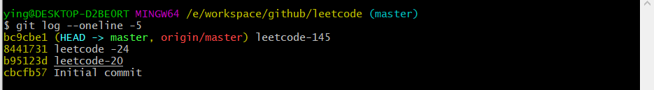
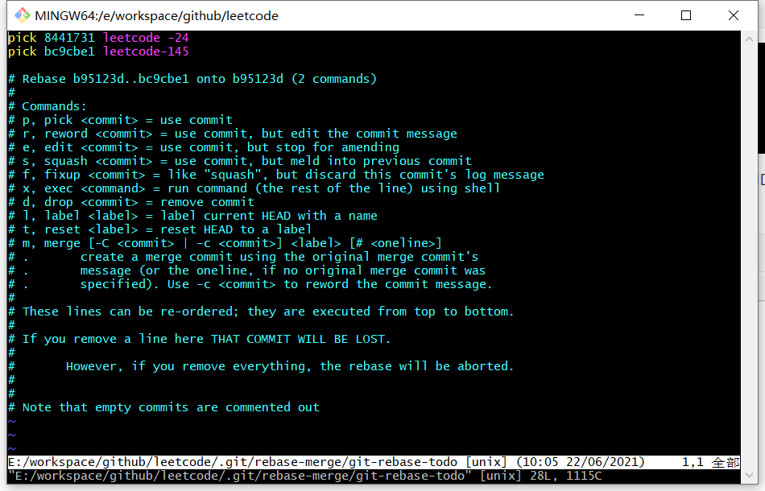
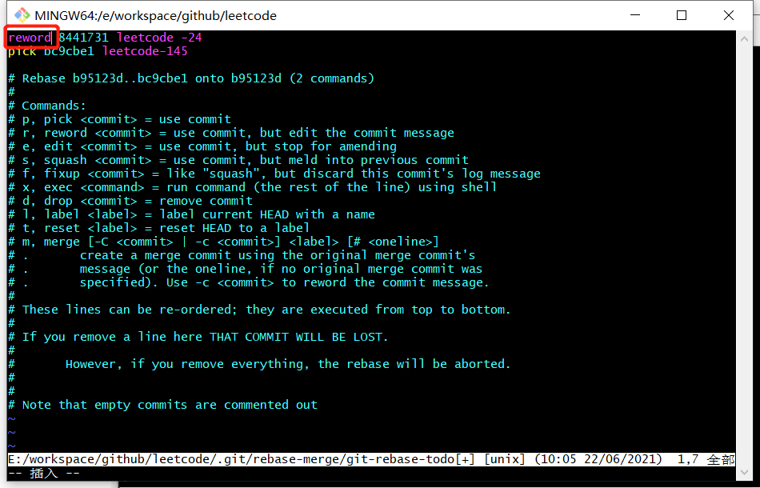
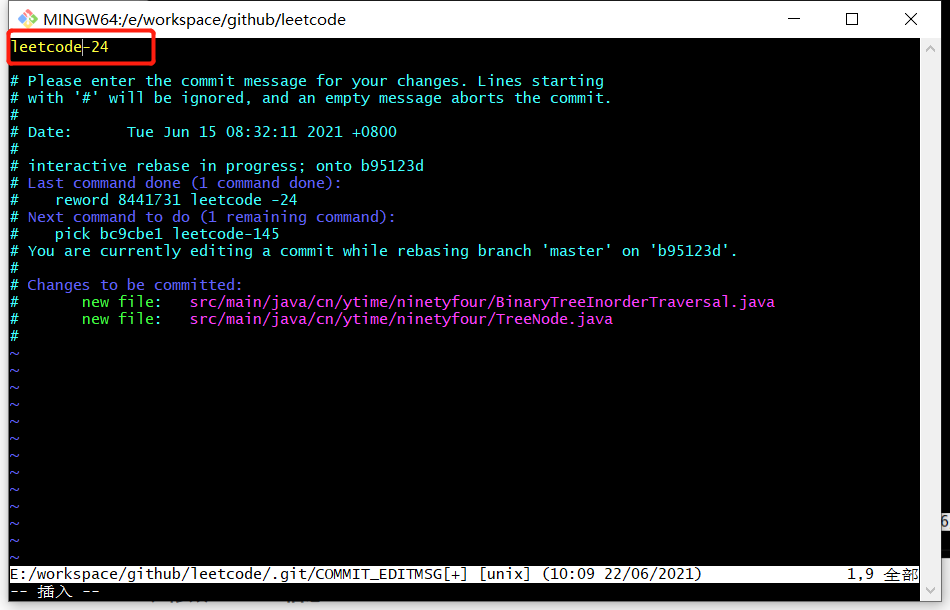
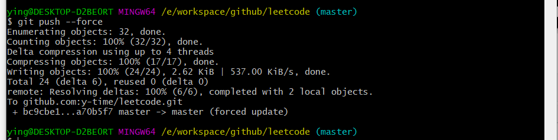

### git 修改远端commit信息

##### 1、查看远端前5次日志

```
git log --oneline -5
```



##### 2、变基要修改的提交的上一次提交，

​		比如需要修改从上往下第2个commit_message，这里的简短commitID为上面输出信息的第3个，以此类推

​		之后会以VIM编辑方式显示了最近的提交信息

```
git rebase -i b95123d
```

##### 3、将想要修改的提交前的pick改为reword

​		如果需要修改多个，也可以将对应的多个pick改为reword。然后保存，会进入commit信息编辑





##### 4、修改commit信息

​		如果修改了多个pick为reword，则会多次弹出修改界面



##### 5、强制推送至远端

```
git push --force
```

