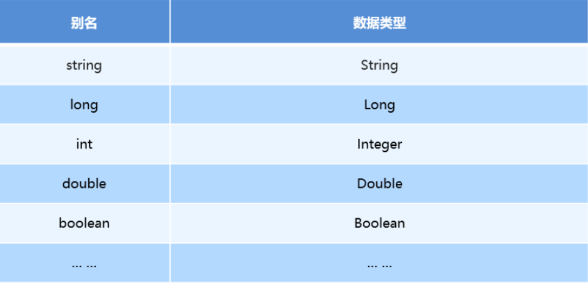
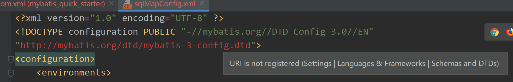
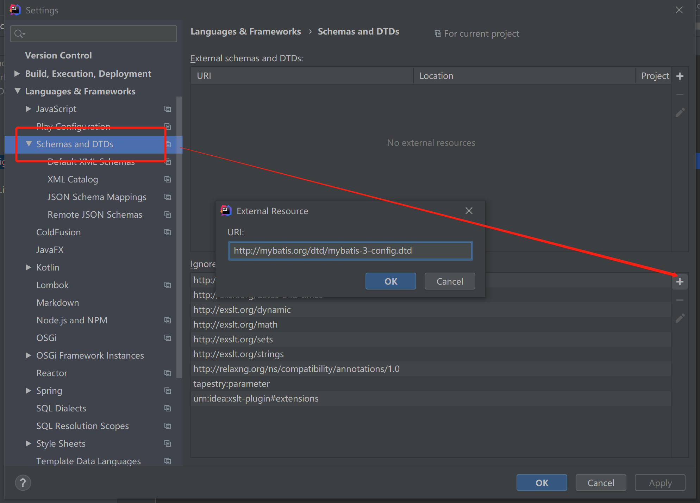
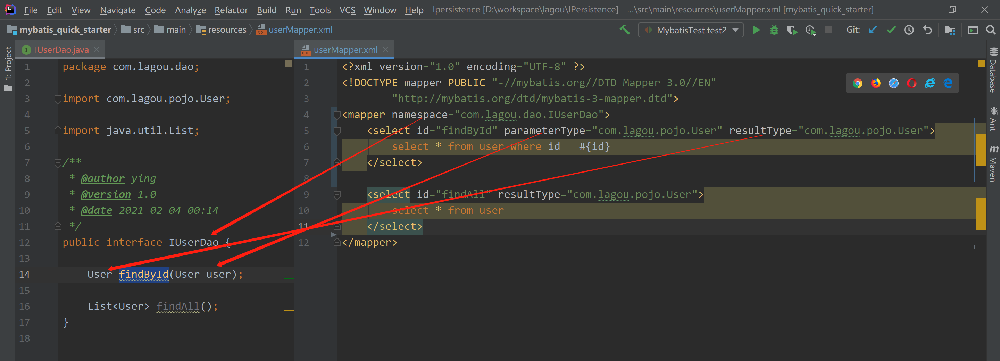

### MyBatis

基于ORM（Object Relation Mapping）的半自动轻量级持久层框架


#### 一、MyBatis基础应用

##### 1、MyBatis配置文件

* **sqlMappConfig.xml**

  MyBatis核心配置文件，约定俗成命名为sqlMappConfig.xml。主要用于配置数据库信息和加载mapper.xml映射。

  ```xml
  <?xml version="1.0" encoding="UTF-8" ?>
  <!DOCTYPE configuration PUBLIC "-//mybatis.org//DTD Config 3.0//EN"
  "http://mybatis.org/dtd/mybatis-3-config.dtd"> <!--约束头-->
  
  <configuration>
      <properties resource="jdbc.properties" />
      <typeAliases>
          <!--<typeAlias type="com.lagou.pojo.User" alias="user"/>-->
          <package name="com.lagou.pojo"/>
      </typeAliases>
      <environments default="development">
          <environment id="development">
              <transactionManager type="JDBC"/>
              <dataSource type="POOLED">
                  <property name="driver" value="${jdbc.driver}" />
                  <property name="url" value="${jdbc.url}" />
                  <property name="username" value="${jdbc.username}" />
                  <property name="password" value="${jdbc.password}" />
              </dataSource>
          </environment>
      </environments>
  
      <mappers>
          <mapper resource="userMapper.xml"/>
      </mappers>
  </configuration>
  ```

  * configuration  根目录标签

  * properties  数据源的配置信息文件映射

  * typeAliases  给实体类的全限定类名起别名

    * typeAlias  给单独的实体起别名

    * package  批量起别名，为该包下的类本身的类名，不区分大小写

      MyBaties常用类型别名

      

  * environments  数据库环境信息，可配置多个，default为默认环境名称

  * environment  数据库环境信息，id为当前环境名称

  * transactionManager  事务管理类型，当前为JDBC，使⽤JDBC事务的提交和回滚

  * dataSource  数据源配置
    * POOLED：MyBatis会创建一个数据库连接池，连接池的一个连接将会被用作数据库操作
    * UNPOOLED：每次被请求时打开和关闭连接
    * JNDI：这个数据源的实现是为了能在如 EJB 或应⽤服务器这类容器中使⽤，容器可以集中或在外部配置数据源，然后放置⼀个JNDI上下⽂的引⽤
    
  * property  数据源信息，driver数据库对应驱动，url数据库地址，username用户名，password密码

  * mappers  加载映射配置文件

  * mapper  对应映射配置文件位置
    * resource：使用类路径的资源引用
    * package：将包内的映射器接⼝实现全部注册为映射器
    * url：使⽤完全限定资源定位符

  

  PS：idea约束头报错URI is not registered (Settings | Languages & Frameworks | Schemas and DTDs)，设置idea注册统一资源标识符。

  

  

* **mapper.xml**

  MyBatis映射配置文件，定义管理对象数据SQL

  ```xml
  <?xml version="1.0" encoding="UTF-8" ?>
  <!DOCTYPE mapper PUBLIC "-//mybatis.org//DTD Mapper 3.0//EN"
          "http://mybatis.org/dtd/mybatis-3-mapper.dtd">
  <mapper namespace="user">
      <select id="findAll" resultType="User">
          select * from user
      </select>
      <insert id="saveUser" parameterType="User">
          insert into user (id, username) values (#{id}, #{username})
      </insert>
      <update id="updateUser" parameterType="User">
          update user set username = #{username} where id = #{id};
      </update>
      <delete id="deleteUser" parameterType="int">
          delete from user where id = #{id}
      </delete>
      <select id="findByCondition" parameterType="User" resultType="User">
          select * from user
        <where>
              <if test="id != null">
                  and id = #{id}
              </if>
              <if test="username != null">
                  and username = #{username}
              </if>
          </where>
      </select>
      <select id="findByIds" parameterType="list" resultType="User">
          select * from user
          <where>
              <foreach collection="array" open="id in (" close=")" item="id" separator=",">
                  #{id}
              </foreach>
          </where>
      </select>
  </mapper>
  ```
  
  * mapper  根目录标签，namespqce为命名空间（使用接口代理开发时，命名为接口类路径）
  * insert、delete、update、select  增删改查语句标签
    * id：语句的标识，与命名空间组成查询标识（使用接口代理开发时，命名为接口对应方法名）
    * resultType：查询结果对应的实体类型
    * parameterType：传入参数的实体类型
    * resultMap：
  
  动态sql标签
  
  * if  根据实体取不同值，拼接不同SQL语句
  * where  智能处理SQL语句，在有查询条件时拼接where语句，并且拼接第一个条件时自动忽略and、or等
  * foreach  循环拼接SQL
    * collection  传入的是单参数且参数类型是List，collection属性值为list；单参数且参数类型是数组的时候，collection的属性值为array；传入的参数是Map的时候，collection 的属性值为map 的key值。
    * open  语句以什么开始
    * close  语句以什么结束
    * separator  迭代元素之间的分隔符
    * item  迭代元素别名
    * index  当前迭代元素的索引
  * sql
  * include
  
  

##### 2、MyBatis执行的API

```java
    @Test
    public void test1() throws IOException {
        // 通过Rescoures工具类加载sqlMapConfig.xml成字节流
        InputStream resourceAsStream = Resources.getResourceAsStream("sqlMapConfig.xml");
        // 解析传入的配置文件字节流，创建sqlSession工厂
        SqlSessionFactory sessionFactory = new SqlSessionFactoryBuilder()
            .build(resourceAsStream);
        // 生产一个sqlSession，默认开启事务，执行增删改时不会自动提交，需要执行sqlSession.commit()
        // sessionFactory.openSession(true) 在构造方法中传true，开启自动提交
        SqlSession sqlSession = sessionFactory.openSession();
        // 执行sqlSession增删改查方法
 		List<User> userList = sqlSession.selectList("user.findAll");
		userList.forEach(System.out::println);

        User user = new User();
        user.setId(5);
        user.setUsername("ying");
		sqlSession.insert("user.saveUser", user);

		user.setUsername("yy");
        sqlSession.update("user.updateUser", user);
        sqlSession.delete("user.deleteUser", user);
        sqlSession.commit();
    }
```

##### 3、MyBatis的dao层代理开发



namespace为dao接口的相对路径

sql语句标签的id为dao接口的对用方法，parameterType为方法参数类型，resultType为返回结果类型

##### 4.MyBatis复杂映射

* 一对一
* 一对多
* 多对多


