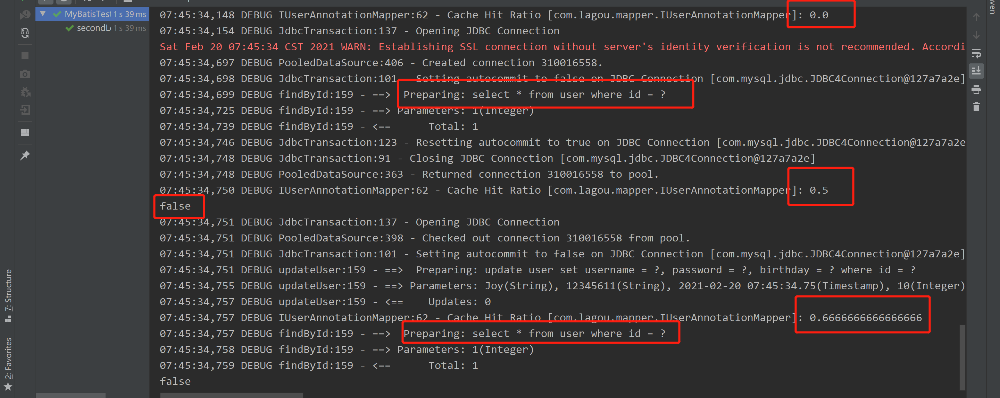

### MyBatis

基于ORM（Object Relation Mapping）的半自动轻量级持久层框架


#### 一、MyBatis基础应用

##### 1、MyBatis配置文件

###### 1.1  sqlMappConfig.xml

MyBatis核心配置文件，约定俗成命名为sqlMappConfig.xml。主要用于配置数据库信息和加载mapper.xml映射。

```xml
<?xml version="1.0" encoding="UTF-8" ?>
<!DOCTYPE configuration PUBLIC "-//mybatis.org//DTD Config 3.0//EN"
"http://mybatis.org/dtd/mybatis-3-config.dtd"> <!--约束头-->

<configuration>
    <properties resource="jdbc.properties" />
    <typeAliases>
        <!--<typeAlias type="com.lagou.pojo.User" alias="user"/>-->
        <package name="com.lagou.pojo"/>
    </typeAliases>
    <plugins>
        <plugin interceptor="com.lagou.plugin.MyPlugin">
            <!--配置参数-->
            <property name="name" value="ying"/>
        </plugin>
    </plugins>
    <environments default="development">
        <environment id="development">
            <transactionManager type="JDBC"/>
            <dataSource type="POOLED">
                <property name="driver" value="${jdbc.driver}" />
                <property name="url" value="${jdbc.url}" />
                <property name="username" value="${jdbc.username}" />
                <property name="password" value="${jdbc.password}" />
            </dataSource>
        </environment>
    </environments>

    <mappers>
        <mapper resource="userMapper.xml"/>
    </mappers>
</configuration>
```

* configuration  根目录标签

* properties  数据源的配置信息文件映射

* typeAliases  给实体类的全限定类名起别名

  * typeAlias  给单独的实体起别名

  * package  批量起别名，为该包下的类本身的类名，不区分大小写

    MyBaties常用类型别名

    | 别名       | 数据类型   |
    | ---------- | ---------- |
    | _byte      | byte       |
    | _long      | long       |
    | _short     | short      |
    | _int       | int        |
    | _integer   | int        |
    | _double    | double     |
    | _float     | float      |
    | _boolean   | boolean    |
    | string     | String     |
    | byte       | Byte       |
    | long       | Long       |
    | short      | Short      |
    | int        | Integer    |
    | integer    | Integer    |
    | double     | Double     |
    | float      | Float      |
    | boolean    | Boolean    |
    | date       | Date       |
    | bigdecimal | BigDecimal |
    | object     | Object     |
    | map        | Map        |
    | hashmap    | HashMap    |
    | list       | List       |
    | arraylist  | Arraylist  |
    | collection | Collection |
    | iterator   | Iterator   |

* plugins  插件配置

* environments  数据库环境信息，可配置多个，default为默认环境名称

* environment  数据库环境信息，id为当前环境名称

* transactionManager  事务管理类型，当前为JDBC，使⽤JDBC事务的提交和回滚

* dataSource  数据源配置
  * POOLED：MyBatis会创建一个数据库连接池，连接池的一个连接将会被用作数据库操作
  * UNPOOLED：每次被请求时打开和关闭连接
  * JNDI：这个数据源的实现是为了能在如 EJB 或应⽤服务器这类容器中使⽤，容器可以集中或在外部配置数据源，然后放置⼀个JNDI上下⽂的引⽤
  
* property  数据源信息，driver数据库对应驱动，url数据库地址，username用户名，password密码

* mappers  加载映射配置文件

* mapper  对应映射配置文件位置
  * resource：使用类路径的资源引用
  
  * package：将包内的映射器接⼝实现全部注册为映射器，可将xml放置resources目录下，但是必须和接口同包同名
  
    
  
  * url：使⽤完全限定资源定位符


PS：idea约束头报错URI is not registered (Settings | Languages & Frameworks | Schemas and DTDs)，设置idea注册统一资源标识符。


###### 1.2  mapper.xml

MyBatis映射配置文件，定义管理对象数据SQL

```xml
<?xml version="1.0" encoding="UTF-8" ?>
<!DOCTYPE mapper PUBLIC "-//mybatis.org//DTD Mapper 3.0//EN"
        "http://mybatis.org/dtd/mybatis-3-mapper.dtd">
<mapper namespace="user">
    <select id="findAll" resultType="User">
        select * from user
    </select>
    <insert id="saveUser" parameterType="User">
        insert into user (id, username) values (#{id}, #{username})
    </insert>
    <update id="updateUser" parameterType="User">
        update user set username = #{username} where id = #{id};
    </update>
    <delete id="deleteUser" parameterType="int">
        delete from user where id = #{id}
    </delete>
    <select id="findByCondition" parameterType="User" resultType="User">
        select * from user
        <where>
            <if test="id != null">
                and id = #{id}
            </if>
            <if test="username != null">
                and username = #{username}
            </if>
        </where>
    </select>
    <sql id="selectUser">
        select * from user
    </sql>
    <select id="findByIds" parameterType="list" resultType="User">
        <include refid="selectUser" />
        <where>
            <foreach collection="array" open="id in (" close=")" item="id" separator=",">
                #{id}
            </foreach>
        </where>
    </select>
    
    <resultMap id="userRoleMap" type="User">
        <result property="id" column="userid"/>
        <result property="username" column="username"/>
        <result property="password" column="password"/>
        <result property="birthday" column="birthday" javaType="date"/>
        <collection property="roleList" ofType="Role">
            <result property="id" column="roleid"/>
            <result property="roleName" column="rolename"/>
            <result property="roleDesc" column="roleDesc"/>
        </collection>
    </resultMap>
    <select id="findAllUserAndRole" resultMap="userRoleMap">
        select * from user u left join sys_user_role s on u.id = s.userid left join sys_role r on s.roleid = r.id
    </select>
</mapper>
```

```xml
<?xml version="1.0" encoding="UTF-8" ?>
<!DOCTYPE mapper PUBLIC "-//mybatis.org//DTD Mapper 3.0//EN"
        "http://mybatis.org/dtd/mybatis-3-mapper.dtd">
<mapper namespace="com.lagou.mapper.IOrderMapper">
    <resultMap id="orderMap" type="Order">
        <result property="id" column="id" />
        <result property="ordertime" column="ordertime" javaType="date"/>
        <result property="total" column="total" />
        <association property="user" javaType="User">
            <result property="id" column="uid" />
            <result property="username" column="username" />
            <result property="password" column="password" />
            <result property="birthday" column="birthday" javaType="date"/>
        </association>
    </resultMap>
    <select id="findAll"  resultMap="orderMap">
        select * from orders o,user u where o.uid = u.id
    </select>
</mapper>
```

* mapper  根目录标签，namespqce为命名空间（使用接口代理开发时，命名为接口类路径）
* insert、delete、update、select  增删改查语句标签
  * id：语句的标识，与命名空间组成查询标识（使用接口代理开发时，命名为接口对应方法名）
  * resultType：查询结果对应的实体类型
  * parameterType：传入参数的实体类型
  * resultMap：映射复杂数据映射到一个结果集中

* resultMap：id唯一标识，type映射的pojo对象
  * result：column表字段，property映射的pojo对象的属性，javaType字段类型
  * association：对象一对一关联
  * collection：对象一对多，多对多关联，ofType集合中的pojo对象，select嵌套的查询语句

动态sql标签

* if  根据实体取不同值，拼接不同SQL语句
* where  智能处理SQL语句，在有查询条件时拼接where语句，并且拼接第一个条件时自动忽略and、or等
* foreach  循环拼接SQL
  * collection  传入的是单参数且参数类型是List，collection属性值为list；单参数且参数类型是数组的时候，collection的属性值为array；传入的参数是Map的时候，collection 的属性值为map 的key值。
  * open  语句以什么开始
  * close  语句以什么结束
  * separator  迭代元素之间的分隔符
  * item  迭代元素别名
  * index  当前迭代元素的索引
* sql  抽取SQL语句片段
* include  引入SQL语句片段


##### 2、MyBatis注解开发

* @Insert、@Delete、@Update、@Select  增删改查

* @Result  实现结果集封装

* @Results  与@Result ⼀起使⽤，封装多个结果集

* @One  实现一对一结果集封装

  

  

* @Many  实现一对多结果集封装 

  

  

##### 3、MyBatis执行的API

```java
    @Test
    public void test1() throws IOException {
        // 通过Rescoures工具类加载sqlMapConfig.xml成字节流
        InputStream resourceAsStream = Resources.getResourceAsStream("sqlMapConfig.xml");
        // 解析传入的配置文件字节流，创建sqlSession工厂
        SqlSessionFactory sessionFactory = new SqlSessionFactoryBuilder()
            .build(resourceAsStream);
        // 生产一个sqlSession，默认开启事务，执行增删改时不会自动提交，需要执行sqlSession.commit()
        // sessionFactory.openSession(true) 在构造方法中传true，开启自动提交
        SqlSession sqlSession = sessionFactory.openSession();
        // 执行sqlSession增删改查方法
 		List<User> userList = sqlSession.selectList("user.findAll");
		userList.forEach(System.out::println);

        User user = new User();
        user.setId(5);
        user.setUsername("ying");
		sqlSession.insert("user.saveUser", user);

		user.setUsername("yy");
        sqlSession.update("user.updateUser", user);
        sqlSession.delete("user.deleteUser", user);
        sqlSession.commit();
    }
```

##### 4、MyBatis的dao层代理开发


namespace为dao接口的相对路径

sql语句标签的id为dao接口的对用方法，parameterType为方法参数类型，resultType为返回结果类型


#### 二、MyBatis缓存

##### 1、一级缓存

一级缓存默认开启，为sqlSession级别，进行增删改操作时为清空sqlSession中的缓存


###### 1.1  一级缓存底层结构

一级缓存的底层结构是一个HashMap，key为CacheKey对象，由MappedStatement id、分页参数offset、limit和具体sql组成，重写equals和hashCode方法。


###### 1.2  一级缓存创建使用流程

CachingExecutor 从内存中获取数据， 在查找数据库前先查找缓存，若没有找到的话调用delegate从数据库查询，并将查询结果存入缓存中。


##### 2、二级缓存

​		二级缓存底层结构还是HashMap，默认不开启。为namespace级别，即被多个sqlSession共享。进行增删改操作时清空缓存。二级缓存缓存的不是对象，而是数据，读取二级缓存的时候底层会重新创建一个对象，将缓存的数据赋值上。




###### 2.1  开启二级缓存

* 对应实体类必须实现Serializable接口

* 全局配置文件sqlMapConfig.xml中加入对应配置（settings标签应在properties标签后）

  ```xml
  <!--开启⼆级缓存-->
  <settings>
  	<setting name="cacheEnabled" value="true"/>
  </settings>
  ```

  

* mapper xml中加上cache标签，注解方式则在对应mapper接口加上@CacheNamespace注解。可配置自定义缓存实现，实现Cache接口，配置具体实现类的路径

  ```xml
  <cache type="org.apache.ibatis.cache.impl.PerpetualCache"/>
  ```

  

###### 2.2  useCache和flushCache

​		userCache是否禁⽤⼆级缓存，默认true；flushCache是否刷新缓存，默认true

​		xml配置方式

```xml
<select id="selectUserByUserId" flushCache="true" useCache="false"
	resultType="com.lagou.pojo.User" parameterType="int">
	select * from user where id=#{id}
</select>
```

​		注解方式


###### 2.3  redis实现二级缓存

* pom.xml导入对应redis实现mybatis二级缓存的依赖

  ```xml
  <dependency>
  	<groupId>org.mybatis.caches</groupId>
      <artifactId>mybatis-redis</artifactId>
      <version>1.0.0-beta2</version>
  </dependency>
  ```

* redis配置文件

  

* 注解或xml声明使用RedisCache实现二级缓存

  

  

#### 三、MyBatis插件

##### 1、MyBatis插件原理

* 创建MyBatis四大对象Executor、 StatementHandler、 ParameterHandler、ResultSetHandler时，通过 interceptorChain.pluginAll(parameterHandler) 获取

* 获取到所有的 Interceptor (插件需要实现的接⼝)。调⽤ interceptor.plugin(target)，返回 target 包装后的对象

* 即插件为四⼤对象创建出代理对象，代理对象就可以拦截到四⼤对象的每⼀个执行

##### 2、MyBatis所允许拦截的⽅法

* 执⾏器Executor (update、 query、 commit、 rollback等)
* SQL语法构建器StatementHandler (prepare、 parameterize、 batch、 updates query等)；
* 参数处理器ParameterHandler (getParameterObject、 setParameters)
* 结果集处理器ResultSetHandler (handleResultSets、 handleOutputParameters等)

##### 3、实现自定义插件

* 创建一个自定义插件类，实现 Interceptor 接口

  ```java
  // mybatis拦截器注解
  @Intercepts({
          // 要拦截的四大对象的哪个方法(可配置多个)，因为方法有重载，需要通过参数确定哪个方法
          @Signature(
                  type = Executor.class,
                  method = "query",
                  args = {MappedStatement.class, Object.class, RowBounds.class, ResultHandler.class}
          )
  })
  public class MyPlugin implements Interceptor {
  
      // 增强逻辑
      @Override
      public Object intercept(Invocation invocation) throws Throwable {
          System.out.println("自定义插件增强逻辑");
          // 调用原方法
          return invocation.proceed();
      }
  
      // 把这个拦截器⽣成⼀个代理放到拦截器链
      @Override
      public Object plugin(Object target) {
          System.out.println("将要包装的⽬标对象： " + target);
          return Plugin.wrap(target, this);
      }
  
      // 获取配置⽂件的属性，插件初始化的时候调⽤，也只调⽤⼀次，插件配置的属性从这⾥设置进来
      @Override
      public void setProperties(Properties properties) {
          System.out.println("插件配置的初始化参数： " + properties);
      }
  }
  ```

* sqlMapConfig.xml配置自定义插件

  ```xml
  <plugins>
  	<plugin interceptor="com.lagou.plugin.MyPlugin">
      	<!--配置参数-->
      	<property name="name" value="ying"/>
      </plugin>
  </plugins>
  ```

##### 4、自定插件执行流程源码解析

​		在解析 sqlMapConfig.xml ，初始化 configuration 对象时，会将当前配置的 plugin 实例化，读取配置插件参数，放进 interceptorChain 中，等待Executor调用。


​			执行查询的Mapper对象其实就是一个代理对象，真正在起作用的为MapperProxy，然后在执行调用方法时，是调用MapperProxy的invoke方法，然后对于select方法，最终都是调用selectList，selectList经过多层调用后最终还是调用doQuery方法。通过newStatementHandler方法去获取StatementHandler对象。


​		调用了interceptorChain.pluginAll(statementHandler)去获取statementHandler对象，里边其实是循环配置的插件，调用自定义插件的 plugin 方法，返回一个代理对象


​		自定义插件上的注解都在 getSignatureMap 方法中解析，将对应的type、method保存进Map中返回。

然后在wrap方法中对当前class进行判断，如果是当前class是@Signature中指定的type的子类，则进行代理操作。


​		代理对象最终执行的方法为invoke方法，只有signatureMap取出的methods中包含当前方法名才会调用代理对象的intercept方法，否则直接进行method.invoke操作，不会对方法进行拦截


##### 5、分页插件pageHelp

* pom.xml导入对应依赖

  ```xml
  <dependency>
  	<groupId>com.github.pagehelper</groupId>
      <artifactId>pagehelper</artifactId>
      <version>3.7.5</version>
  </dependency>
  <dependency>
       <groupId>com.github.jsqlparser</groupId>
       <artifactId>jsqlparser</artifactId>
       <version>0.9.1</version>
  </dependency>
  ```

* sqlMapperConfig.xml配置 pageHelper 插件，并指定数据库

  ```xml
  <plugin interceptor="com.github.pagehelper.PageHelper">
  	<!--指定⽅⾔-->
      <property name="dialect" value="mysql"/>
  </plugin>
  ```

* 测试使用，设置分页，获取分页信息

  

##### 6、通用mapper插件

​		通⽤Mapper就是为了解决单表增删改查，基于Mybatis的插件机制。开发⼈员不需要编写SQL,不需要

在DAO中增加⽅法，只要写好实体类，就能⽀持相应的增删改查⽅法。

* pom.xml 导入通用 mapper 依赖

  ```xml
  <!--通用mapper-->
  <dependency>
  	<groupId>tk.mybatis</groupId>
      <artifactId>mapper</artifactId>
      <version>3.1.2</version>
      </dependency>
  </dependencies>
  ```

*  sqlMapperConfig.xml配置通用 mapper 插件，指定使用的通用 mapper 接口

  ```xml
  <plugin interceptor="tk.mybatis.mapper.mapperhelper.MapperInterceptor">
  	<!-- 通⽤Mapper接⼝，多个通⽤接⼝⽤逗号隔开 -->
      <property name="mappers" value="tk.mybatis.mapper.common.Mapper"/>
  </plugin>
  ```

* 实体类

  ```java
  package com.lagou.pojo;
  
  import lombok.Data;
  
  import javax.persistence.*;
  
  @Data
  @Table(name = "sys_role")  // 数据库表名
  public class Role {
  
      @Id  // 主键
      @GeneratedValue(strategy = GenerationType.IDENTITY)  // 主键自增方式
      private Integer id;
  
      @Column(name = "rolename")  // 映射的数据库字段
      private String roleName;
  
      @Column(name = "roleDesc")
      private String roleDesc;
  }
  ```

* mapper 接口继承通用mapper接口

  ```java
  package com.lagou.mapper;
  
  import com.lagou.pojo.Role;
  import tk.mybatis.mapper.common.Mapper;
  
  public interface IRoleMapper extends Mapper<Role> {
  }
  ```

