### redis

#### 一、缓存

​		缓存原指CPU上的一种高速存储器，它先于内存与CPU交换数据，速度很快。现在泛指存储在计算机上的原始数据的复制集，便于快速访问。在互联网技术中，缓存是系统快速响应的关键技术之一。以空间换时间的一种技术。

##### 1、缓存的使用场景

###### 1.1 DB 缓存

​		一般情况下应用程序直接操作数据库，当访问量上万，数据库压力增大，可以采用读写分离、分库分表。当访问量继续增大时，需要引入缓存，将访问过的数据存到缓存中。当再次访问时先找换缓存，缓存命中直接返回数据，不命中再找数据库，并回填缓存。

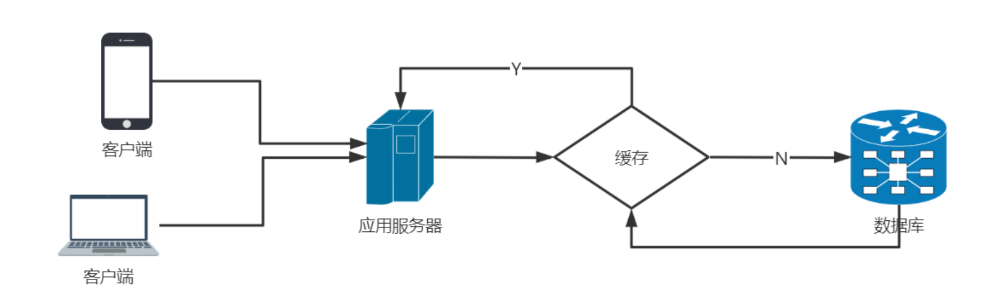

###### 1.2 提高系统相应

​		数据库的数据是存在硬盘中。与内存做交换（swap），在高并发时，MySQL单机会因为频繁 IO 而造成无法响应。MySQL 的 InnoDB 是有行锁。

​		将数据缓存在Redis中，也就是存在了内存中。内存天然支持高并发访问。可以瞬间处理大量请求。qps到达11万/S读请求 8万写/S  。

###### 1.3 做Session分离

​		传统的session是由tomcat自己进行维护和管理。集群或分布式环境，不同的tomcat管理各自的session。只能在各个tomcat之间，通过网络和Io进行session的复制，极大的影响了系统的性能。
1、各个Tomcat间复制session，性能损耗；2、不能保证各个Tomcat的Session数据同步。
​		可以将登录成功后的Session信息，存放在Redis中，这样多个服务器(Tomcat)可以共享Session信息。

###### 1.4 做分布式锁

​		一般讲锁是多线程的锁，是在一个进程中的。多个进程（JVM）在并发时也会产生问题，也要控制时序性。可以采用分布式锁。使用Redis实现 setNX。

###### 1.5 做乐观锁

​		同步锁和数据库中的行锁、表锁都是悲观锁。悲观锁的性能是比较低的，响应性比较差。高性能、高响应（秒杀）采用乐观锁。Redis可以实现乐观锁 watch + incr  。


##### 2、常见缓存的分类

###### 2.1 客户端缓存

​		传统互联网：页面缓存和浏览器缓存；移动互联网：APP缓存。

###### 2.2 页面缓存

​		页面自身对某些元素或全部元素进行存储，并保存成文件。html5：Cookie、WebStorage（SessionStorage和LocalStorage）、WebSql、indexDB、Application

Cache等。

###### 2.3 浏览器缓存

​		当客户端向服务器请求资源时，会先抵达浏览器缓存，如果浏览器有“要请求资源”的副本，就可以直接从浏览器缓存中提取而不是从原始服务器中提取这个资源。
​		浏览器缓存可分为强制缓存和协商缓存。

​		强制缓存：直接使用浏览器的缓存数据。条件：Cache-Control的max-age没有过期或者Expires的缓存时间没有过期。

```html
<meta http-equiv="Cache-Control" content="max-age=7200" />
<meta http-equiv="Expires" content="Mon, 20 Aug 2010 23:00:00 GMT" />
```

​		协商缓存：服务器资源未修改，使用浏览器的缓存（304；反之，使用服务器资源（200）。

```html
<meta http-equiv="cache-control" content="no-cache">
```

###### 2.4 APP缓存

​		原生APP中把数据缓存在内存、文件或本地数据库（SQLite）中。比如图片文件。

###### 2.5 网络端缓存

​		通过代理的方式响应客户端请求，对重复的请求返回缓存中的数据资源。  

###### 2.6 Web代理缓存

​		可以缓存原生服务器的静态资源，比如样式、图片等。常见的反向代理服务器比如Nginx 。

###### 2.7 边缘缓存

​		边缘缓存中典型的商业化服务就是CDN了。CDN的全称是Content Delivery Network，即内容分发网络。CDN通过部署在各地的边缘服务器，使用户就近获取所需内容，降低网络拥塞，提高用户访问响应速度和命中率。CDN的关键技术主要有内容存储和分发技术。现在一般的公有云服务商都提供CDN服务。

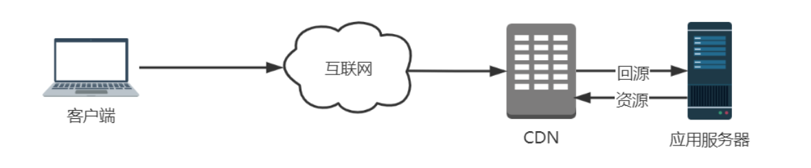

###### 2.8 服务端缓存

​		服务器端缓存是整个缓存体系的核心。包括数据库级缓存、平台级缓存和应用级缓存。

###### 2.9 数据库缓存

​		数据库是用来存储和管理数据的。MySQL在Server层使用查询缓存机制。将查询后的数据缓存起来。K-V结构，Key：select语句的hash值，Value：查询结果。InnoDB存储引擎中的buffer-pool用于缓存InnoDB索引及数据块。

###### 2.10 平台级缓存

​		平台级缓存指的是带有缓存特性的应用框架。比如：GuavaCache 、EhCache（二级缓存，硬盘）、OSCache（页面缓存）等。部署在应用服务器上，也称为服务器本地缓存。

###### 2.11 应用级缓存

​		具有缓存功能的中间件：Redis、Memcached、EVCache（AWS）、Tair（阿里 、美团）等。采用K-V形式存储。利用集群支持高可用、高性能、高并发、高扩展。分布式缓存。


##### 3、缓存的优势和代价

**优势**

* 提升用户体验。
* 减轻服务器压力
* 提升系统性能（响应时间、延迟时间、吞吐量、并发用户数和资源利用率  ）

**代价**

* 额外硬件指出
* 高并发缓存失效
* 缓存与数据库一致性问题
* 缓存并发竞争


##### 4、缓存的读写模式

###### Cache Aside Pattern

​		Cache Aside Pattern（旁路缓存），是最经典常用的缓存+数据库读写模式。读的时候，先读缓存，缓存没有的话，就读数据库，然后取出数据后放入缓存，同时返回响应。更新的时候，先更新数据库，然后再删除缓存。

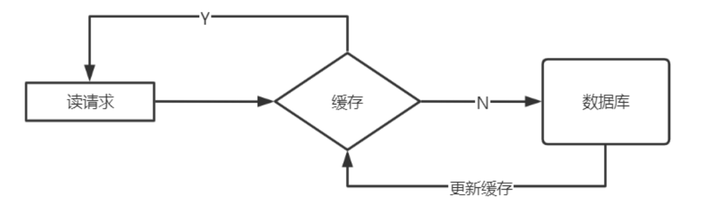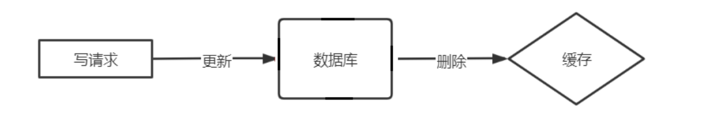


**为什么是删除缓存，而不是更新缓存呢？**
		1、缓存的值是一个结构：hash、list，更新数据需要遍历先遍历（耗时）后修改。
		2、懒加载，使用的时候才更新缓存使用的时候才从DB中加载。也可以采用异步的方式填充缓存，开启一个线程 定时将DB的数据刷到缓存中。

**高并发脏读的三种情况**

* 先更新数据库，再更新缓存

  update与commit之间，更新缓存，commit失败则DB与缓存数据不一致。

* 先删除缓存，再更新数据库

  update与commit之间，有新的读，缓存空，读DB数据到缓存数据是旧的数据
  commit后DB为新数据，则DB与缓存数据不一致。

* 先更新数据库，再删除缓存（推荐）

  update与commit之间，有新的读，缓存空，读DB数据到缓存数据是旧的数据
  commit后DB为新数据，则DB与缓存数据不一致。采用延时双删策略。


###### Read/Write Through Pattern

​		应用程序只操作缓存，缓存操作数据库。Read-Through（穿透读模式/直读模式）：应用程序读缓存，缓存没有，由缓存回源到数据库，并写入缓存。（guavacache）Write-Through（穿透写模式/直写模式）：应用程序写缓存，缓存写数据库。该种模式需要提供数据库的handler，开发较为复杂。 


###### Write Behind Caching Pattern

​		应用程序只更新缓存。缓存通过异步的方式将数据批量或合并后更新到DB中。不能时时同步，甚至会丢数据。


### 二、Redis

​		Redis （Remote Dictionary Server）远程字典务器，是用C语言开发的一个开源的高性能键值对（ key-value ）内存数据库。
​		它提供了五种数据类型来存储值：字符串类型、散列类型、列表类型、集合类型、有序集合类型。
​		它是一种 NoSQL 数据存储。  

##### 1、redis应用场景

* 缓存使用，减轻DB压力
* DB使用，用于临时存储数据（字典表，购买记录）
* 解决分布式场景下Session分离问题（登录信息）
* 任务队列（秒杀、抢红包等等） 乐观锁
* 应用排行榜 zset
* 签到 bitmap
* 分布式锁
* 冷热数据交换  

##### 2、redis下载安装

* 官网地址：http://redis.io/
* 中文官网地址：http://www.redis.cn/
* 下载地址：http://download.redis.io/releases/  

**redis安装**

* 安装c语言需要的GCC环境

  ```
  yum install -y gcc-c++
  yum install -y wget
  ```

* 下载并解压redis源码压缩包

  ```
  wget http://download.redis.io/releases/redis-5.0.5.tar.gz
  tar -zxf redis-5.0.5.tar.gz
  ```

* 编译redis源码，进入redis-5.0.5目录，执行编译命令

  ```
  cd redis-5.0.5/src
  make
  ```

* 创建目录，通过该PREFIX指定安装路径，安装redis

  ```
  mkdir /usr/redis -p
  make install PREFIX=/usr/redis
  ```


##### 3、redis 启动

**前端启动**

直接运行bin/redis-server以前端模式启动

```
./redis-server
```

关闭命令： ctrl+c  

前端启动，客户端窗口关闭则 redis-server 程序结束，不推荐使用此方法

**后端启动**

* 拷贝 redis-5.0.5/redis.conf 配置文件到 Redis 安装目录的 bin 目录

  ```
  cp redis.conf /usr/redis/bin/
  ```

* 修改 redis.conf

  ```
  vim redis.conf
  ```

  ```
  # 将`daemonize`由`no`改为`yes`
  daemonize yes
  # 默认绑定的是回环地址，默认不能被其他机器访问
  # bind 127.0.0.1
  # 是否开启保护模式，由yes该为no
  protected-mode no
  ```

* 启动服务

  ```
  ./redis-server redis.conf
  ```

  查看是否启动成功

  ```
  ps -ef | grep redis
  ```

  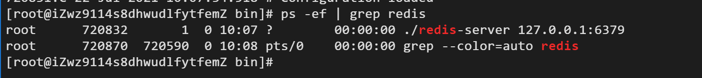

* Redis命令行客户端 

  ```
  ./redis-cli -h 127.0.0.1 -p 6379
  ```

  -h：redis服务器的ip地址
  -p：redis实例的端口号

  如果不指定主机和端口也可以，默认主机地址是127.0.0.1，默认端口是6379

* 关闭服务

  ```
  ./redis-cli shutdown
  ```


##### 4、redis命令

* **redis-server** ：启动 redis 服务
* **redis-cli** ：进入 redis 命令客户端
* **redis-benchmark** ： 性能测试的工具
* **redis-check-aof** ： aof 文件进行检查的工具
* **redis-check-dump** ： rdb 文件进行检查的工具
* **redis-sentinel** ： 启动哨兵监控服务  


##### 5、redis 客户端访问

###### 5.1 Java程序访问redis

* 关闭RedisServer端防火墙

  ```
  systemctl stop firewalld（默认）
  systemctl disable firewalld.service（设置开启不启动）
  ```

  云服务器需要添加安全组规则，例如阿里云

  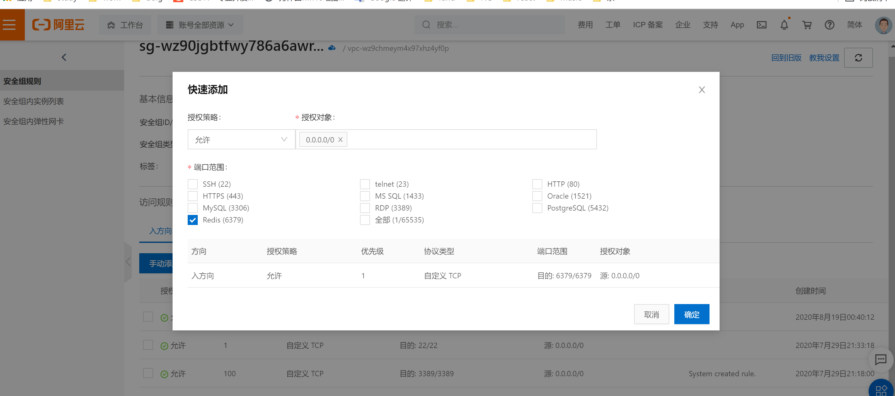

* 新建 maven 项目后导入 Jedis 包

  ```xml
  <dependency>
      <groupId>redis.clients</groupId>
      <artifactId>jedis</artifactId>
      <version>2.9.0</version>
  </dependency>
  ```

* 测试代码

  ```java
  package test;
  
  import org.junit.Test;
  import redis.clients.jedis.Jedis;
  
  public class RedisTest {
  
      @Test
      public void redisTest() {
          // 与Redis建立连接 IP+port，（云服务器的公网ip）
          Jedis redis = new Jedis("112.74.80.80", 6379);
          // 在Redis中写字符串 key value
          redis.set("jedis:name:1", "jd-zhangfei");
          // 获得Redis中字符串的值
          System.out.println(redis.get("jedis:name:1"));
          // 在Redis中写list
          redis.lpush("jedis:list:1", "1", "2", "3", "4", "5");
          // 获得list的长度
          System.out.println(redis.llen("jedis:list:1"));
      }
  }
  ```

  

###### 5.2 Spring访问redis

* 新建maven项目

  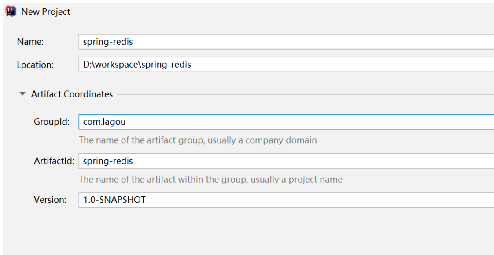

* 导入spring、redis、junit依赖

  ```xml
  <dependency>
      <groupId>org.springframework</groupId>
      <artifactId>spring-beans</artifactId>
      <version>5.2.5.RELEASE</version>
  </dependency>
  <dependency>
      <groupId>org.springframework</groupId>
      <artifactId>spring-core</artifactId>
      <version>5.2.5.RELEASE</version>
  </dependency>
  <dependency>
      <groupId>org.springframework</groupId>
      <artifactId>spring-context</artifactId>
      <version>5.2.5.RELEASE</version>
  </dependency>
  <dependency>
      <groupId>org.springframework</groupId>
      <artifactId>spring-test</artifactId>
      <version>5.2.5.RELEASE</version>
  </dependency>
  <dependency>
      <groupId>junit</groupId>
      <artifactId>junit</artifactId>
      <version>4.12</version>
      <scope>test</scope>
  </dependency>
  <dependency>
      <groupId>org.springframework.data</groupId>
      <artifactId>spring-data-redis</artifactId>
      <version>1.0.3.RELEASE</version>
  </dependency>
  ```

* redis信息配置

  ```properties
  redis.pool.maxActive=100
  redis.pool.maxIdle=50
  redis.pool.maxWait=1000
  redis.pool.testOnBorrow=true
  redis.timeout=50000
  redis.server=112.74.80.80
  redis.port=6379
  ```

* spring配置文件

  ```xml
  <?xml version="1.0" encoding="UTF-8"?>
  <beans xmlns="http://www.springframework.org/schema/beans"
         xmlns:xsi="http://www.w3.org/2001/XMLSchema-instance"
         xsi:schemaLocation="http://www.springframework.org/schema/beans
         http://www.springframework.org/schema/beans/spring-beans.xsd">
      <bean id="propertyConfigurer"  class="org.springframework.beans.factory.config.PropertyPlaceholderConfigurer">
          <property name="locations">
              <list>
                  <value>classpath:redis.properties</value>
              </list>
          </property>
      </bean>
      <!-- redis config -->
      <bean id="jedisPoolConfig" class="redis.clients.jedis.JedisPoolConfig">
          <property name="maxActive" value="${redis.pool.maxActive}"/>
          <property name="maxIdle" value="${redis.pool.maxIdle}"/>
          <property name="maxWait" value="${redis.pool.maxWait}"/>
          <property name="testOnBorrow" value="${redis.pool.testOnBorrow}"/>
      </bean>
      <bean id="jedisConnectionFactory" class="org.springframework.data.redis.connection.jedis.JedisConnectionFactory">
          <property name="hostName" value="${redis.server}"/>
          <property name="port" value="${redis.port}"/>
          <property name="timeout" value="${redis.timeout}"/>
          <property name="poolConfig" ref="jedisPoolConfig"/>
      </bean>
      <bean id="redisTemplate" class="org.springframework.data.redis.core.RedisTemplate">
          <property name="connectionFactory" ref="jedisConnectionFactory"/>
          <property name="KeySerializer">
              <bean class="org.springframework.data.redis.serializer.StringRedisSerializer">
              </bean>
          </property>
          <property name="ValueSerializer">
              <bean class="org.springframework.data.redis.serializer.StringRedisSerializer">
              </bean>
          </property>
      </bean>
  </beans>
  ```

* 测试程序

  ```java
  package test;
  
  import org.junit.Test;
  import org.springframework.beans.factory.annotation.Autowired;
  import org.springframework.data.redis.core.RedisTemplate;
  import org.springframework.test.context.ContextConfiguration;
  import org.springframework.test.context.junit4.AbstractJUnit4SpringContextTests;
  
  import java.io.Serializable;
  
  @ContextConfiguration({ "classpath:applicationContext.xml" })
  public class RedisTest extends AbstractJUnit4SpringContextTests {
  
      @Autowired
      private RedisTemplate<Serializable, Serializable> redisTemplate;
  
      @Test
      public void test() {
          redisTemplate.opsForValue().set("name","zhangfei");
          System.out.println(redisTemplate.opsForValue().get("name"));
      }
  }
  ```


###### 5.3 SpringBoot访问redis

* 创建SpringBoot工程

  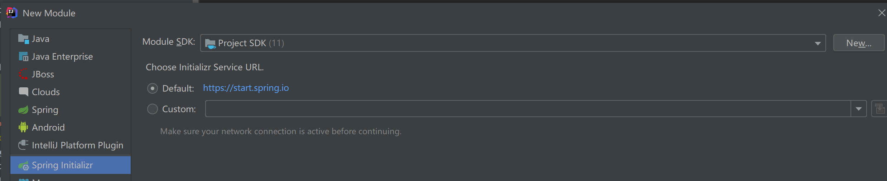

  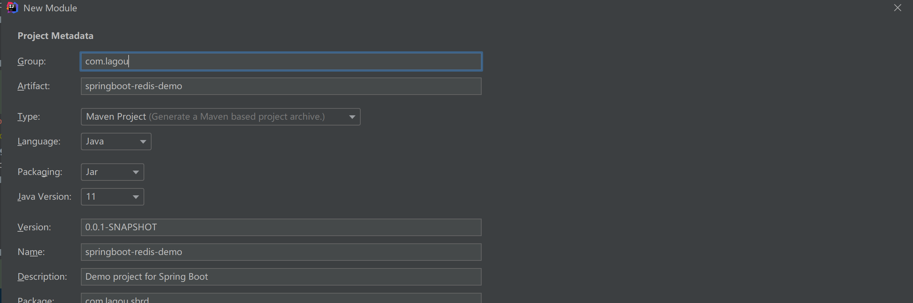

  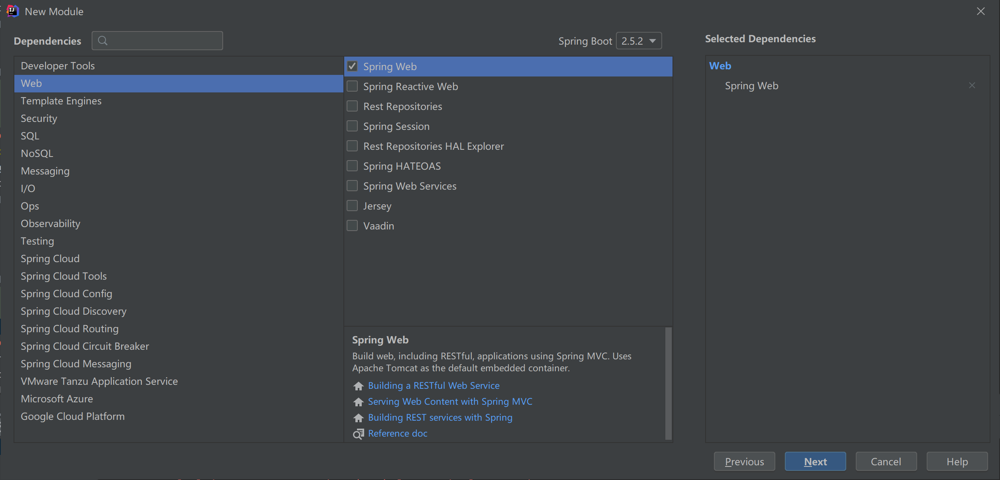

  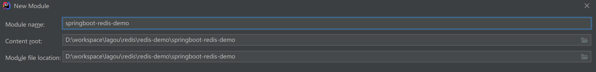

* 添加 redis 自动配置依赖

  ```xml
  <dependency>
  	<groupId>org.springframework.boot</groupId>
  	<artifactId>spring-boot-starter-data-redis</artifactId>
  </dependency>
  ```

* redis 配置信息

  ```properties
  spring.redis.host=112.74.80.80
  spring.redis.port=6379
  spring.redis.jedis.pool.min-idle=0
  spring.redis.jedis.pool.max-idle=8
  spring.redis.jedis.pool.max-active=80
  spring.redis.jedis.pool.max-wait=30000
  spring.redis.jedis.pool.timeout=3000
  ```

* redis 配置类

  ```java
  package com.lagou.sbrd.config;
  
  import org.springframework.beans.factory.annotation.Autowired;
  import org.springframework.context.annotation.Bean;
  import org.springframework.data.redis.connection.RedisConnectionFactory;
  import org.springframework.data.redis.core.RedisTemplate;
  import org.springframework.data.redis.serializer.StringRedisSerializer;
  
  public class RedisConfig {
  
      @Autowired
      private RedisConnectionFactory factory;
  
      @Bean
      public RedisTemplate<String, Object> redisTemplate() {
          RedisTemplate<String, Object> redisTemplate = new RedisTemplate<>();
          redisTemplate.setKeySerializer(new StringRedisSerializer());
          redisTemplate.setHashKeySerializer(new StringRedisSerializer());
          redisTemplate.setHashValueSerializer(new StringRedisSerializer());
          redisTemplate.setValueSerializer(new StringRedisSerializer());
          redisTemplate.setConnectionFactory(factory);
          return redisTemplate;
      }
  }
  ```

*  controller

  ```java
  package com.lagou.sbrd.controller;
  
  import org.springframework.beans.factory.annotation.Autowired;
  import org.springframework.data.redis.core.RedisTemplate;
  import org.springframework.stereotype.Controller;
  import org.springframework.web.bind.annotation.GetMapping;
  import org.springframework.web.bind.annotation.RequestMapping;
  import org.springframework.web.bind.annotation.RequestParam;
  import org.springframework.web.bind.annotation.RestController;
  
  import java.util.concurrent.TimeUnit;
  
  @RestController
  @RequestMapping(value = "/redis")
  public class RedisController {
  
      @Autowired
      private RedisTemplate redisTemplate;
  
      @GetMapping("/put")
      public String put(@RequestParam String key, @RequestParam String value) {
          // 设置过期时间为20秒
          redisTemplate.opsForValue().set(key, value, 20, TimeUnit.SECONDS);
          return "Success";
      }
  
      @GetMapping("/get")
      public String get(@RequestParam String key) {
          return (String) redisTemplate.opsForValue().get(key);
      }
  }
  
  ```

* Application 加上 @EnableCaching 注解

  ```java
  package com.lagou.sbrd;
  
  import org.springframework.boot.SpringApplication;
  import org.springframework.boot.autoconfigure.SpringBootApplication;
  import org.springframework.cache.annotation.EnableCaching;
  
  @SpringBootApplication
  @EnableCaching
  public class SpringbootRedisDemoApplication {
  
      public static void main(String[] args) {
          SpringApplication.run(SpringbootRedisDemoApplication.class, args);
      }
  }
  ```


##### 6、redis 数据类型

​		Redis 是一个key-value的存储系统，使用C语言编写。

​		key的类型是字符串（Redis中命令是忽略大小写，（set SET），key是不忽略大小写的（NAME name））

​		value的数据类型：

​				常用的：**string**字符串类型、**list**列表类型、**set**集合类型、**sortedset**（zset）有序集合类型、**hash**类型 

​				不常用的：bitmap位图类型、geo地理位置类型 

​		Redis5.0新增一种：stream类型


###### string字符串类型

​		常见操作命令：

| 命令名称 | 命令格式             | 命令描述                                                     |
| -------- | -------------------- | ------------------------------------------------------------ |
| set      | set key value        | 赋值                                                         |
| get      | get key              | 取值                                                         |
| getset   | getset key value     | 取值并赋值                                                   |
| setnx    | setnx key value      | 当key不存在时才用赋值 <br />set key value NX PX 3000 原子操作，px 设置毫秒数 |
| append   | append key value     | 如果 key 已经存在将 value 追加到 key 原来的值的末尾，如果不存在同 SET key value |
| strlen   | strlen key           | 获取字符串值长度                                             |
| incr     | incr key             | 递增数字                                                     |
| incrby   | incrby key increment | 增加指定的整数                                               |
| decr     | decr key             | 递减数字                                                     |
| decrby   | decrby key decrement | 减少指定的整数                                               |

**应用场景：**
1）key和命令是字符串

2）普通的赋值

3）incr用于乐观锁，incr：递增数字，可用于实现乐观锁 watch(事务)

4）setnx用于分布式锁，当value不存在时采用赋值，可用于实现分布式锁 


###### **list 列表类型**

​		list列表类型可以存储有序、可重复的元素。获取头部或尾部附近的记录是极快的。list的元素个数最多为2^32-1个（40亿）  。

​		常见操作命令：

| 命令名称   | 命令格式                             | 命令描述                                                     |
| ---------- | ------------------------------------ | ------------------------------------------------------------ |
| lpush      | lpush key v1 v2 v3 ...               | 从左侧插入列表                                               |
| lpop       | lpop key                             | 从列表左侧取出一个元素                                       |
| rpush      | rpush key v1 v2 v3 ...               | 从右侧插入列表                                               |
| rpop       | rpop key                             | 从列表右侧取出                                               |
| lpushx     | lpushx key value                     | 将值插入到列表头部（左侧是头）                               |
| rpushx     | rpushx key value                     | 将值插入到列表尾部（右侧是尾）                               |
| blpop      | blpop key timeout                    | 从列表左侧取出，当列表为空时阻塞，可以设置最大阻塞时 间，单位为秒 |
| brpop      | blpop key timeout                    | 从列表右侧取出，当列表为空时阻塞，可以设置最大阻塞时 间，单位为秒 |
| llen       | llen key                             | 获得列表中元素个数                                           |
| lindex     | lindex key index                     | 获得列表中下标为index的元素 index从0开始                     |
| lrange     | lrange key start end                 | 返回列表中指定区间的元素，区间通过start和end指定             |
| lrem       | lrem key count value                 | 删除列表中与value相等的元素 当count>0时， lrem会从列表左边开始删除;当count<0时， lrem会从列表后边开始删除;当count=0时， lrem删除所有值 为value的元素 |
| lset       | lset key index value                 | 将列表index位置的元素设置成value的值                         |
| ltrim      | ltrim key start end                  | 对列表进行修剪，只保留start到end区间                         |
| rpoplpush  | rpoplpush key1 key2                  | 从key1列表右侧弹出最后一个元素并插入到key2列表左侧           |
| brpoplpush | brpoplpush key1 key2                 | 从key1列表右侧弹出最后一个元素并插入到key2列表左侧，会阻塞   |
| linsert    | linsert key BEFORE/AFTER pivot value | 将value插入到列表，且位于值pivot之前或之后                   |

**应用场景：**

1）作为栈或队列使用

2）可用于各种列表，比如用户列表、商品列表、评论列表等  


###### set 集合类型

​		无序、唯一元素，集合中最大的成员数为 2^32 -1 。

​		 常见操作命令：

| 命令名称    | 命令格式                | 描述                                   |
| ----------- | ----------------------- | -------------------------------------- |
| sadd        | sadd key mem1 mem2 .... | 为集合添加元素                         |
| srem        | srem key mem1 mem2 .... | 删除集合中指定成员                     |
| smembers    | smembers key            | 获得集合中所有元素                     |
| spop        | spop key                | 返回集合中一个随机元素，并将该元素删除 |
| srandmember | srandmember key         | 返回集合中一个随机元素，不会删除该元素 |
| scard       | scard key               | 获得集合中元素的数量                   |
| sismember   | sismember key member    | 判断元素是否在集合内                   |
| sinter      | sinter key1 key2 key3   | 求多集合的交集                         |
| sdiff       | sdiff key1 key2 key3    | 求多集合的差集                         |
| sunion      | sunion key1 key2 key3   | 求多集合的并集                         |

**应用场景：**

​		适用于不能重复的且不需要顺序的数据结构。比如：关注的用户，还可以通过spop进行随机抽奖 。


###### sortedset（zset） 有序集合类型

​		元素本身是无序不重复的，每个元素关联一个分数(score)，可按分数排序，分数可重复。

​		常见操作命令：

| 命令名称  | 命令格式                                   | 描述                                        |
| --------- | ------------------------------------------ | ------------------------------------------- |
| zadd      | zadd key score1 member1 score2 member2 ... | 为有序集合添加新成员                        |
| zrem      | zrem key mem1 mem2 ....                    | 删除有序集合中指定成员                      |
| zcard     | zcard key                                  | 获得有序集合中的元素数量                    |
| zcount    | zcount key min max                         | 返回集合中score值在[min,max]区间 的元素数量 |
| zincrby   | zincrby key increment member               | 在集合的member分值上加increment             |
| zscore    | zscore key member                          | 获得集合中member的分值                      |
| zrank     | zrank key member                           | 获得集合中member的排名（按分值从小到大）    |
| zrevrank  | zrevrank key member                        | 获得集合中member的排名（按分值从大到小）    |
| zrange    | zrange key start end                       | 获得集合中指定区间成员，按分数递增 排序     |
| zrevrange | zrevrange key start end                    | 获得集合中指定区间成员，按分数递减 排序     |

**应用场景：**

​		由于可以按照分值排序，所以适用于各种排行榜。比如：点击排行榜、销量排行榜、关注排行榜等。  


###### hash类型（散列表）

​		hash 是一个 string 类型的 field 和 value 的映射表，它提供了字段和字段值的映射。 每个 hash 可以存储 2^32 - 1 键值对（40多亿）。  

​		常见操作命令：

| 命令名称 | 命令格式                              | 描述                                                         |
| -------- | ------------------------------------- | ------------------------------------------------------------ |
| hset     | hset key field value                  | 赋值，不区别新增或修改                                       |
| hmset    | hmset key field1 value1 field2 value2 | 批量赋值                                                     |
| hsetnx   | hsetnx key field value                | 赋值，如果filed存在则不操作                                  |
| hexists  | hexists key filed                     | 查看某个field是否存在                                        |
| hget     | hget key field                        | 获取一个字段值                                               |
| hmget    | hmget key field1 field2 ...           | 获取多个字段值                                               |
| hgetall  | hgetall key                           | 返回哈希表中，所有的字段和值。在返回值里，紧跟每个字段名(field name)之后是字段的值(value)，所以返回值的长度是哈希表大小的两倍。 |
| hdel     | hdel key field1 field2...             | 删除指定字段                                                 |
| hincrby  | hincrby key field increment           | 指定字段自增increment                                        |
| hlen     | hlen key                              | 获得字段数量                                                 |

**应用场景：**

​		对象的存储 ，表数据的映射。


###### bitmap位图类型

​		bitmap是进行位操作的，通过一个bit位来表示某个元素对应的值或者状态，其中的key就是对应元素本身。bitmap本身会极大的节省储存空间。
​		常见操作命令：

| 命令名称 | 命令格式                                  | 描述                                    |
| -------- | ----------------------------------------- | --------------------------------------- |
| setbit   | setbit key offset value                   | 设置key在offset处的bit值(只能是0或者 1) |
| getbit   | getbit key offset                         | 获得key在offset处的bit值                |
| bitcount | bitcount key                              | 获得key的bit位为1的个数                 |
| bitpos   | bitpos key value                          | 返回第一个被设置为bit值的索引值         |
| bitop    | bitop and[or/xor/not] destkey key [key …] | 对多个key 进行逻辑运算后存入destkey 中  |

**应用场景：**

​		1）用户每月签到，用户id为key ， 日期作为偏移量 1表示签到

​		2）统计活跃用户, 日期为key，用户id为偏移量 1表示活跃

​		3）查询用户在线状态， 日期为key，用户id为偏移量 1表示在线  


###### geo地理位置类型

​		geo是Redis用来处理位置信息的。在Redis3.2中正式使用。主要是利用了Z阶曲线、Base32编码和geohash算法  。

**Z阶曲线**

​		在x轴和y轴上将十进制数转化为二进制数，采用x轴和y轴对应的二进制数依次交叉后得到一个六位数编码。把数字从小到大依次连起来的曲线称为Z阶曲线，Z阶曲线是把多维转换成一维的一种方法。

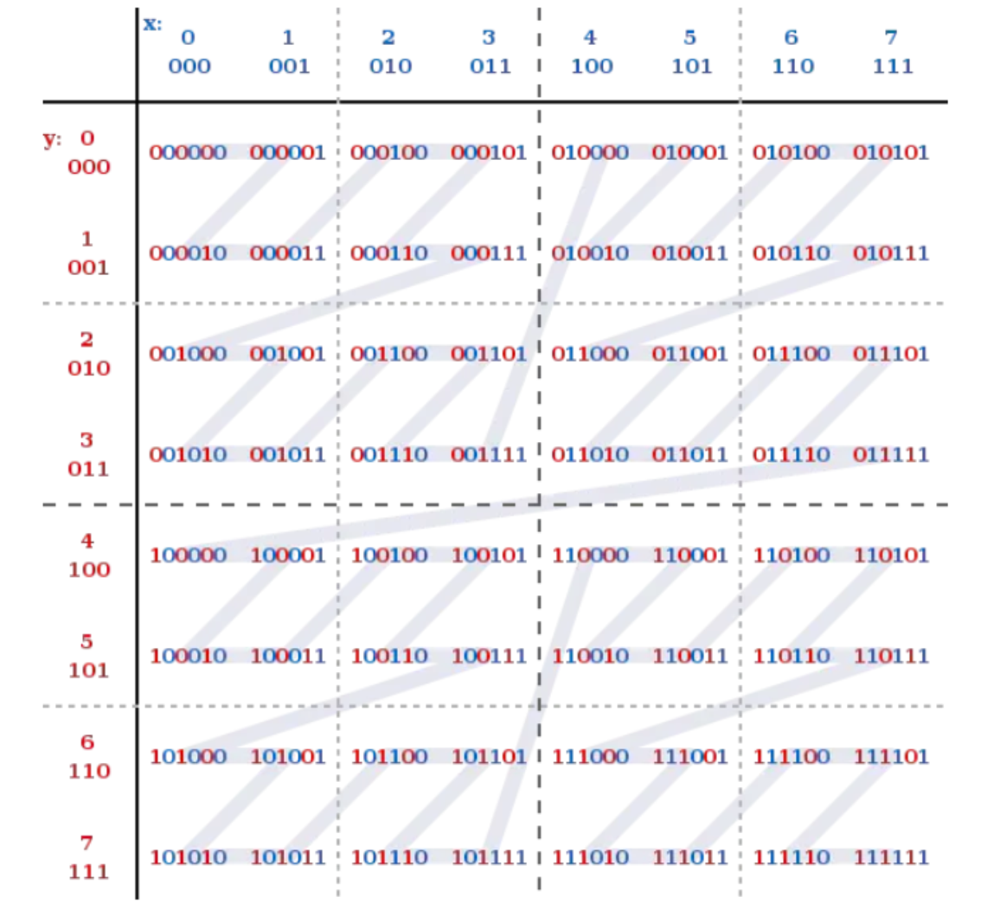

**Base32编码**
		Base32这种数据编码机制，主要用来把二进制数据编码成可见的字符串，其编码规则是：任意给定一个二进制数据，以5个位(bit)为一组进行切分(base64以6个位(bit)为一组)，对切分而成的每个组进行编码得到1个可见字符。Base32编码表字符集中的字符总数为32个（0-9、b-z去掉a、i、l、o），这也是Base32名字的由来。  

**geohash算法**

​		Gustavo在2008年2月上线了 geohash.org 网站。Geohash是一种地理位置信息编码方法。 经过geohash映射后，地球上任意位置的经纬度坐标可以表示成一个较短的字符串。可以方便的存储在数据库中，附在邮件上，以及方便的使用在其他服务中。以北京的坐标举例，[39.928167,116.389550]可以转换成 wx4g0s8q3jf9 。  