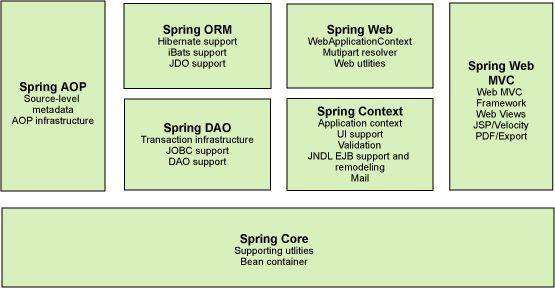
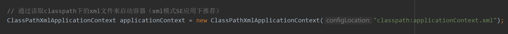
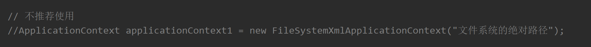
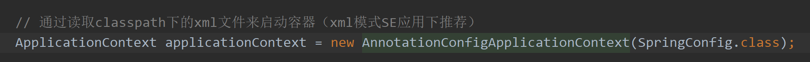
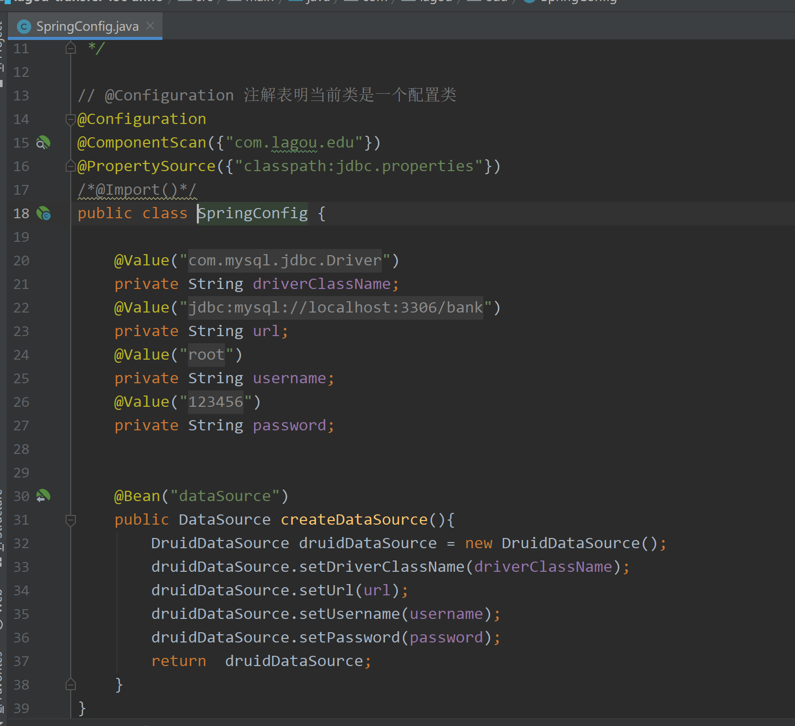
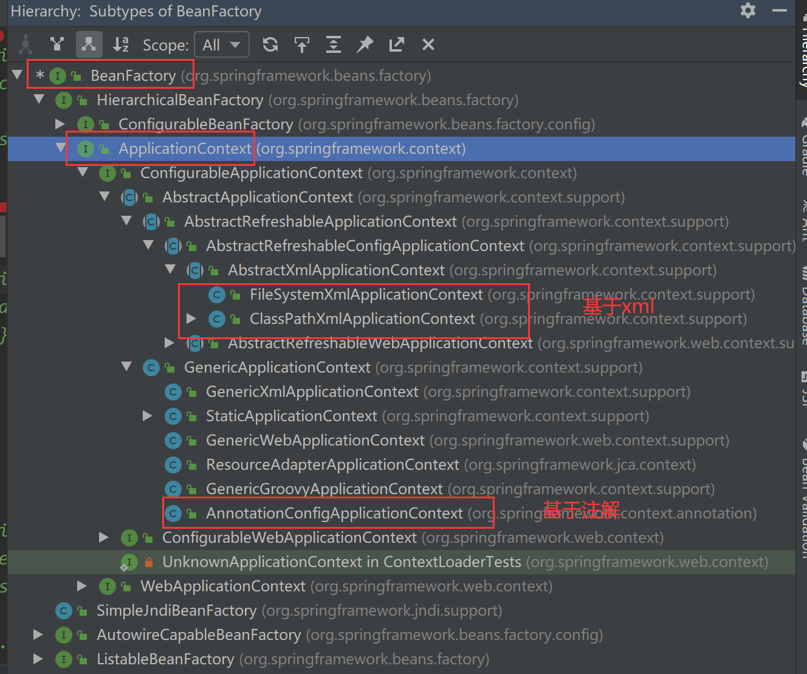
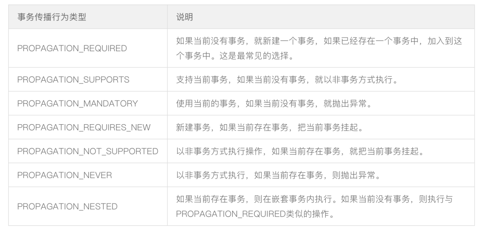
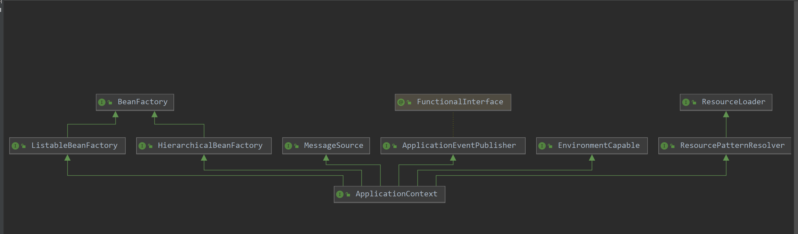

### Spring

#### 一、Spring简介

​		Spring 是分层的 full-stack（全栈） 轻量级开源框架，以 IoC 和 AOP 为内核，提供了展现层 SpringMVC 和业务层事务管理等众多的企业级应⽤技术，还能整合开源世界众多著名的第三⽅框架和类库，已经成为使⽤最多的 Java EE 企业应⽤开源框架 。

#### 二、内核思想

##### 1、IOC（Inversion of Control）控制反转

​		IOC是一种设计思想，可以用来降低计算机代码之间的耦合度。由一个调控系统管理创建设计好的对象，在需要使用对象时，由调控系统去提供。即原本由程序主动去创建依赖对象，现在由调控系统控制。由自己在对象中主动控制去直接获取依赖对象，反转为由调控系统帮我们查找及注入依赖对象。

##### 2、AOP（aspect oriented Programming）面向切面编程

​		AOP面向切面编程，可以通过预编译方式和运行期动态代理实现在不修改源代码的情况下给程序动态统一添加功能的一种技术。是对OOP面向对象的延续和补充，拆分业务代码和横切逻辑代码 ，在不改变原有业务逻辑情况下，增强横切逻辑代码，根本上解耦合，避免横切逻辑代码重复。

##### 3、DI（Dependancy Injection）依赖注入

​		DI依赖注入是我们实现控制反转的一种手段。把程序运行所需要的外部资源通过容器加载注入给程序内的对象，例如：当实例化对象A需要依赖对象B时，由spring容器去实例化对象B注入给A。

#### 三、Spring架构



- **核心容器**：核心容器提供 Spring 框架的基本功能。核心容器的主要组件是BeanFactory，它是工厂模式的实现。BeanFactory 使用*控制反转*（IOC） 模式将应用程序的配置和依赖性规范与实际的应用程序代码分开。
- **Spring 上下文**：Spring 上下文是一个配置文件，向 Spring 框架提供上下文信息。Spring 上下文包括企业服务，例如 JNDI、EJB、电子邮件、国际化、校验和调度功能。
- **Spring AOP**：通过配置管理特性，Spring AOP 模块直接将面向切面的编程功能 , 集成到了 Spring 框架中。所以，可以很容易地使 Spring 框架管理任何支持 AOP的对象。Spring AOP 模块为基于 Spring 的应用程序中的对象提供了事务管理服务。通过使用 Spring AOP，不用依赖组件，就可以将声明性事务管理集成到应用程序中。
- **Spring DAO**：JDBC DAO 抽象层提供了有意义的异常层次结构，可用该结构来管理异常处理和不同数据库供应商抛出的错误消息。异常层次结构简化了错误处理，并且极大地降低了需要编写的异常代码数量（例如打开和关闭连接）。Spring DAO 的面向 JDBC 的异常遵从通用的 DAO 异常层次结构。
- **Spring ORM**：Spring 框架插入了若干个 ORM 框架，从而提供了 ORM 的对象关系工具，其中包括 JDO、Hibernate 和 iBatis SQL Map。所有这些都遵从 Spring 的通用事务和 DAO 异常层次结构。
- **Spring Web 模块**：Web 上下文模块建立在应用程序上下文模块之上，为基于 Web 的应用程序提供了上下文。所以，Spring 框架支持与 Jakarta Struts 的集成。Web 模块还简化了处理多部分请求以及将请求参数绑定到域对象的工作。
- **Spring MVC 框架**：MVC 框架是一个全功能的构建 Web 应用程序的 MVC 实现。通过策略接口，MVC 框架变成为高度可配置的，MVC 容纳了大量视图技术，其中包括 JSP、Velocity、Tiles、iText 和 POI。

#### 四、Spring使用

##### 4.1 启动IOC容器

###### 4.1.1  Java环境下启动IoC容器

* **ClassPathXmlApplicationContext**：从类的根路径下加载配置⽂件（推荐使⽤）

  

* **FileSystemXmlApplicationContext**：从磁盘路径上加载配置⽂件

  

* **AnnotationConfigApplicationContext**：纯注解模式下启动Spring容器

  

  




###### 4.1.2 Web 环境下启动 IOC 容器

* **从 xml 启动**

  web.xml 配置如下：

  ```xml
  <!DOCTYPE web-app PUBLIC
   "-//Sun Microsystems, Inc.//DTD Web Application 2.3//EN"
   "http://java.sun.com/dtd/web-app_2_3.dtd" >
  <web-app>
    <display-name>Archetype Created Web Application</display-name>
  
    <!--配置Spring ioc容器的配置文件-->
    <context-param>
      <param-name>contextConfigLocation</param-name>
      <param-value>classpath:applicationContext.xml</param-value>
    </context-param>
    <!--使用监听器启动Spring的IOC容器-->
    <listener>
      <listener-class>org.springframework.web.context.ContextLoaderListener</listener-class>
    </listener>
  </web-app>
  ```

* **从配置类启动器**

  web.xml 配置：

  ```xml
  <!DOCTYPE web-app PUBLIC
   "-//Sun Microsystems, Inc.//DTD Web Application 2.3//EN"
   "http://java.sun.com/dtd/web-app_2_3.dtd" >
  
  <web-app>
    <display-name>Archetype Created Web Application</display-name>
  
    <!--告诉ContextloaderListener知道我们使用注解的方式启动ioc容器-->
    <context-param>
      <param-name>contextClass</param-name>
      <param-value>org.springframework.web.context.support.AnnotationConfigWebApplicationContext</param-value>
    </context-param>
    <!--配置启动类的全限定类名-->
    <context-param>
      <param-name>contextConfigLocation</param-name>
      <param-value>com.lagou.edu.SpringConfig</param-value>
    </context-param>
    <!--使用监听器启动Spring的IOC容器-->
    <listener>
      <listener-class>org.springframework.web.context.ContextLoaderListener</listener-class>
    </listener>
  </web-app>
  ```

  

##### 4.2 bean标签属性

| 属性           | 描述                                                         |
| -------------- | ------------------------------------------------------------ |
| id             | bean的唯⼀标识。                                             |
| class          | 指定创建Bean对象的全限定类名。                               |
| name           | 给bean提供⼀个或多个名称，多个名称⽤空格分隔。               |
| factory-bean   | 指定创建当前bean对象的⼯⼚bean的唯⼀标识。当指定了此属性之后，<br/>class属性失效。 |
| factory-method | ⽤于指定创建当前bean对象的⼯⼚⽅法，如配合factory-bean属性使⽤，<br/>则class属性失效。如配合class属性使⽤，则⽅法必须是static的。 |
| scope          | 指定bean对象的作⽤范围。通常情况下就是singleton。当要⽤到多例模式时，<br/>可以配置为prototype。 |
| init-method    | 指定bean对象的初始化⽅法，此⽅法会在bean对象装配后调⽤。必须是<br/>⼀个⽆参⽅法。 |
| destory-method | 指定bean对象的销毁⽅法，此⽅法会在bean对象销毁前执⾏。它只<br/>能为scope是singleton时起作⽤。 |
| lazy-init      | 是否延迟加载。                                               |

##### 4.3 bean实例化的方式

###### 4.3.1 xml配置

* 使用⽆参构造函数

  ```xml
  <bean id="userService" class="com.lagou.service.impl.TransferServiceImpl"></bean>
  ```

* 使⽤静态⽅法

  ```xml
  <bean id="userService" class="com.lagou.factory.BeanFactory" 
  factory-method="getTransferService"></bean>
  ```

* 使⽤实例化⽅法

  ```xml
  <bean id="beanFactory"
  class="com.lagou.factory.instancemethod.BeanFactory"></bean>
  <bean id="transferService" factory-bean="beanFactory" factorymethod="getTransferService"></bean>
  ```
  
  **applicationContext.xml 示例：**
  
  ```xml
  <?xml version="1.0" encoding="UTF-8"?>
  <!--跟标签beans，里面配置一个又一个的bean子标签，每一个bean子标签都代表一个类的配置-->
  <beans xmlns="http://www.springframework.org/schema/beans"
         xmlns:tx="http://www.springframework.org/schema/tx"
         xmlns:xsi="http://www.w3.org/2001/XMLSchema-instance"
         xsi:schemaLocation="
          http://www.springframework.org/schema/beans
          https://www.springframework.org/schema/beans/spring-beans.xsd
          http://www.springframework.org/schema/tx
          https://www.springframework.org/schema/tx/spring-tx.xsd
  ">
  
      <!--id标识对象，class是类的全限定类名-->
      <!--scope：定义bean的作用范围
                  singleton：单例，IOC容器中只有一个该类对象，默认为singleton
                  prototype：原型(多例)，每次使用该类的对象（getBean），都返回给你一个新的对象，Spring只创建对象，不管理对象
      -->
      <bean id="accountDao" class="com.lagou.edu.dao.impl.JdbcTemplateDaoImpl" scope="singleton" init-method="init" destroy-method="destory">
  
          <!--set注入使用property标签，如果注入的是另外一个bean那么使用ref属性，如果注入的是普通值那么使用的是value属性-->
          <!--<property name="ConnectionUtils" ref="connectionUtils"/>
          <property name="name" value="zhangsan"/>
          <property name="sex" value="1"/>
          <property name="money" value="100.3"/>-->
  
          <!--<constructor-arg index="0" ref="connectionUtils"/>
          <constructor-arg index="1" value="zhangsan"/>
          <constructor-arg index="2" value="1"/>
          <constructor-arg index="3" value="100.5"/>-->
  
          <!--name：按照参数名称注入，index按照参数索引位置注入-->
          <constructor-arg name="connectionUtils" ref="connectionUtils"/>
          <constructor-arg name="name" value="zhangsan"/>
          <constructor-arg name="sex" value="1"/>
          <constructor-arg name="money" value="100.6"/>
  
          <!--set注入注入复杂数据类型-->
          <property name="myArray">
              <array>
                  <value>array1</value>
                  <value>array2</value>
                  <value>array3</value>
              </array>
          </property>
  
          <property name="myMap">
              <map>
                  <entry key="key1" value="value1"/>
                  <entry key="key2" value="value2"/>
              </map>
          </property>
  
          <property name="mySet">
              <set>
                  <value>set1</value>
                  <value>set2</value>
              </set>
          </property>
  
          <property name="myProperties">
              <props>
                  <prop key="prop1">value1</prop>
                  <prop key="prop2">value2</prop>
              </props>
          </property>
  
      </bean>
      <bean id="transferService" class="com.lagou.edu.service.impl.TransferServiceImpl">
          <!--set+ name 之后锁定到传值的set方法了，通过反射技术可以调用该方法传入对应的值-->
          <property name="AccountDao" ref="accountDao"></property>
      </bean>
  
      <!--事务管理器-->
      <bean id="transactionManager" class="com.lagou.edu.utils.TransactionManager">
          <property name="ConnectionUtils" ref="connectionUtils"/>
      </bean>
  
      <!--代理对象工厂-->
      <bean id="proxyFactory" class="com.lagou.edu.factory.ProxyFactory">
          <property name="TransactionManager" ref="transactionManager"/>
      </bean>
  
      <!--Spring ioc 实例化Bean的三种方式-->
      <!--方式一：使用无参构造器（推荐）-->
      <bean id="connectionUtils" class="com.lagou.edu.utils.ConnectionUtils"></bean>
  
      <!--另外两种方式是为了我们自己new的对象加入到SpringIOC容器管理-->
      <!--方式二：静态方法-->
      <!--<bean id="connectionUtils" class="com.lagou.edu.factory.CreateBeanFactory" factory-method="getInstanceStatic"/>-->
      <!--方式三：实例化方法-->
      <!--<bean id="createBeanFactory" class="com.lagou.edu.factory.CreateBeanFactory"></bean>
      <bean id="connectionUtils" factory-bean="createBeanFactory" factory-method="getInstance"/>-->
  
      <!--lazy-init默认为false立即加载-->
      <bean id="accountPojo" class="com.lagou.edu.pojo.Account" lazy-init="true"/>
  </beans>
  ```

###### 4.3.2 注解方式

**@Configuration**  表明当前类是⼀个配置类

**@ComponentScan**  替代 context:component-scan  

**@PropertySource**  引⼊外部属性配置⽂件

**@Import**  引⼊其他配置类

**@Value**  对变量赋值，可以直接赋值，也可以使⽤ ${} 读取资源配置⽂件中的信息

**@Bean** 将⽅法返回对象加⼊ SpringIOC 容器  

```java
package com.lagou.edu;

import com.alibaba.druid.pool.DruidDataSource;
import org.springframework.beans.factory.annotation.Value;
import org.springframework.context.annotation.*;

import javax.sql.DataSource;


@Configuration  // 表明当前类是一个配置类
@ComponentScan({"com.lagou.edu"})
@PropertySource({"classpath:jdbc.properties"})
/*@Import()*/  // 可以导入其他配置类
public class SpringConfig {

    @Value("${jdbc.driver}")
    private String driverClassName;
    @Value("${jdbc.url}")
    private String url;
    @Value("${jdbc.username}")
    private String username;
    @Value("${jdbc.password}")
    private String password;

    @Bean("dataSource")
    public DataSource createDataSource(){
        DruidDataSource druidDataSource = new DruidDataSource();
        druidDataSource.setDriverClassName(driverClassName);
        druidDataSource.setUrl(url);
        druidDataSource.setUsername(username);
        druidDataSource.setPassword(password);
        return  druidDataSource;
    }
}
```


##### bean的作用域

| 作用域      | 描述                                                         |
| ----------- | ------------------------------------------------------------ |
| singleton   | （默认）在每个Spring IoC容器中，一个bean定义对应只会有唯一的一个bean实例。 |
| prototype   | 一个bean定义可以有多个bean实例。                             |
| request     | 一个bean定义对应于单个HTTP 请求的生命周期。也就是说，每个HTTP 请求都有一个bean实例，且该实例仅在这个HTTP 请求的生命周期里有效。该作用域仅适用于WebApplicationContext环境。 |
| session     | 一个bean 定义对应于单个HTTP Session 的生命周期，也就是说，每个HTTP Session 都有一个bean实例，且该实例仅在这个HTTP Session 的生命周期里有效。该作用域仅适用于WebApplicationContext环境。 |
| application | 一个bean 定义对应于单个ServletContext 的生命周期。该作用域仅适用于WebApplicationContext环境。 |
| websocket   | 一个bean 定义对应于单个websocket 的生命周期。该作用域仅适用于WebApplicationContext环境。 |

##### Spring事务传播行为

​		事务传播行为用来描述由某一个事务传播行为修饰的方法被嵌套进另一个方法的时事务如何传播。



#### 五、Spring 源码

##### 5.1 BeanFactory与ApplicationContext区别

​		BeanFactory 是 Spring 框架中 IoC 容器的顶层接⼝，它只是⽤来定义⼀些基础功能，定义⼀些基础规范，⽽ApplicationContext是它的⼀个⼦接⼝，所以ApplicationContext是具备BeanFactory提供的全部功能的。  

​		通常，我们称BeanFactory为SpringIOC的基础容器， ApplicationContext是容器的⾼级接⼝，⽐BeanFactory要拥有更多的功能，⽐如说国际化⽀持和资源访问（xml， java配置类）等等  



##### 5.2 FactoryBean 和 BeanFactory

​		BeanFactory 接⼝是容器的顶级接⼝，定义了容器的⼀些基础⾏为，负责⽣产和管理 Bean 的⼀个⼯⼚，具体使⽤它下⾯的⼦接⼝类型，⽐如ApplicationContext。

​		FactoryBean 是一个一种工厂 Bean。Spring 中 Bean有两种，⼀种是普通 Bean，⼀种是⼯⼚ Bean， FactoryBean 可以⽣成某⼀个类型的Bean实例（返回给我们），也就是说我们可以借助于它⾃定义Bean的创建过程。Bean创建的三种⽅式中的静态⽅法和实例化⽅法和FactoryBean作⽤类似， FactoryBean使⽤较多，尤
其在Spring框架⼀些组件中会使⽤，还有其他框架和Spring框架整合时使⽤。