### SpringBoot

​		SpringBoot 的设计是为了让尽可能快的跑起来 Spring 应用程序并且尽可能减少你的配置文件，使约定优于配置(Convention over Configuration)。


#### 一、SpringBoot应用

##### 1、热部署

###### 	1.1 热部署配置

* **引入热部署依赖**

  ```xml
  <!-- 引入热部署依赖 -->
  <dependency>
  	<groupId>org.springframework.boot</groupId>
  	<artifactId>spring-boot-devtools</artifactId>
  </dependency>
  ```

* **IDEA配置开启自动编译**

  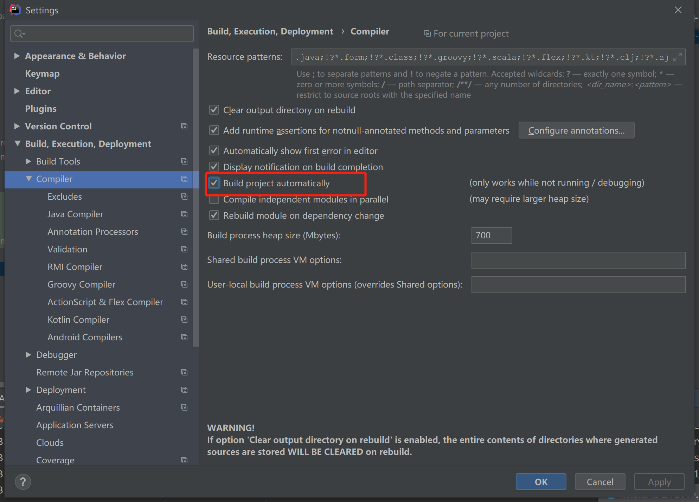

* IDEA**配置在运行过程中自动编译（Ctrl+Shift+Alt+/”打开Maintenance选项框）**

  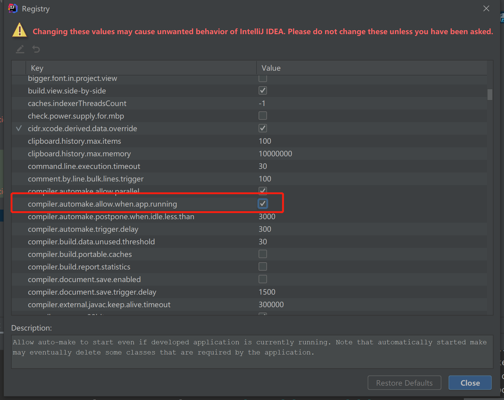

###### 1.2 热部署排除资源

​		某些资源在更改后不一定需要触发重新启动。  可以在 application.properties 里配置

```properties 
spring.devtools.restart.exclude=static/**,public/**
```

##### 2、配置文件

###### 	**2.1 properties配置信息注入实体类**

* 引入SpringBoot配置处理器依赖

  ```xml
  <dependency>
  	<groupId>org.springframework.boot</groupId>
      <artifactId>spring-boot-configuration-processor</artifactId>
      <optional>true</optional>
  </dependency>
  ```

* 实体类，使用 @Component 将类加入Spring IOC 容器中，@ConfigurationProperties(prefix = "person")  将配置文件中以person开头的属性注入到该类中

  ```java
  package com.lagou.pojo;
  
  import lombok.Data;
  import org.springframework.boot.context.properties.ConfigurationProperties;
  import org.springframework.stereotype.Component;
  
  import java.util.List;
  import java.util.Map;
  
  @Data
  @Component
  @ConfigurationProperties(prefix = "person")
  public class Person {
      private String name;
      private List<String> hobby;
      private String[] family;
      private Map<String, Object> map;
      private Pet pet;
  }
  ```

  ```java
  package com.lagou.pojo;
  
  import lombok.Data;
  
  @Data
  public class Pet {
      private String type;
      private String name;
  }
  ```

* 配置文件 application.properties

  ```properties
  person.name=ZhangSan
  person.family=mother,father
  person.hobby=吃饭,睡觉
  person.map.k1 = v1
  person.map.k2 = v2
  person.pet.name = 旺财
  person.pet.type = dog
  ```

* 运行结果

  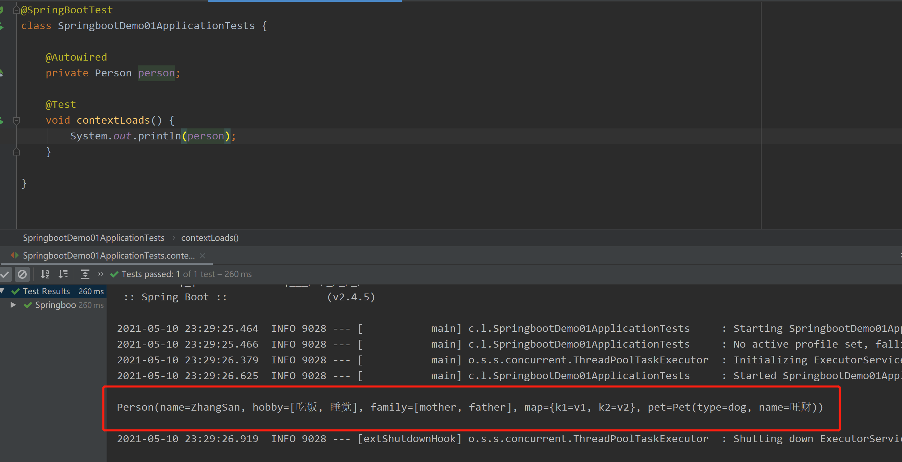

  

  ###### **2.2 yml配置方式  application.yml**

```yaml
spring:
  devtools:
    restart:
      exclude: [static/**,public/**]
person:
  name: LiSi
  family: [mother, father]
  hobby: [吃饭, 睡觉]
  map: {k1: v1,k2: v2}
  pet: {name: 大黄,type: dog}

```

​		

###### 	2.3 配置批量注入

​	@Configuration 标识该类为一个配置类

​	@EnableConfigurationProperties 使用该注解用于启用应用对另外一个注解 @ConfigurationProperties 的支持

​	@ConfigurationProperties  批量注入配置信息

```java
package com.lagou.pojo;

import lombok.Data;
import org.springframework.boot.context.properties.ConfigurationProperties;
import org.springframework.boot.context.properties.EnableConfigurationProperties;
import org.springframework.context.annotation.Configuration;

@Configuration
@EnableConfigurationProperties(JdbcProperties.class)
@ConfigurationProperties(prefix = "jdbc")
@Data
public class JdbcProperties {

    private String url;

    private String driver;

    private String username;

    private String password;
}

```


###### 	2.3 第三方配置

​	@ConfigurationProperties 用于注释类之外，还可以在公共 @Bean 方法上使用它。可以将属性绑定到控件之外的第三方组件。

```java
@Data
public class AnotherComponent {
	private boolean enabled;
	private InetAddress remoteAddress;
}
```

```java
@Configuration
public class MyService {
    @ConfigurationProperties("another")
    @Bean
    public AnotherComponent anotherComponent(){
    	return new AnotherComponent();
    }
}
```

```properties
another.enabled=true
another.remoteAddress=192.168.10.11
```


###### 	2.4 松散绑定

​			Spring Boot使用一些宽松的规则将环境属性绑定到@ConfigurationProperties bean，因此环境属性名和bean属性名之间不需要完全匹配

```java
@Data
@Component
@ConfigurationProperties("acme.my-person.person")
public class OwnerProperties {
	private String firstName;
}
```

```yaml
acme:
	my-person:
		person:
			first-name: 泰森
```


##### 3、日志框架

###### 3.1、SLF4J 结合各种日志框架的官方示例

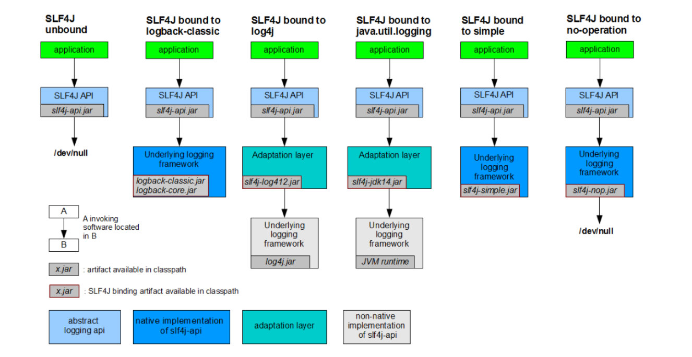

​		在项目中存在着各种不同的第三方 jar  时，可以使用一种和要替换的日志框架类完全一样的 jar 进行替换，这样不至于原来的第三方 jar 报错，而这个替换的 jar 其实使用了 SLF4J API.。这样项目中的日志就都可以通过 SLF4J API 结合自己选择的框架进行日志输出。

​		统一日志框架使用步骤归纳如下：1.排除系统中的其他日志框架。2.使用中间包替换要替换的日志框架。3.导入我们选择的 SLF4J 实现    

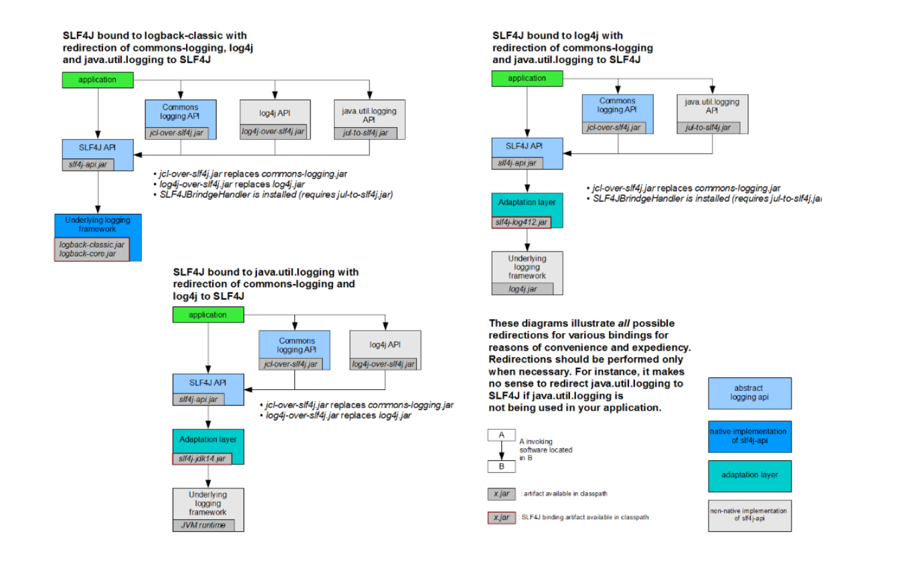

###### 3.2 自定义日志输出

```properties
# 日志配置
# 指定具体包的日志级别
logging.level.com.lagou=debug
# 控制台和日志文件输出格式
logging.pattern.console=%d{yyyy-MM-dd HH:mm:ss.SSS} [%thread] %-5level%logger{50} - %msg%n
logging.pattern.file=%d{yyyy-MM-dd HH:mm:ss.SSS} [%thread] %-5level %logger{50} - %msg%n
# 日志输出路径，默认文件spring.log
logging.file.path=spring.log
```

###### 3.3 替换日志框架

​		替换日志框架为 Log4j2   

```xml
<dependency>
	<groupId>org.springframework.boot</groupId>
	<artifactId>spring-boot-starter-web</artifactId>
	<exclusions>
		<exclusion>
			<artifactId>spring-boot-starter-logging</artifactId>
			<groupId>org.springframework.boot</groupId>
		</exclusion>
	</exclusions>
</dependency>

<dependency>
	<groupId>org.springframework.boot</groupId>
	<artifactId>spring-boot-starter-log4j2</artifactId>
</dependency>
```


#### 二、SpringBoot 源码

##### 1、SpringBoot 源码构建

###### 1.1 环境

* JDK 1.8+
* Maven 3.5+

###### 1.2 下载源码

https://github.com/spring-projects/spring-boot/releases  （当前使用spring-boot-2.2.9.RELEASE）

###### 1.3 编译源码

* 进⼊spring-boot源码根⽬录
* 执⾏mvn命令: mvn clean install -DskipTests -Pfast

###### 1.4 IDEA 打开工程

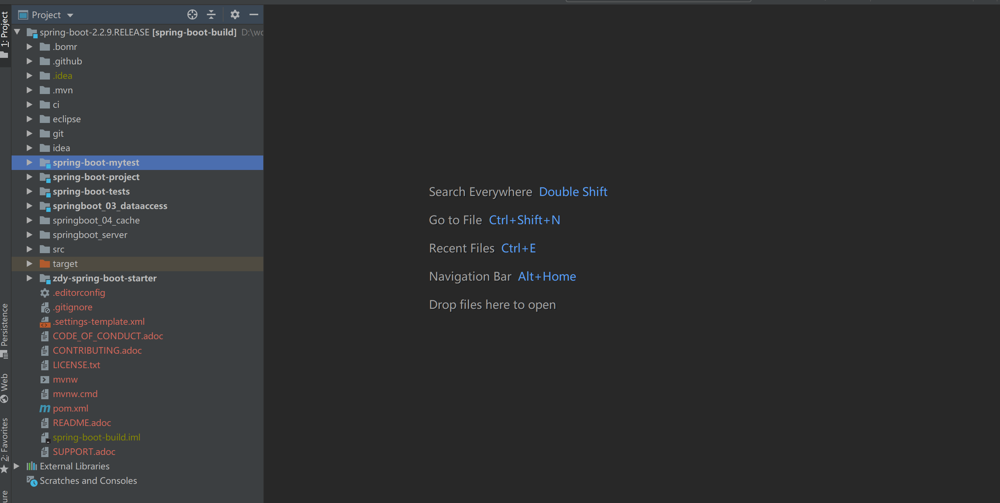

disable.checks 报红处理

```xml
<properties>
	<revision>2.2.9.RELEASE</revision>
	<main.basedir>${basedir}</main.basedir>
	<disable.checks>true</disable.checks>
</properties>
```

###### 1.5 新建一个module

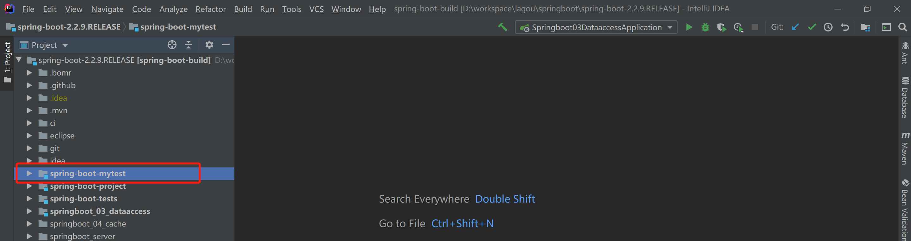

Springboot 依赖版本要注意和下载的一样

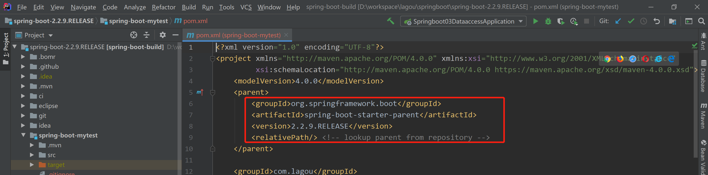

建好测试类

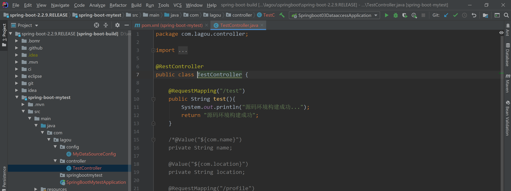


##### 2、SpringBoot 自动配置原理

##### 3、SpringBoot run 方法执行流程

###### 3.1 run 方法执行流程及作用

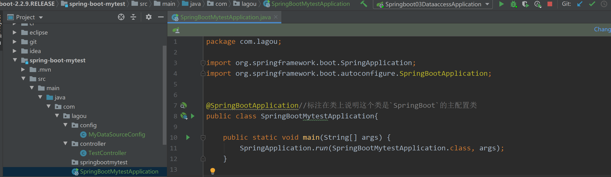

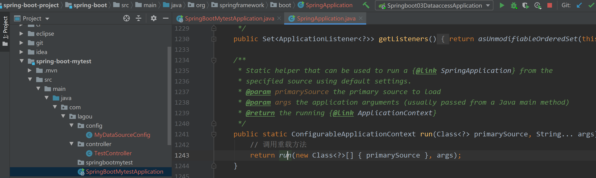

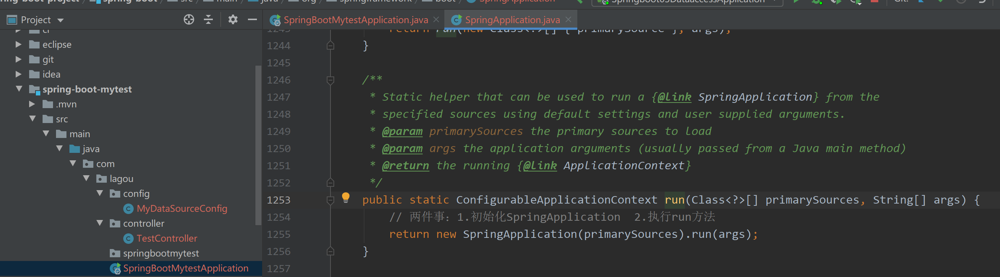

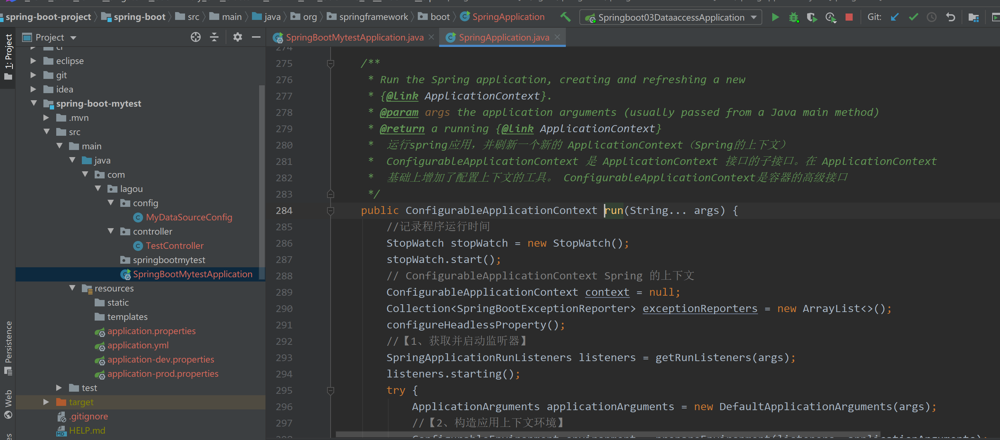

run 方法执行的六个步骤

1. **获取并启动监听器**
2. **构造应用上下文环境**
3. **初始化应用上下文**
4. **刷新应用上下文前的准备阶段**
5. **刷新应用上下文**
6. **刷新应用上下文后的扩展接口**

```java
	public ConfigurableApplicationContext run(String... args) {
		//记录程序运行时间
		StopWatch stopWatch = new StopWatch();
		stopWatch.start();
		// ConfigurableApplicationContext Spring 的上下文
		ConfigurableApplicationContext context = null;
		Collection<SpringBootExceptionReporter> exceptionReporters = new ArrayList<>();
		configureHeadlessProperty();
		//【1、获取并启动监听器】
		SpringApplicationRunListeners listeners = getRunListeners(args);
        // 启动监听器
		listeners.starting();
		try {
			ApplicationArguments applicationArguments = new DefaultApplicationArguments(args);
			//【2、构造应用上下文环境】
			ConfigurableEnvironment environment = prepareEnvironment(listeners, applicationArguments);
			//处理需要忽略的Bean
			configureIgnoreBeanInfo(environment);
			//打印banner
			Banner printedBanner = printBanner(environment);
			///【3、初始化应用上下文】
			context = createApplicationContext();
			//实例化SpringBootExceptionReporter.class，用来支持报告关于启动的错误
			exceptionReporters = getSpringFactoriesInstances(SpringBootExceptionReporter.class,
					new Class[] { ConfigurableApplicationContext.class }, context);
			//【4、刷新应用上下文前的准备阶段】
			prepareContext(context, environment, listeners, applicationArguments, printedBanner);
			//【5、刷新应用上下文】
			refreshContext(context);
			//【6、刷新应用上下文后的扩展接口】
			afterRefresh(context, applicationArguments);
			//时间记录停止
			stopWatch.stop();
			if (this.logStartupInfo) {
				new StartupInfoLogger(this.mainApplicationClass).logStarted(getApplicationLog(), stopWatch);
			}
			//发布容器启动完成事件
			listeners.started(context);
			callRunners(context, applicationArguments);
		}
		catch (Throwable ex) {
			handleRunFailure(context, ex, exceptionReporters, listeners);
			throw new IllegalStateException(ex);
		}

		try {
			listeners.running(context);
		}
		catch (Throwable ex) {
			handleRunFailure(context, ex, exceptionReporters, null);
			throw new IllegalStateException(ex);
		}
		return context;
	}
```


##### 4、自定义 Start

###### 4.1 SpringBoot Start 机制

​		SpringBoot中的starter是一种非常重要的机制，能够抛弃以前繁杂的配置，将其统一集成进starter，应用者只需要在maven中引入starter依赖，SpringBoot就能自动扫描到要加载的信息并启动相应的默认配置。Starter让我们摆脱了各种依赖库的处理，需要配置各种信息的困扰。
​		SpringBoot会自动通过classpath路径下的类发现需要的Bean，并注册进IOC容器。SpringBoot提供了针对日常企业应用研发各种场景的spring-boot-starter依赖模块。所有这些依赖模块都遵循着约定成俗的默认配置，并允许我们调整这些配置，即遵循“约定大于配置”的理念。  

###### 4.2 自定义starter的命名规则

​		SpringBoot提供的starter以 spring-boot-starter-xxx 的方式命名的。

​		官方建议自定义的starter使用 xxx-spring-boot-starter 命名规则。以区分SpringBoot生态提供的starter。

###### 4.3 自定义starter代码实现

* 新建 maven jar 工程，工程名为 zdy-spring-boot-starter，导入依赖：

  ```xml
  <dependencies>
  	<dependency>
  		<groupId>org.springframework.boot</groupId>
  		<artifactId>spring-boot-autoconfigure</artifactId>
  		<version>2.2.9.RELEASE</version>
  	</dependency>
  </dependencies>
  ```

* 编写 JavaBean

  ```java
  package com.lagou.pojo;
  
  import lombok.Data;
  import org.springframework.boot.context.properties.ConfigurationProperties;
  import org.springframework.boot.context.properties.EnableConfigurationProperties;
  
  @Data
  @EnableConfigurationProperties
  @ConfigurationProperties(prefix = "simplebean")
  public class SimpleBean {
  
  	private int id;
  	private String name;
  }
  
  ```

* 编写配置类 MyAutoConfiguration

  ```java
  package com.lagou.config;
  
  import com.lagou.pojo.SimpleBean;
  import org.springframework.boot.autoconfigure.condition.ConditionalOnBean;
  import org.springframework.context.annotation.Bean;
  import org.springframework.context.annotation.Configuration;
  
  @Configuration
  public class MyAutoConfiguration {
  
  	static {
  		System.out.println("MyAutoConfiguration init.... ");
  	}
  
  	@Bean
  	public SimpleBean simpleBean(){
  		return new SimpleBean();
  	}
  
  }
  
  ```

* resources下创建/META-INF/spring.factories ，配置编写的自动配置类

  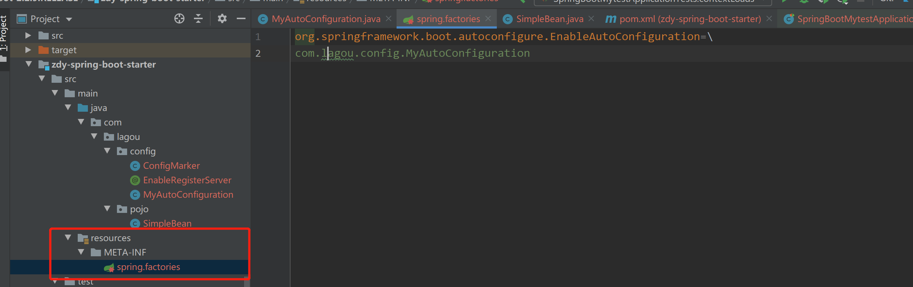

  ```properties
  org.springframework.boot.autoconfigure.EnableAutoConfiguration=\
  com.lagou.config.MyAutoConfiguration
  ```

* 使用自定义 starter，导入自定义 starter 依赖，在全局配置文件中配置属性值

  ```xml
  <dependency>
  	<groupId>com.lagou</groupId>
  	<artifactId>zdy-spring-boot-starter</artifactId>
  	<version>1.0-SNAPSHOT</version>
  </dependency>
  ```

  ```properties
  simplebean.id=1
  simplebean.name=zhangsan
  ```

###### 4.4 热插拔技术

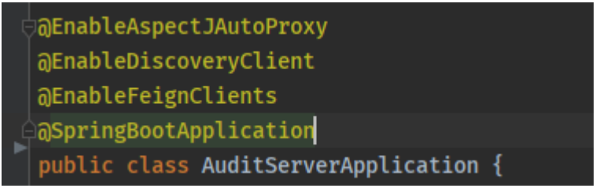

​		@Enablexxx注解就是一种热拔插技术，加了这个注解就可以启动对应的starter，当不需要对应的starter的时候只需要把这个注解注释掉就行。

​		改造自定义 starter 工程支持热插拔

* 新增标记类ConfigMarker

  ```java
  package com.lagou.config;
  
  public class ConfigMarker {
  }
  ```

* 新增 EnableRegisterServer  注解

  ```java
  package com.lagou.config;
  
  
  import org.springframework.context.annotation.Import;
  
  import java.lang.annotation.ElementType;
  import java.lang.annotation.Retention;
  import java.lang.annotation.RetentionPolicy;
  import java.lang.annotation.Target;
  
  @Target(ElementType.TYPE)
  @Retention(RetentionPolicy.RUNTIME)
  @Import(ConfigMarker.class)
  public @interface EnableRegisterServer {
  }
  ```

* 改造 MyAutoConfiguration 新增条件注解 @ConditionalOnBean(ConfigMarker.class) ，
  @ConditionalOnBean 这个是条件注解，前面的意思代表只有当期上下文中含有 ConfigMarker对象，被标注的类才会被实例化 

  ```java
  package com.lagou.config;
  
  import com.lagou.pojo.SimpleBean;
  import org.springframework.boot.autoconfigure.condition.ConditionalOnBean;
  import org.springframework.context.annotation.Bean;
  import org.springframework.context.annotation.Configuration;
  
  @Configuration
  @ConditionalOnBean(ConfigMarker.class)
  public class MyAutoConfiguration {
  
  	static {
  		System.out.println("MyAutoConfiguration init.... ");
  	}
  
  	@Bean
  	public SimpleBean simpleBean(){
  		return new SimpleBean();
  	}
  
  }
  ```

##### 5、内嵌tomcat原理

SpringBoot支持Tomcat，Jetty，Undertow作为底层容器。
SpringBoot默认使用Tomcat，一旦引入spring-boot-starter-web模块，就默认使用Tomcat容器。

spring-boot-starter-web核心就是引入了tomcat和SpringMVC。

###### 5.1 切换servlet容器

* 将tomcat依赖移除
* 引入其他Servlet容器依赖

```xml
<dependency>
	<groupId>org.springframework.boot</groupId>
	<artifactId>spring-boot-starter-web</artifactId>
	<exclusions>
        <exclusion>
        <!--移除spring-boot-starter-web中的tomcat-->
		<artifactId>spring-boot-starter-tomcat</artifactId>
		<groupId>org.springframework.boot</groupId>
		<exclusion>
     </exclusions>
</dependency>
<dependency>
	<groupId>org.springframework.boot</groupId>
	<!--引入jetty-->
	<artifactId>spring-boot-starter-jetty</artifactId>
</dependency>
```

###### 5.2 内嵌 tomcat 源码

**进入 SpringBoot 启动类 @SpringBootApplication**

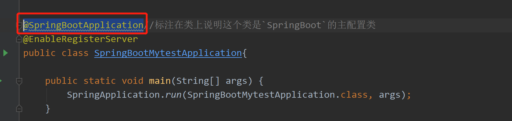

**找到自动配置注解 @EnableAutoConfiguration** 

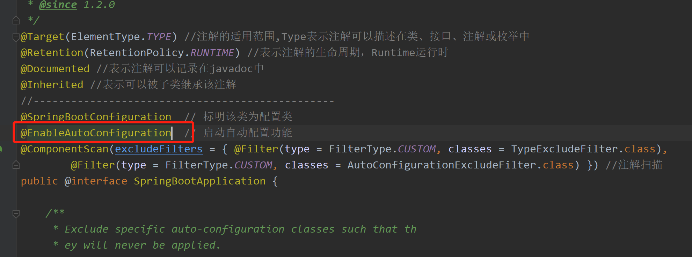

**@EnableAutoConfiguration 注解对 AutoConfigurationImportSelector 进行了引入**

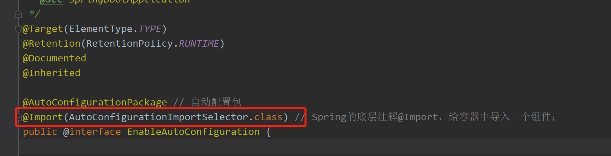

**首先调用 selectImport() 方法，在该方法中调用了 getAutoConfigurationEntry() 方法，在之中又调用了getCandidateConfigurations() 方法，getCandidateConfigurations() 方法就去 META-INF/spring.factory 配置文件中加载相关配置类**

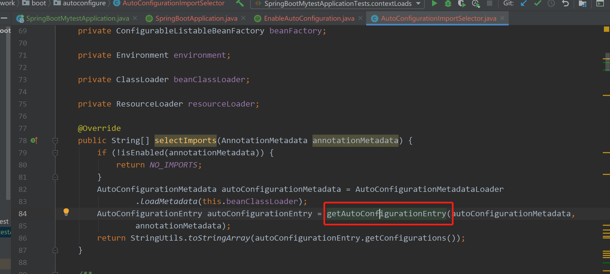

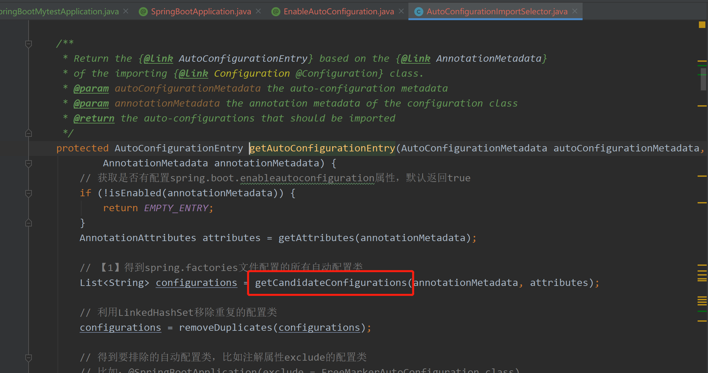

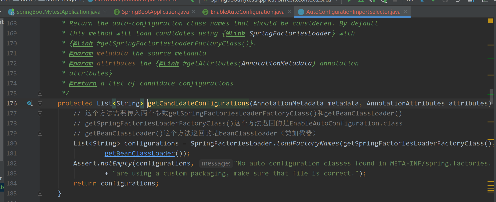

**tomcat 加载在 ServletWebServerFactoryAutoConfiguration 配置类中**  

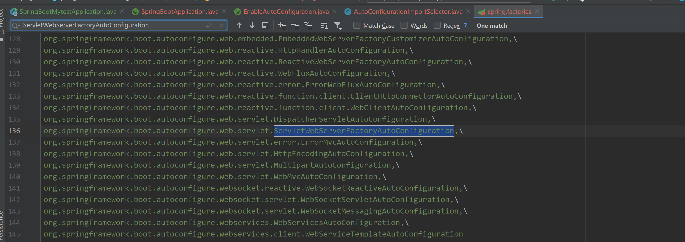

**通过@Import注解将EmbeddedTomcat、EmbeddedJetty、EmbeddedUndertow等嵌入式容器类加载进来了**  

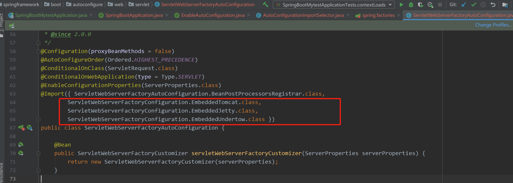

**EmbeddedTomcat 中实例化了 tomcat 工厂类**

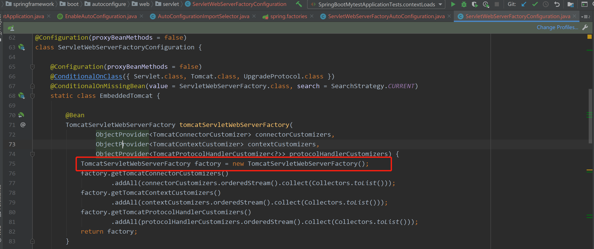

**在 TomcatServletWebServerFactory 的 getWebServer() 方法中，实例化了一个 tomcat，设置了 tomcat 相关信息**

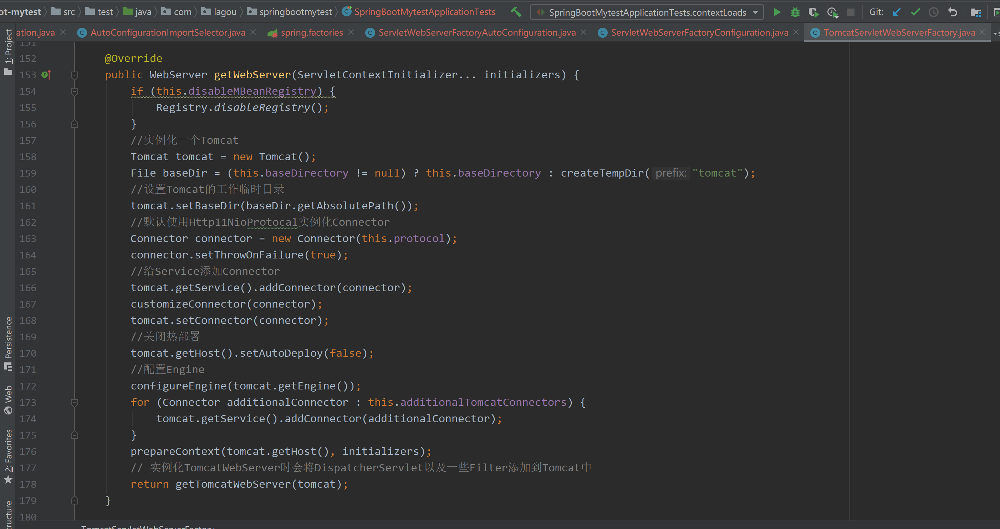

**一直进入 getTomcatWebServer() 方法，最终在 initialize() 方法中启动了 tomcat**

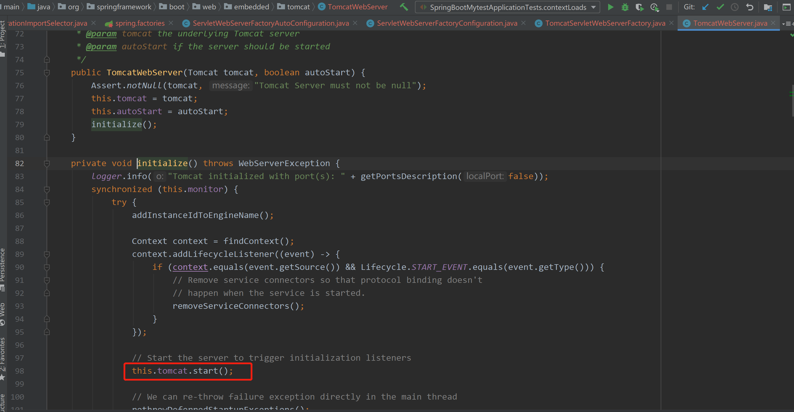

###### 5.3 getWebServer() 的调用分析  


##### 6、自动配置SpringMVC功能

​		普遍 web 项目使用 SpringMVC 需要配置 web.xml ，配置对应的DispatcherServlet 。

 ```xml
<servlet>
	<description>spring mvc servlet</description>
	<servlet-name>springMvc</servlet-name>
	<servletclass>org.springframework.web.servlet.DispatcherServlet</servlet-class>
	<load-on-startup>1</load-on-startup>
</servlet>
<servlet-mapping>
	<servlet-name>springMvc</servlet-name>
	<url-pattern>*.do</url-pattern>
</servlet-mapping>
 ```

​		在 Servlet3.0 规范中，要添加一个Servlet，处理采用xml配置的方式，还可以通过代码添加

```java
servletContext.addServlet(name, this.servlet);
```

###### 6.1 自动配置DispatcherServlet和DispatcherServletRegistry

SpringMVC 自动配置类

  ```java
org.springframework.boot.autoconfigure.web.servlet.DispatcherServletAutoConfiguration
  ```

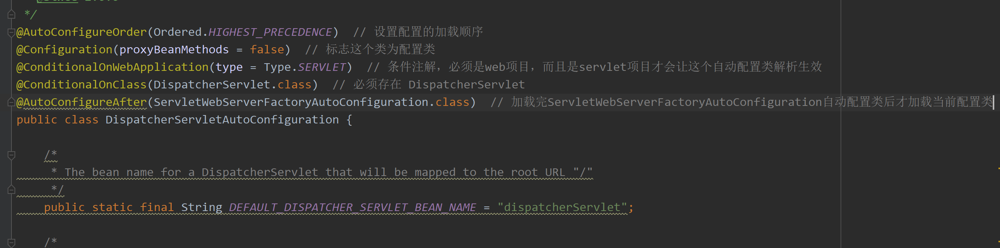

DispatcherServletAutoConfiguration主要包含两个内部类DispatcherServletConfiguration 和DispatcherServletRegistrationConfiguration 。

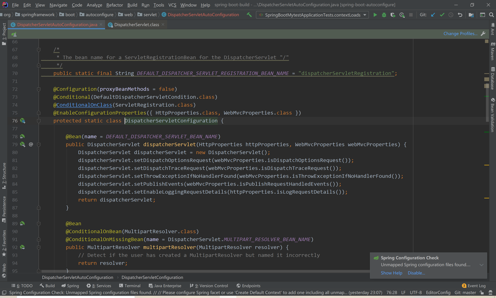

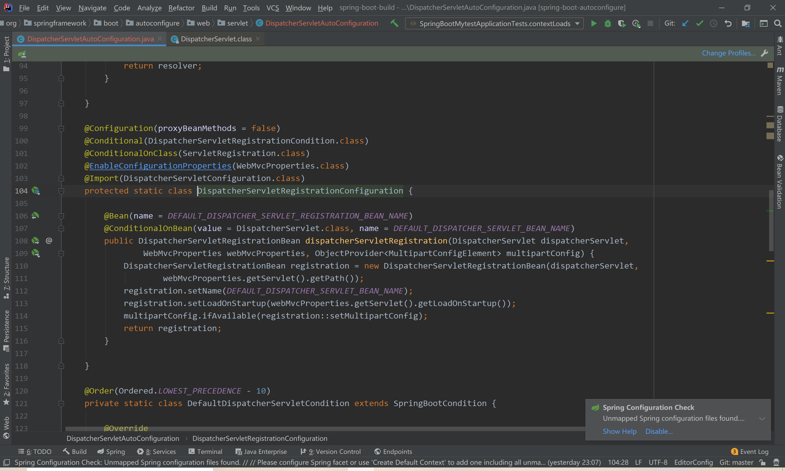

​		前者是配置DispatcherServlet，后者是配置DispatcherServlet的注册类。什么是注册类？我们知道Servlet实例是要被添加（注册）到如tomcat这样的ServletContext里的，这样才能够提供请求服务。所以，DispatcherServletRegistrationConfiguration将生成一个Bean，负责将
DispatcherServlet给注册到ServletContext中 。

**DispatcherServletConfiguration**这个内部类

​		@Conditional指明了一个前置条件判断，由DefaultDispatcherServletCondition实现。主要是判
断了是否已经存在DispatcherServlet，如果没有才会触发解析。
​		@ConditionalOnClass指明了当ServletRegistration这个类存在的时候才会触发解析，生成的
DispatcherServlet才能注册到ServletContext中。
​		最后，@EnableConfigrationProperties将会从application.properties这样的配置文件中读取
spring.http和spring.mvc前缀的属性生成配置对象HttpProperties和WebMvcProperties 。

​		dispatcherServlet方法将生成一个DispatcherServlet的Bean对象。比较简单，就是获取一个实
例，然后添加一些属性设置。
​		multipartResolver方法主要是把你配置的MultipartResolver的Bean给重命名一下，防止你不是用
multipartResolver这个名字作为Bean的名字。

**DispatcherServletRegistrationConfiguration**这个内部类

​		@Conditional有一个前置判断，DispatcherServletRegistrationCondition主要判断了该注册类的Bean是否存在。
​		@ConditionOnClass也判断了ServletRegistration是否存在。
​		@EnableConfigurationProperties生成了WebMvcProperties的属性对象。
​		@Import导入了DispatcherServletConfiguration，也就是我们上面的配置对象。   

​		只有一个方法DispatcherServletRegistrationBean，生成了DispatcherServletRegistrationBean。核心逻辑就是实例化了一个Bean，设置了一些参数，如dispatcherServlet、loadOnStartup等。 


###### 6.2 注册DispatcherServlet到ServletContext

​		看到了DispatcherServlet和DispatcherServletRegistrationBean这两个Bean的自动配置。DispatcherServlet我们很熟悉，DispatcherServletRegistrationBean负责将DispatcherServlet注册到ServletContext当中。

DispatcherServletRegistrationBean 类图

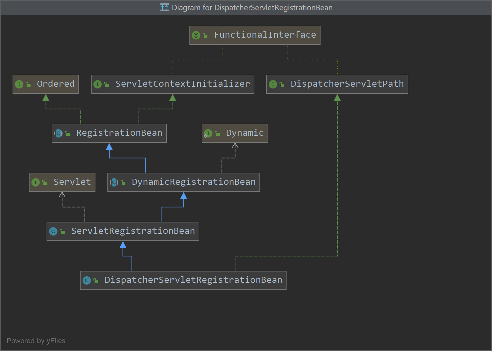 

从ServletContextInitializer接口一直往下查看，这里直接将DispatcherServlet给add到了servletContext当中 。

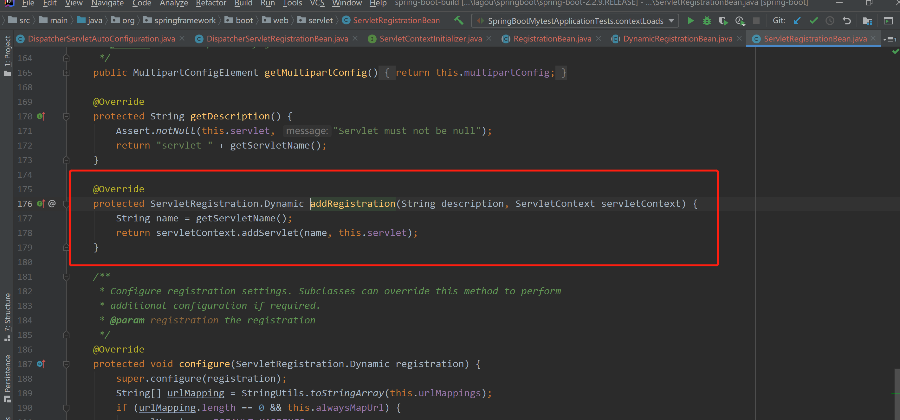

SpringBoot 启动时依次去调用对象的 onStartup 方法，就是会调用到DispatcherServletRegistrationBean 的 onStartup 方法，这个类并没有这个方法，所以最终会调用到父类 RegistrationBean 的 onStartup 方法

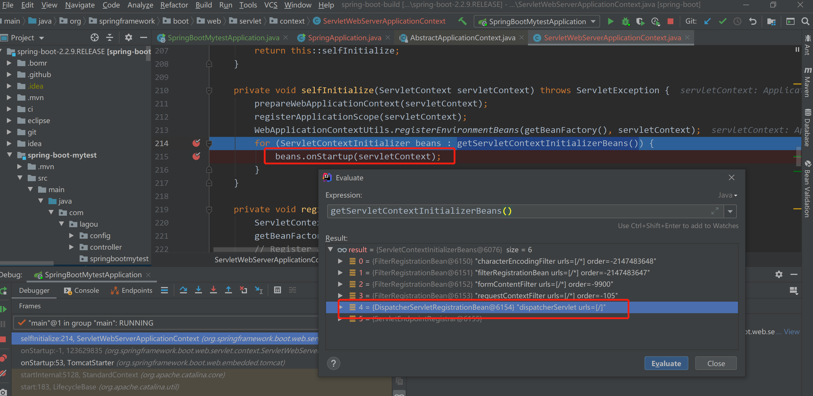


#### 三、SpringBoot数据源及连接池配置

##### 1、数据源配置

###### 1.1 maven配置MySql数据库驱动

```xml
<dependency>
	<groupId>mysql</groupId>
	<artifactId>mysql-connector-java</artifactId>
	<scope>runtime</scope>
</dependency>
```

###### 1.2 数据库连接配置

```properties
spring.datasource.driver-class-name=com.mysql.cj.jdbc.Driver
spring.datasource.url=jdbc:mysql://localhost:3306/lagou?useUnicode=true&characterEncoding=utf-8&useSSL=true&serverTimezone=UTC
spring.datasource.username=root
spring.datasource.password=root
```

###### 1.3、配置spring-boot-starter-jdbc  

```xml
<dependency>
	<groupId>org.springframework.boot</groupId>
	<artifactId>spring-boot-starter-jdbc</artifactId>
</dependency>
```

###### 1.4 测试

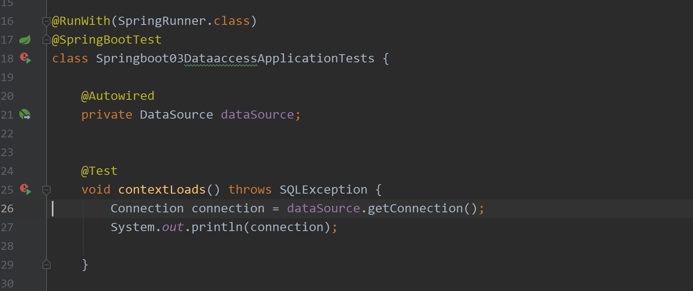


##### 2、连接池配置方式

###### 2.1 SpringBoot 默认提供了三种数据库连接方式

* HikariCP

* Commons DBCP2

* Tomcat JDBC Connection Pool

  

###### 2.2 spring boot2.x版本默认使用HikariCP

maven配置

```xml
<dependency>
	<groupId>org.springframework.boot</groupId>
	<artifactId>spring-boot-starter-jdbc</artifactId>
</dependency>
```

改用 Commons DBCP2 ，maven配置

```xml
<dependency>
	<groupId>org.apache.commons</groupId>
	<artifactId>commons-dbcp2</artifactId>
</dependency>
<dependency>
	<groupId>org.springframework.boot</groupId>
	<artifactId>spring-boot-starter-jdbc</artifactId>
	<exclusions>
		<exclusion>
			<groupId>com.zaxxer</groupId>
			<artifactId>HikariCP</artifactId>
		</exclusion>
	</exclusions>
</dependency>
```

SpringBoot哪里配置默认使用HikariCP

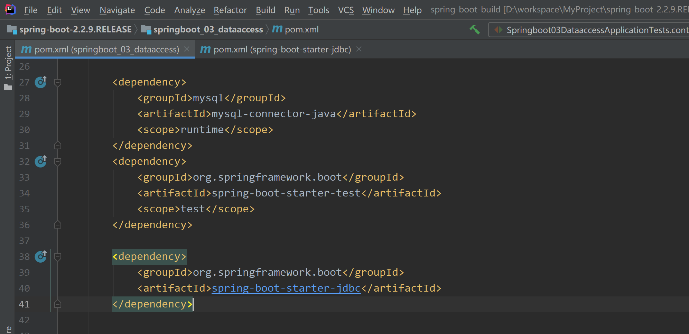

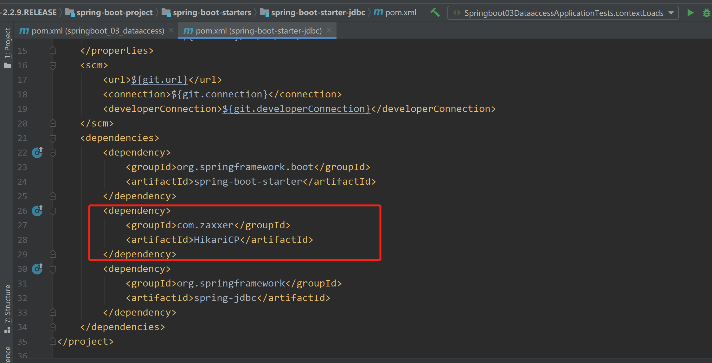


##### 3、数据源自动配置原理

/spring-boot-2.2.9.RELEASE/spring-boot-project/spring-boot-autoconfigure/src/main/resources/META-INF/spring.factories 中找到

```xml
org.springframework.boot.autoconfigure.jdbc.DataSourceAutoConfiguration,\
```

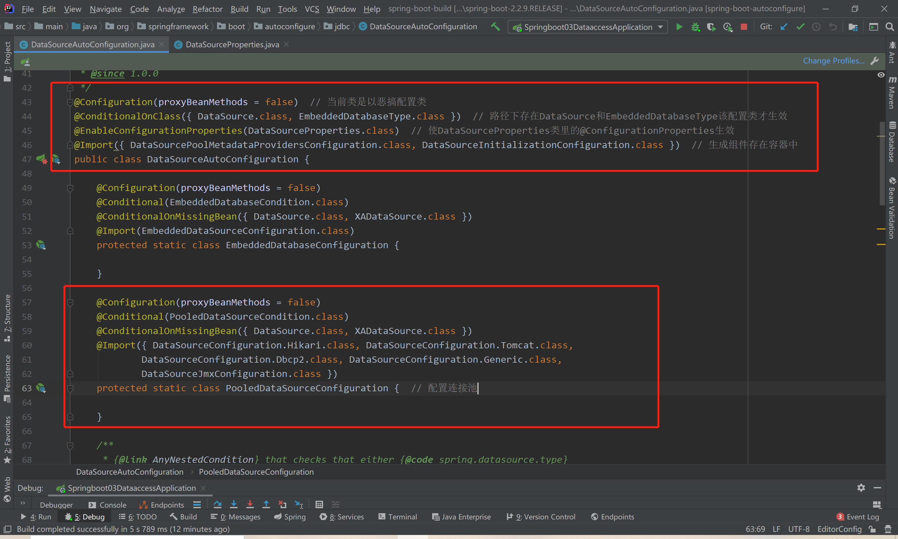

查看注解@Conditional(PooledDataSourceCondition.class)，根据判断条件，实例化这个类，指定了配置文
件中，必须有type这个属性

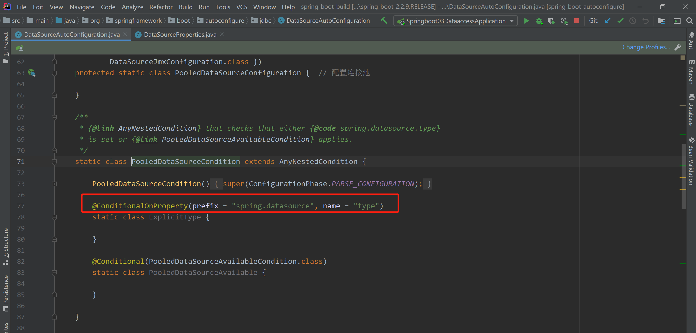

```properties
spring.datasource.type=com.zaxxer.hikari.HikariDataSource
```

spring.datasource.type作用是设置当前连接池类型

如果要改默认连接池，需要导入对应jar包，并且更改spring.datasource.type。


##### 4、配置Druid连接池

###### 4.1 引入对应 Maven 依赖

```xml
<dependency>
	<groupId>com.alibaba</groupId>
	<artifactId>druid-spring-boot-starter</artifactId>
	<version>1.1.10</version>
</dependency>
```

###### 4.2 配置文件配置 Druid

​		这边使用的是application.yml，也可以在application.properties配置

```yaml
spring:
  datasource:
    username: root
    password: root
    url: jdbc:mysql:///springboot_h?useUnicode=true&characterEncoding=utf-8&useSSL=true&serverTimezone=UTC
    driver-class-name: com.mysql.cj.jdbc.Driver
    initialization-mode: always
    # 使用druid数据源
    type: com.alibaba.druid.pool.DruidDataSource
    # 数据源其他配置
    # 初始化连接数，设为0表示无限制
    initialSize: 5
    # 最小的空闲连接
    minIdle: 5
    # 最大连接数
    maxActive: 20
    # 最大建立连接等待时间。如果超过此时间将接到异常。设为-1表示无限制
    maxWait: 60000
    # 检查空闲连接的频率，单位毫秒, 非正整数时表示不进行检查
    timeBetweenEvictionRunsMillis: 60000
    # 池中某个连接的空闲时长达到 N 毫秒后, 连接池在下次检查空闲连接时，将回收该连接,要小于防火墙超时设置net.netfilter.nf_conntrack_tcp_timeout_established的设置
    minEvictableIdleTimeMillis: 300000
    # 检查池中的连接是否仍可用的SQL语句，drui会连接到数据库执行该SQL, 如果正常返回，则表示连接可用，否则表示连接不可用
    validationQuery: SELECT 1 FROM DUAL
    # 当程序请求连接，池在分配连接时，是否先检查该连接是否有效。(高效)
    testWhileIdle: true
    # 程序申请连接时，进行连接有效性检查（低效，影响性能）
    testOnBorrow: false
    # 程序返还连接时，进行连接有效性检查（低效，影响性能）
    testOnReturn: false
    # 缓存通过以下两个方法发起的SQL:
    # public PreparedStatement prepareStatement(String sql)
    # public PreparedStatement prepareStatement(String sql, int resultSetType, int resultSetConcurrency)
    poolPreparedStatements: true
    # 配置监控统计拦截的filters，去掉后监控界面sql无法统计，'wall'用于防火墙
    filters: stat,wall,log4j
    # 每个连接最多缓存多少个SQL
    maxPoolPreparedStatementPerConnectionSize: 20
    # 是否开启Druid的监控统计功能
    useGlobalDataSourceStat: true
    connectionProperties: druid.stat.mergeSql=true;druid.stat.slowSqlMillis=500
```

###### 4.3 编写 druid 配置类 DruidConfig 

​		如果没有 druid 配置类，配置文件里对 druid 的配置就不会生效

```java
package com.lagou.config;

import com.alibaba.druid.pool.DruidDataSource;
import org.springframework.boot.context.properties.ConfigurationProperties;
import org.springframework.context.annotation.Bean;
import org.springframework.context.annotation.Configuration;

import javax.sql.DataSource;

@Configuration
public class DruidConfig {
	
	@ConfigurationProperties(prefix = "spring.datasource")
	@Bean
	public DataSource dataSource(){
		return  new DruidDataSource();
	}

}
```

###### 4.4 引入 slf4j-log4j12 适配器

​		因为 druid 配置里用到了 log4j，而 springBoot2.0 以后使用的日志框架已经不再使用 log4j 了。此时应该引入相应的适配器。

```xml
<dependency>
	<groupId>org.slf4j</groupId>
	<artifactId>slf4j-log4j12</artifactId>
</dependency>
```


##### 5、SpringBoot 整合 MyBatis

导入对应MyBatis包，配置好配置文件

```xml
<dependency>
	<groupId>org.mybatis.spring.boot</groupId>
	<artifactId>mybatis-spring-boot-starter</artifactId>
	<version>1.3.2</version>
</dependency>
```

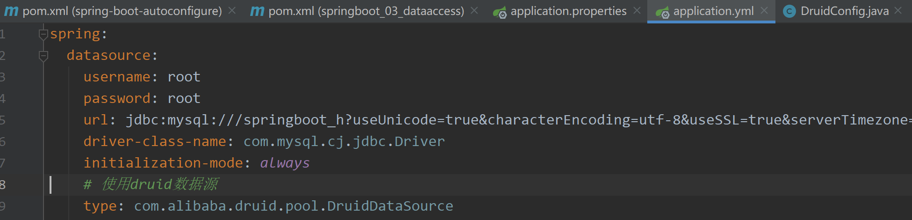

可以在启动类配置mapper包扫描，Spring会把这个包下的类都加入Spring容器，这样mapper接口就不用每个去添加@Mapper注解

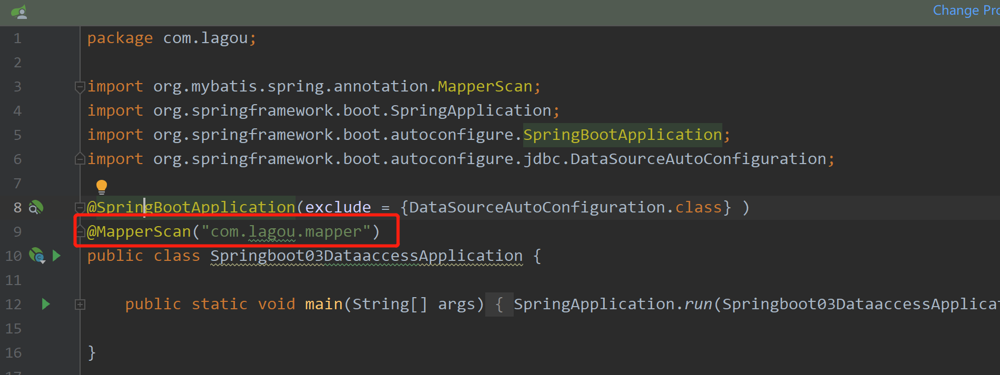


##### 6、MyBatis 自动配置原理

找到 MyBatis 自动配置类

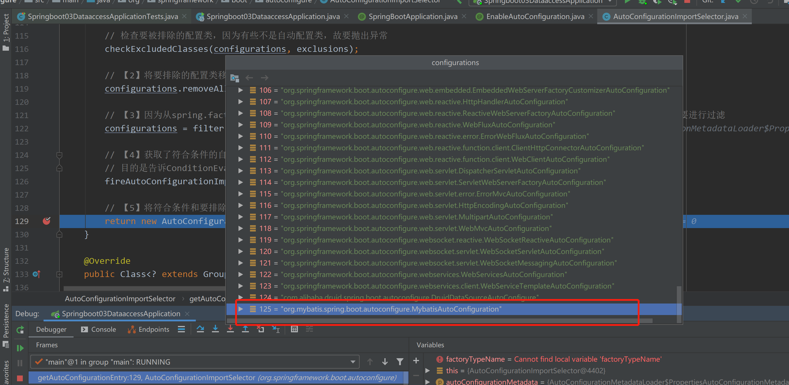

@ConditionalOnMissingBean作用：在没有类的时候调用，创建sqlsessionFactory，sqlsessionfactory最主要的是创建并保存了Configuration类 。

获取SqlSessionFactoryBean的getObject()中的对象注入Spring容器，也就是
SqlSessionFactory对象，最终调用了MyBatis的初始化流程  


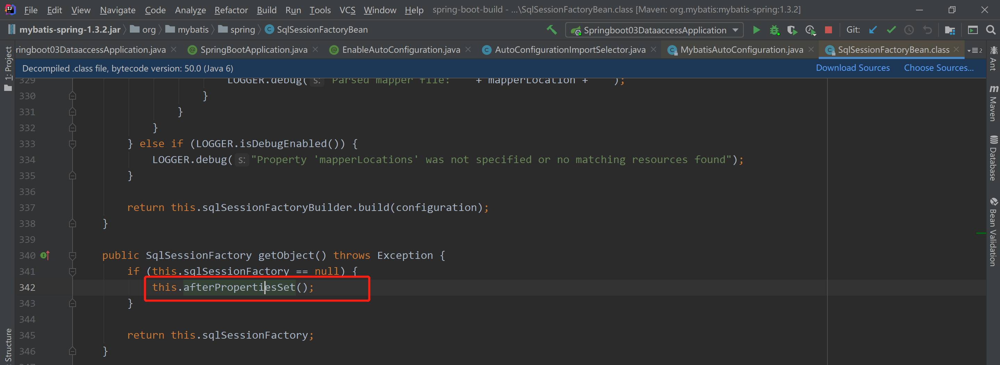

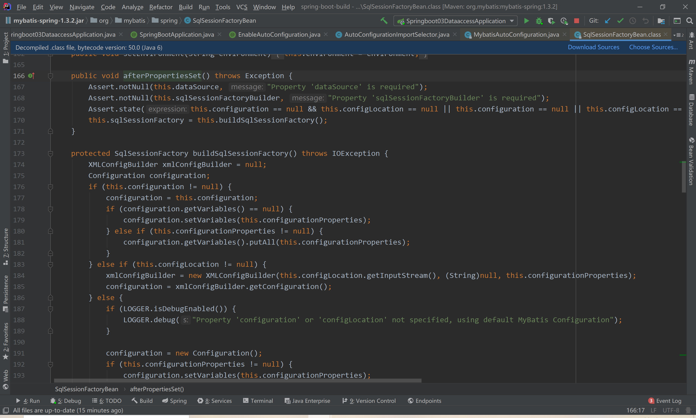

扫描 mapper 接口以及生成代理对象

启动类配置扫描 mapper 接口注解

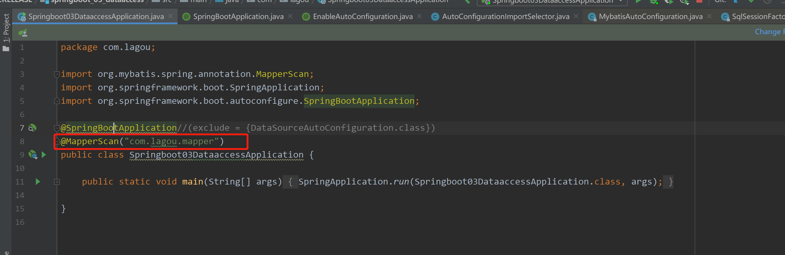

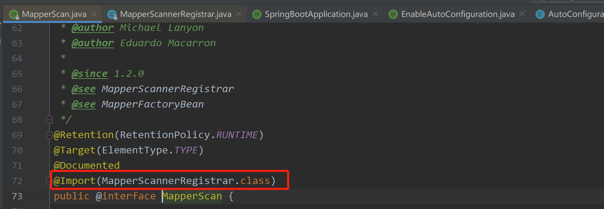

MapperScannerRegistrar 实现了 ImportBeanDefinitionRegistrar 接口，重写了 registerBeanDefinitions 方法，在Spring 实例化的时候回去调用该方法

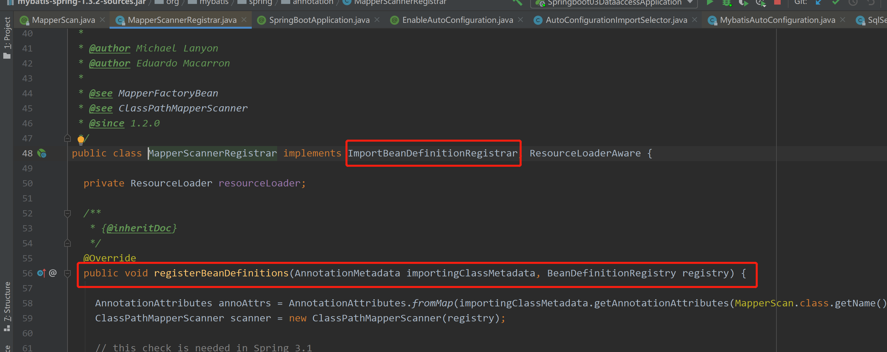

doScan 方法将包下的类放到Spring 容器中，但此时还未生成代理对象

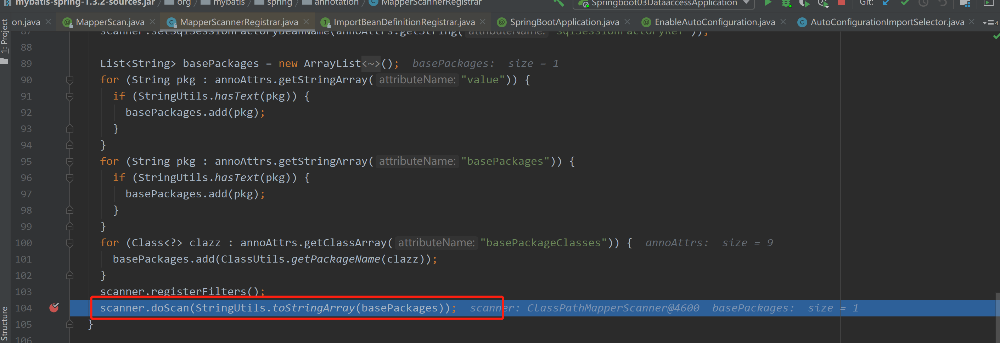

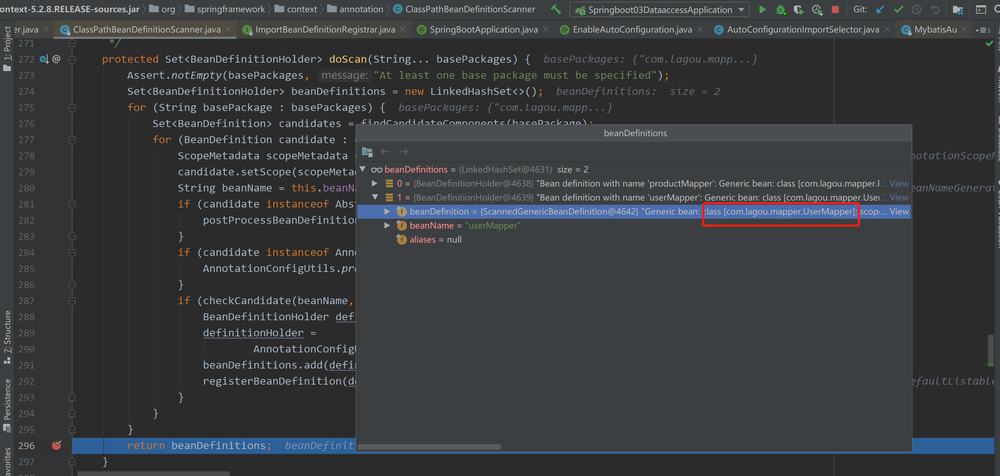

processBeanDefinitions 方法里去生成了mapper 代理对象，这边将bean设置成了MapperFactoryBean，而 MapperFactoryBean 实现了FactoryBean接口，当Spring 去遍历到这个bean执行实例化的时候，就会去调用getObject 方法，最终走到了MyBatis的生成代理对象源码

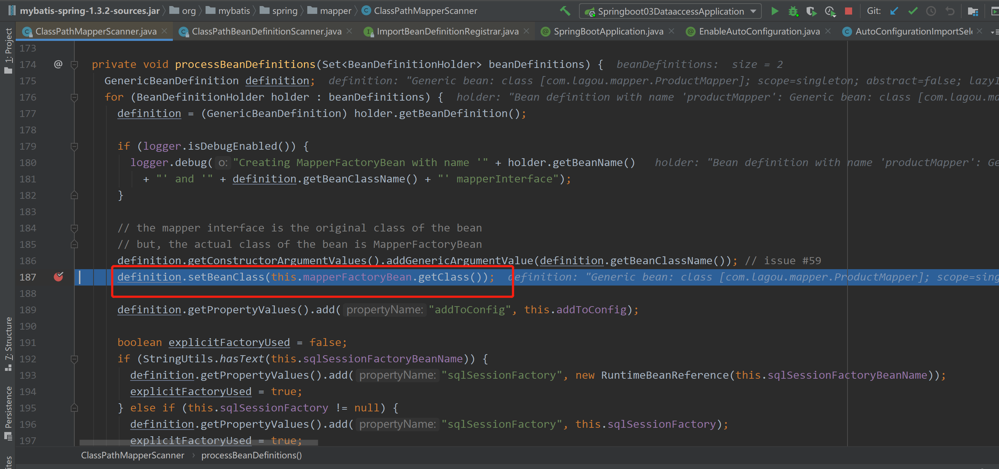

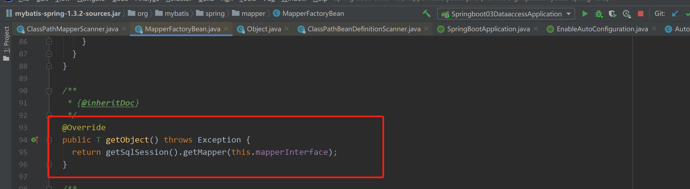


##### 7、SpringBoot + MyBatis 实现动态数据源切换

​		Spring内置了一个AbstractRoutingDataSource，它可以把多个数据源配置成一个Map，然后，根据不同的key返回不同的数据源。因为AbstractRoutingDataSource也是一个DataSource接口，因此，应用程序可以先设置好key， 访问数据库的代码就可以从AbstractRoutingDataSource拿到对应的一个真实的数据源，从而访问指定的数据库。

​	具体实现：

###### 7.1 properties 配置对应数据源

```properties
spring.druid.datasource.master.password=root
spring.druid.datasource.master.username=root
spring.druid.datasource.master.jdbc-url=jdbc:mysql://localhost:3306/product_master?useUnicode=true&characterEncoding=utf-8&useSSL=true&serverTimezone=UTC
spring.druid.datasource.master.driver-class-name=com.mysql.cj.jdbc.Driver

spring.druid.datasource.slave.password=root
spring.druid.datasource.slave.username=root
spring.druid.datasource.slave.jdbc-url=jdbc:mysql://localhost:3306/product_slave?useUnicode=true&characterEncoding=utf-8&useSSL=true&serverTimezone=UTC
spring.druid.datasource.slave.driver-class-name=com.mysql.cj.jdbc.Driver
```


###### 7.2 写一个自定义配置类，同时在启动类排除默认数据源自动配置类

```java
package com.lagou.config;

import org.slf4j.Logger;
import org.slf4j.LoggerFactory;
import org.springframework.beans.factory.annotation.Autowired;
import org.springframework.beans.factory.annotation.Qualifier;
import org.springframework.boot.context.properties.ConfigurationProperties;
import org.springframework.boot.jdbc.DataSourceBuilder;
import org.springframework.context.annotation.Bean;
import org.springframework.context.annotation.Configuration;
import org.springframework.context.annotation.Primary;

import javax.sql.DataSource;
import java.util.HashMap;
import java.util.Map;

@Configuration
public class MyDataSourceAutoConfiguration {

	Logger logger = LoggerFactory.getLogger(MyDataSourceAutoConfiguration.class);

	/**
	 * master dataSource
	 */
	@Bean
	@ConfigurationProperties(prefix = "spring.druid.datasource.master")
	public DataSource masterDataSource() {
		logger.info("create master dataSource...");
		return DataSourceBuilder.create().build();
	}

	/**
	 * slave dataSource
	 */
	@Bean
	@ConfigurationProperties(prefix = "spring.druid.datasource.slave")
	public DataSource slaveDataSource() {
		logger.info("create slave dataSource...");
		return DataSourceBuilder.create().build();
	}

	@Bean
	@Primary
	public DataSource primaryDataSource(
			@Autowired @Qualifier("masterDataSource") DataSource masterDataSource,
			@Autowired @Qualifier("slaveDataSource") DataSource slaveDataSource
	) {
		RoutingDataSource routingDataSource = new RoutingDataSource();
		Map<Object, Object> map = new HashMap<>();
		map.put("master", masterDataSource);
		map.put("slave", slaveDataSource);
		routingDataSource.setTargetDataSources(map);
		return routingDataSource;
	}
}
```

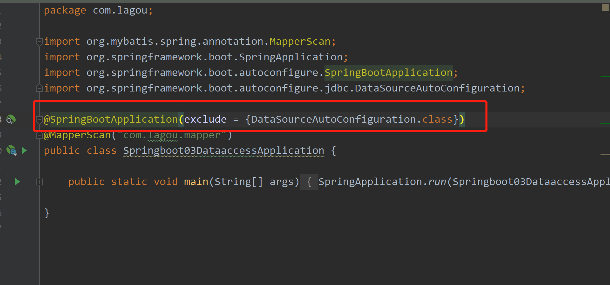


###### 7.3 将数据源 key 存入ThreadLocal中，编写 RoutingDataSource 去实现 AbstractRoutingDataSource

```java
package com.lagou.config;

public class RoutingDataSourceContext {

	static  final ThreadLocal<String> threadLocal = new ThreadLocal<>();

	// key:指定数据源类型 master slave
	public RoutingDataSourceContext(String key) {
		threadLocal.set(key);
	}

	public static String getDataSourceRoutingKey(){
		String key = threadLocal.get();
		return key == null ? "master" : key;
	}

	public void close(){
		threadLocal.remove();
	}
}
```

```java
package com.lagou.config;

import org.springframework.jdbc.datasource.lookup.AbstractRoutingDataSource;

public class RoutingDataSource extends AbstractRoutingDataSource {

	@Override
	protected Object determineCurrentLookupKey() {
		return RoutingDataSourceContext.getDataSourceRoutingKey();
	}
}
```


###### 7.4 写个注解和切面逻辑，在需要切换数据源的地方，根据注解value去获取指定数据源

```java
package com.lagou.config;

import java.lang.annotation.ElementType;
import java.lang.annotation.Retention;
import java.lang.annotation.RetentionPolicy;
import java.lang.annotation.Target;

@Target(ElementType.METHOD)
@Retention(RetentionPolicy.RUNTIME)
public @interface RoutingWith {

	String value() default "master";
}
```

```java
package com.lagou.config;

import org.aspectj.lang.ProceedingJoinPoint;
import org.aspectj.lang.annotation.Around;
import org.aspectj.lang.annotation.Aspect;
import org.springframework.stereotype.Component;

@Aspect
@Component
public class RoutingAspect {

	@Around("@annotation(with)")
	public Object routingWithDataSource(ProceedingJoinPoint joinPoint,RoutingWith with) throws Throwable {
		// master
		String key = with.value();
		RoutingDataSourceContext routingDataSourceContext = new RoutingDataSourceContext(key);
		return  joinPoint.proceed();
	}
}
```


###### 7.5 对应实体类和 mapper 接口

```java
package com.lagou.pojo;

import lombok.Data;

@Data
public class Product {
	private Integer id;
	private String name;
	private Double price;
}
```

```java
package com.lagou.mapper;

import com.lagou.pojo.Product;
import org.apache.ibatis.annotations.Select;

import java.util.List;

public interface ProductMapper {
	
	@Select("select * from product")
	List<Product> findAllProductM();

	@Select("select * from product")
	List<Product> findAllProductS();
}

```


###### 7.6 controller

```java
package com.lagou.controller;


import com.lagou.config.RoutingWith;
import com.lagou.service.ProductService;
import org.springframework.beans.factory.annotation.Autowired;
import org.springframework.web.bind.annotation.RequestMapping;
import org.springframework.web.bind.annotation.RestController;

@RestController
public class ProductController {

	@Autowired
	private ProductService productService;

	@RoutingWith("master")
	@RequestMapping("/findAllProductM")
	public String findAllProductM(){
		productService.findAllProductM();
		return "master";
	}

	@RoutingWith("slave")
	@RequestMapping("/findAllProductS")
	public String findAllProductS(){
		productService.findAllProductS();
		return "slave";
	}
}
```


#### 四、SpringBoot 缓存

##### 4.1 JSR107

​		JSR是Java Specification Requests 的缩写 ，Java规范请求，故名思议提交Java规范， JSR-107就是关于如何使用缓存的规范，是java提供的一个接口规范，类似于JDBC规范，没有具体的实现，具体的实现就是reids等这些缓存。 

##### 4.2 JSR107核心接口 

​		Java Caching（JSR-107）定义了5个核心接口，分别是CachingProvider、CacheManager、Cache、Entry和Expiry。

* CachingProvider（缓存提供者）：创建、配置、获取、管理和控制多个CacheManager

* CacheManager（缓存管理器）：创建、配置、获取、管理和控制多个唯一命名的Cache，Cache存在于CacheManager的上下文中。一个CacheManager仅对应一个CachingProvider

* Cache（缓存）：是由CacheManager管理的，CacheManager管理Cache的生命周期，Cache存在于CacheManager的上下文中，是一个类似map的数据结构，并临时存储以key为索引的值。一个Cache仅被一个CacheManager所拥有

* Entry（缓存键值对）：是一个存储在Cache中的key-value对

* Expiry（缓存时效）：每一个存储在Cache中的条目都有一个定义的有效期。一旦超过这个时间，条目就自动过期，过期后，条目将不可以访问、更新和删除操作。缓存有效期可以通过ExpiryPolicy设置 

  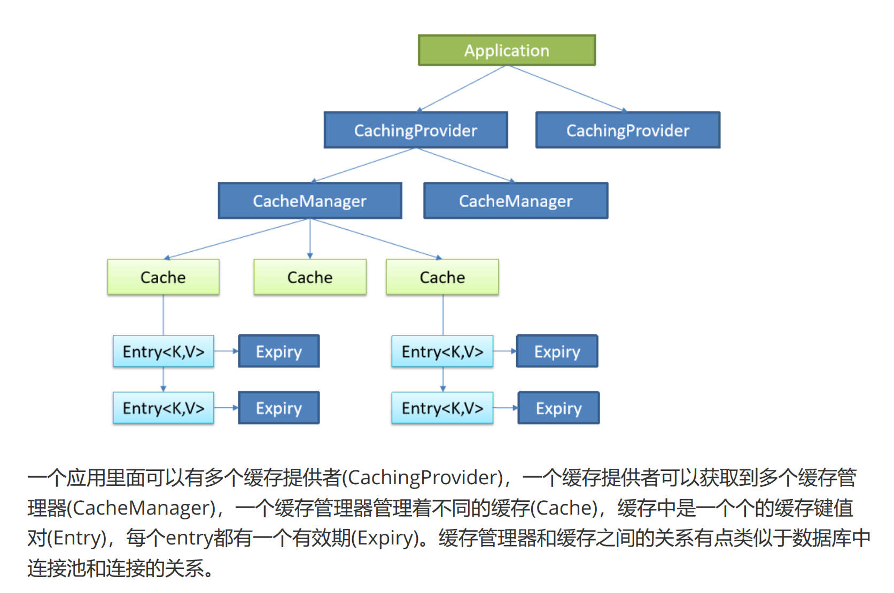

使用JSR-107需导入的依赖

```xml
<dependency>
	<groupId>javax.cache</groupId>
	<artifactId>cache-api</artifactId>
</dependency>
```


##### 4.3 Spring 缓存对象

​		Spring从3.1开始定义了org.springframework.cache.Cache和org.springframework.cache.CacheManager接口来统一不同的缓存技术；并支持使用Java Caching（JSR-107）注解简化我们进行缓存开发。  

​		Spring Cache 只负责维护抽象层，具体的实现由自己的技术选型来决定。将缓存处理和缓存技术解除耦合。每次调用需要缓存功能的方法时，Spring会检查指定参数的指定的目标方法是否已经被调用过，如果有就直接从缓存中获取方法调用后的结果，如果没有就调用方法并缓存结果后返回给用户。下次调用直接从缓存中获取。
  使用Spring缓存抽象时我们需要关注以下两点：
   ① 确定那些方法需要被缓存
   ② 缓存策略 

​		Cache：缓存抽象的规范接口，缓存实现有：RedisCache、EhCache、ConcurrentMapCache等
​		CacheManager：缓存管理器，管理Cache的生命周期 

##### 4.4 Spring 缓存概念和注解

| 概念/注解      | 作用                                                         |
| -------------- | ------------------------------------------------------------ |
| Cache          | 缓存接口，定义缓存操作。实现有：RedisCache、EhCacheCache、 ConcurrentMapCache等 |
| CacheManager   | 缓存管理器，管理各种缓存(Cache)组件                          |
| @Cacheable     | 主要针对方法配置，能够根据方法的请求参数对其结果进行缓存     |
| @CacheEvict    | 清空缓存                                                     |
| @CachePut      | 保证方法被调用，又希望结果被缓存                             |
| @EnableCaching | 开启基于注解的缓存                                           |
| keyGenerator   | 缓存数据时key生成策略                                        |
| serialize      | 缓存数据时value序列化策略                                    |


##### 4.7 缓存自动配置原理

​		SpringBoot 的自动配置都是 xxxAutoConfiguration，搜索下可以找到 CacheAutoConfiguration。

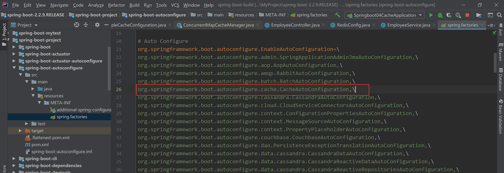

​		CacheAutoConfiguration @Import注解导入了 CacheConfigurationImportSelector，其实就是本身的静态内部类。

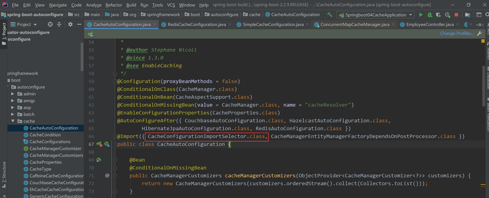

​		CacheConfigurationImportSelector 中的 selectImports 是给容器添加一些缓存要用的组件。

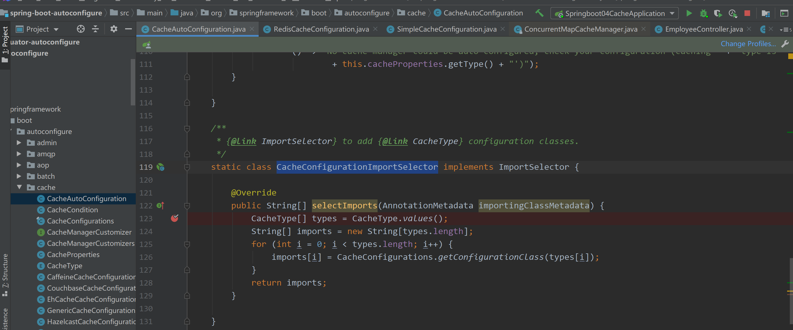

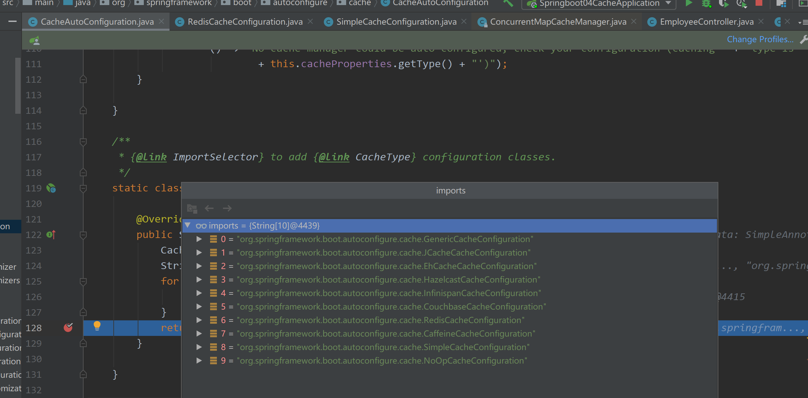

​		缓存组件中都有配置要构建这个组件bean所需条件，比如 RedisCacheConfiguration 要再 classpath 下要存在对应的 RedisConnectionFactory class文件才会进行配置。  

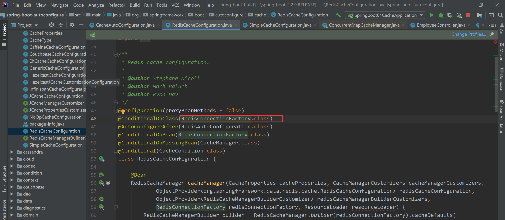

​		查看所有缓存组件后，默认走的是 SimpleCacheConfiguration。SimpleCacheConfiguration 给容器添加了一个 ConcurrentMapCacheManager bean。

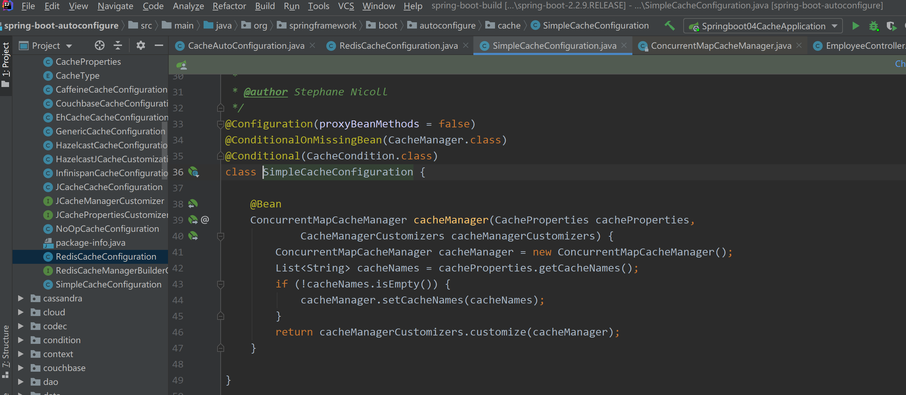

​		ConcurrentMapCacheManager 就是操作缓存的具体实现。cacheMap 就是缓存存储所在。getCache 方法就是去获取缓存，缓存不存在则去创建 put。

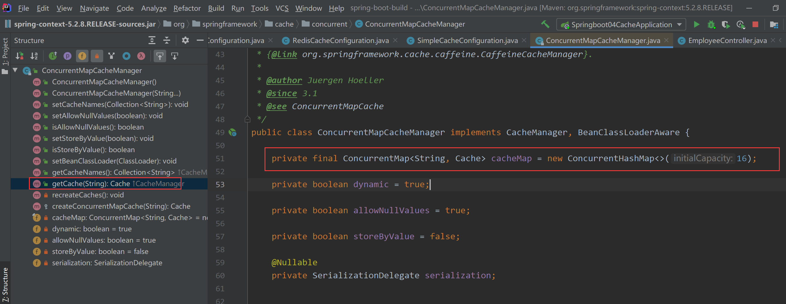

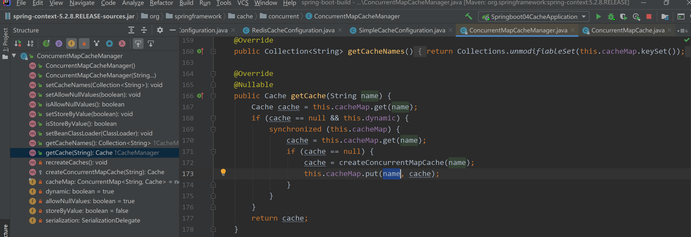

##### 4.6 @Cacheable  

开启缓存注解 @EnableCaching

```java
package com.lagou;

import org.mybatis.spring.annotation.MapperScan;
import org.springframework.boot.SpringApplication;
import org.springframework.boot.autoconfigure.SpringBootApplication;
import org.springframework.cache.annotation.EnableCaching;

@SpringBootApplication
@MapperScan("com.lagou.mapper")
@EnableCaching // 开启缓存
public class Springboot04CacheApplication {

	public static void main(String[] args) {
		SpringApplication.run(Springboot04CacheApplication.class, args);
	}

}
```

@Cacheable 缓存

```java
package com.lagou.service;

import com.lagou.mapper.EmployeeMapper;
import com.lagou.pojo.Employee;
import org.springframework.beans.factory.annotation.Autowired;
import org.springframework.cache.annotation.CacheConfig;
import org.springframework.cache.annotation.Cacheable;
import org.springframework.stereotype.Service;

@Service
@CacheConfig(cacheNames = {"emp"})
public class EmployeeService {

	@Autowired
	private EmployeeMapper employeeMapper;

	/*
	 * 	@Cacheable : 缓存查询：会将该方法的返回值存到缓存中
	 *		value/cacheNames：指定缓存的名称 ，cacheManager是管理多个cache,以名称进行区分
	 * 		key：缓存数据时指定key值 （key,value） ,默认是方法的参数值，也可以使用spEL来计算key的值
	 * 		keyGenerator：key的生成策略，和key进行二选一 ，自定义keyGenerator
	 * 		cacheManager：指定缓存管理器  redis:emp   ehcache:emp
	 * 		cacheResolver: 功能跟cacheManager相同，二选一即可
	 * 		condition：条件属性，满足这个条件才会进行缓存
	 * 		unless: 否定条件：满足这个条件，不进行缓存
	 * 		sync: 是否使用异步模式进行缓存 true
	 *			(1) condition/unless 同时满足，不缓存
	 * 			(2) sync的值为true的时候，unless不被支持
	 */

	@Cacheable(key = "#id", condition = "#id > 0", unless = "#result == null")
	public Employee getEmpById(Integer id){
		Employee emp = employeeMapper.getEmpById(id);
		return emp;
	}
}
```


##### 4.7 @CachePut、@CacheEvict、@CacheConfig 

* @**CachePut**

  既调用方法，又更新缓存数据，一般用于更新操作，在更新缓存时一定要和想更新的缓存有相同的缓存名称和相同的key。

  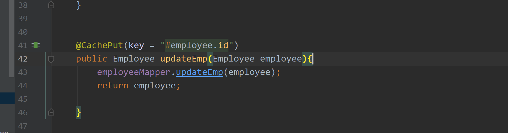

* @**CacheEvict**

  缓存清除，清除缓存时要指明缓存的名字和key，相当于告诉数据库要删除哪个表中的哪条数据，key默认为参数的值 。

  **属性：**

  * value/cacheNames：缓存的名字
  * key：缓存的键
  * allEntries：是否清除指定缓存中的所有键值对，默认为false，设置为true时会清除缓存中的所有键值对，与key属性二选一使用  
  * beforeInvocation：在@CacheEvict注解的方法调用之前清除指定缓存，默认为false，即在方法调用之后清除缓存，设置为true时则会在方法调用之前清除缓存(在方法调用之前还是之后清除缓存的区别在于方法调用时是否会出现异常，若不出现异常，这两种设置没有区别，若出现异常，设置为在方法调用之后清除缓存将不起作用，因为方法调用失败了)  

  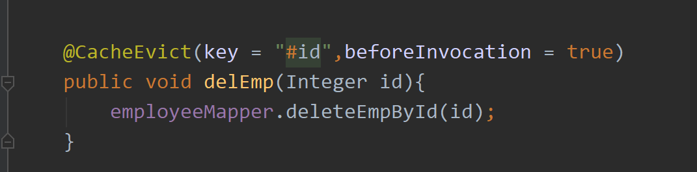

* @**CacheConfig**

  标注在类上，抽取缓存相关注解的公共配置，可抽取的公共配置有缓存名字、主键生成器等。

  比如通过@CacheConfig的cacheNames 属性指定缓存的名字之后，该类中的其他缓存注解就不必再写value或者cacheName了，会使用该名字作为value或cacheName的值，当然也遵循就近原则。

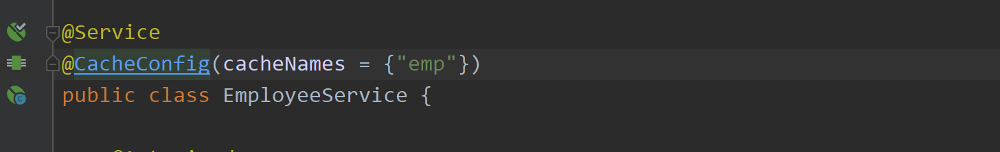


##### 4.8 基于 redis 的缓存实现

###### 4.8.1 安装启动redis

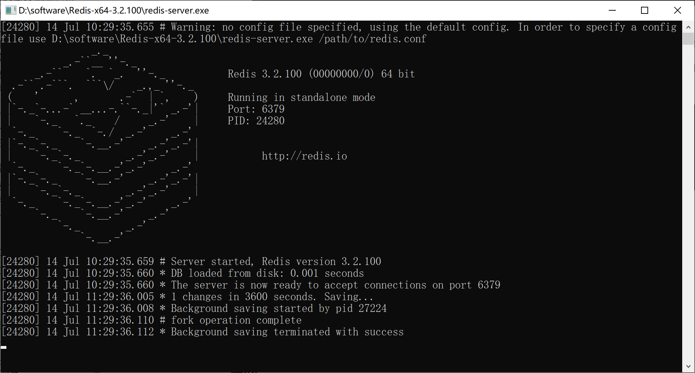

###### 4.8.2 导入 redis starter 依赖

```xml
<dependency>
	<groupId>org.springframework.boot</groupId>
	<artifactId>spring-boot-starter-data-redis</artifactId>
</dependency>
```

​		引入redis的starter之后，会在容器中加入redis相关的一些bean，其中有两个跟操作redis相关的：1） RedisTemplate，封装了操作各种数据类型的操作(stringRredisTemplate.opsForValue()、stringRredisTemplate.opsForList()等)  。2）StringRedisTemplate，用来操作字符串：key和value都是字符串。

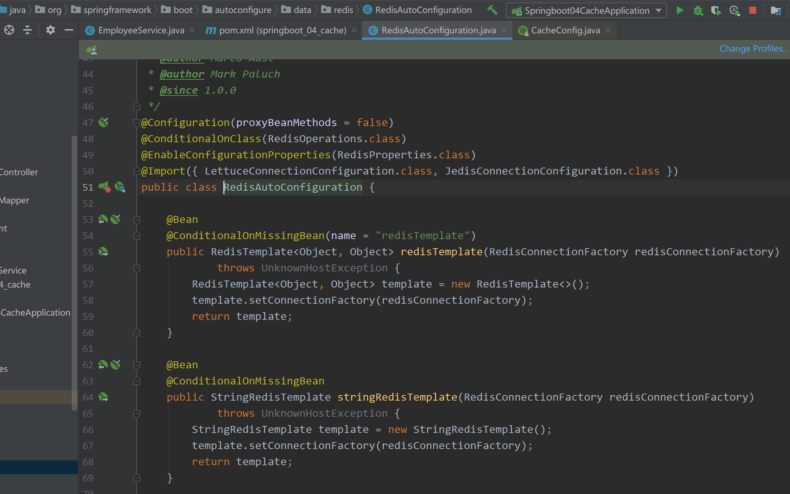

###### 4.8.3 配置redis

​		只需要配置redis的主机地址(端口默认即为6379，因此可以不指定)  

```properties
spring.redis.host=127.0.0.1
```

###### 4.8.4 自定义RedisCacheManager 

​		使用redis存储对象时，该对象必须可序列化(实现Serializable接口)，否则会报错。

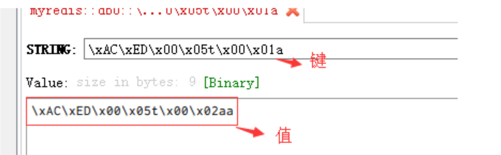		

​		SpringBoot默认采用的是JDK的对象序列化方式，我们可以切换为使用JSON格式进行对象的序列化操作，这时需要我们自定义序列化规则(当然我们也可以使用Json工具先将对象转化为Json格式之后再保存至redis，这样就无需自定义序列化)  。

​		通过查看以下 RedisCacheConfiguration 源码，内部同样通过Redis连接工厂 RedisConnectionFactory 定义了一个缓存管理器RedisCacheManager；同时定制 RedisCacheManager 时，也默认使用JdkSerializationRedisSerializer序列化方式。如果想要使用自定义序列化方式的RedisCacheManager进行数据缓存操作，可以参考上述核心代码创建一个名为cacheManager的Bean组件，并在该组件中设置对应的序列化方式即可。

```java
/*
 * Copyright 2012-2019 the original author or authors.
 *
 * Licensed under the Apache License, Version 2.0 (the "License");
 * you may not use this file except in compliance with the License.
 * You may obtain a copy of the License at
 *
 *      https://www.apache.org/licenses/LICENSE-2.0
 *
 * Unless required by applicable law or agreed to in writing, software
 * distributed under the License is distributed on an "AS IS" BASIS,
 * WITHOUT WARRANTIES OR CONDITIONS OF ANY KIND, either express or implied.
 * See the License for the specific language governing permissions and
 * limitations under the License.
 */

package org.springframework.boot.autoconfigure.cache;

import java.util.LinkedHashSet;
import java.util.List;

import org.springframework.beans.factory.ObjectProvider;
import org.springframework.boot.autoconfigure.AutoConfigureAfter;
import org.springframework.boot.autoconfigure.cache.CacheProperties.Redis;
import org.springframework.boot.autoconfigure.condition.ConditionalOnBean;
import org.springframework.boot.autoconfigure.condition.ConditionalOnClass;
import org.springframework.boot.autoconfigure.condition.ConditionalOnMissingBean;
import org.springframework.boot.autoconfigure.data.redis.RedisAutoConfiguration;
import org.springframework.cache.CacheManager;
import org.springframework.context.annotation.Bean;
import org.springframework.context.annotation.Conditional;
import org.springframework.context.annotation.Configuration;
import org.springframework.core.io.ResourceLoader;
import org.springframework.data.redis.cache.RedisCacheManager;
import org.springframework.data.redis.cache.RedisCacheManager.RedisCacheManagerBuilder;
import org.springframework.data.redis.connection.RedisConnectionFactory;
import org.springframework.data.redis.serializer.JdkSerializationRedisSerializer;
import org.springframework.data.redis.serializer.RedisSerializationContext.SerializationPair;

/**
 * Redis cache configuration.
 *
 * @author Stephane Nicoll
 * @author Mark Paluch
 * @author Ryon Day
 */
@Configuration(proxyBeanMethods = false)
@ConditionalOnClass(RedisConnectionFactory.class)
@AutoConfigureAfter(RedisAutoConfiguration.class)
@ConditionalOnBean(RedisConnectionFactory.class)
@ConditionalOnMissingBean(CacheManager.class)
@Conditional(CacheCondition.class)
class RedisCacheConfiguration {

	@Bean
	RedisCacheManager cacheManager(CacheProperties cacheProperties, CacheManagerCustomizers cacheManagerCustomizers,
			ObjectProvider<org.springframework.data.redis.cache.RedisCacheConfiguration> redisCacheConfiguration,
			ObjectProvider<RedisCacheManagerBuilderCustomizer> redisCacheManagerBuilderCustomizers,
			RedisConnectionFactory redisConnectionFactory, ResourceLoader resourceLoader) {
		RedisCacheManagerBuilder builder = RedisCacheManager.builder(redisConnectionFactory).cacheDefaults(
				determineConfiguration(cacheProperties, redisCacheConfiguration, resourceLoader.getClassLoader()));
		List<String> cacheNames = cacheProperties.getCacheNames();
		if (!cacheNames.isEmpty()) {
			builder.initialCacheNames(new LinkedHashSet<>(cacheNames));
		}
		redisCacheManagerBuilderCustomizers.orderedStream().forEach((customizer) -> customizer.customize(builder));
		return cacheManagerCustomizers.customize(builder.build());
	}

	private org.springframework.data.redis.cache.RedisCacheConfiguration determineConfiguration(
			CacheProperties cacheProperties,
			ObjectProvider<org.springframework.data.redis.cache.RedisCacheConfiguration> redisCacheConfiguration,
			ClassLoader classLoader) {
		return redisCacheConfiguration.getIfAvailable(() -> createConfiguration(cacheProperties, classLoader));
	}

	private org.springframework.data.redis.cache.RedisCacheConfiguration createConfiguration(
			CacheProperties cacheProperties, ClassLoader classLoader) {
		Redis redisProperties = cacheProperties.getRedis();
		org.springframework.data.redis.cache.RedisCacheConfiguration config = org.springframework.data.redis.cache.RedisCacheConfiguration
				.defaultCacheConfig();
		config = config.serializeValuesWith(
				SerializationPair.fromSerializer(new JdkSerializationRedisSerializer(classLoader)));
		if (redisProperties.getTimeToLive() != null) {
			config = config.entryTtl(redisProperties.getTimeToLive());
		}
		if (redisProperties.getKeyPrefix() != null) {
			config = config.prefixKeysWith(redisProperties.getKeyPrefix());
		}
		if (!redisProperties.isCacheNullValues()) {
			config = config.disableCachingNullValues();
		}
		if (!redisProperties.isUseKeyPrefix()) {
			config = config.disableKeyPrefix();
		}
		return config;
	}

}
```

​		自定义 RedisCacheManager。在项目的Redis配置类RedisConfig中，按照上一步分析的定制方法自定义名为

cacheManager的Bean组件 。

```java
package com.lagou;

import com.fasterxml.jackson.annotation.JsonAutoDetect;
import com.fasterxml.jackson.annotation.PropertyAccessor;
import com.fasterxml.jackson.databind.ObjectMapper;
import org.springframework.context.annotation.Bean;
import org.springframework.context.annotation.Configuration;
import org.springframework.data.redis.cache.RedisCacheConfiguration;
import org.springframework.data.redis.cache.RedisCacheManager;
import org.springframework.data.redis.connection.RedisConnectionFactory;
import org.springframework.data.redis.serializer.Jackson2JsonRedisSerializer;
import org.springframework.data.redis.serializer.RedisSerializationContext;
import org.springframework.data.redis.serializer.RedisSerializer;
import org.springframework.data.redis.serializer.StringRedisSerializer;

import java.time.Duration;

@Configuration
public class RedisConfig {

	@Bean
	public RedisCacheManager cacheManager(RedisConnectionFactory redisConnectionFactory) {
		// 分别创建String和JSON格式序列化对象，对缓存数据key和value进行转换
		RedisSerializer<String> strSerializer = new StringRedisSerializer();
		Jackson2JsonRedisSerializer jacksonSeial =
				new Jackson2JsonRedisSerializer(Object.class);
		// 解决查询缓存转换异常的问题
		ObjectMapper om = new ObjectMapper();
		om.setVisibility(PropertyAccessor.ALL, JsonAutoDetect.Visibility.ANY);
		om.enableDefaultTyping(ObjectMapper.DefaultTyping.NON_FINAL);
		jacksonSeial.setObjectMapper(om);
		// 定制缓存数据序列化方式及时效
		RedisCacheConfiguration config = RedisCacheConfiguration.defaultCacheConfig()
				.entryTtl(Duration.ofDays(1))
				.serializeKeysWith(RedisSerializationContext.SerializationPair
						.fromSerializer(strSerializer))
				.serializeValuesWith(RedisSerializationContext.SerializationPair
						.fromSerializer(jacksonSeial))
				.disableCachingNullValues();
		RedisCacheManager cacheManager = RedisCacheManager
				.builder(redisConnectionFactory).cacheDefaults(config).build();
		return cacheManager;
	}
}
```

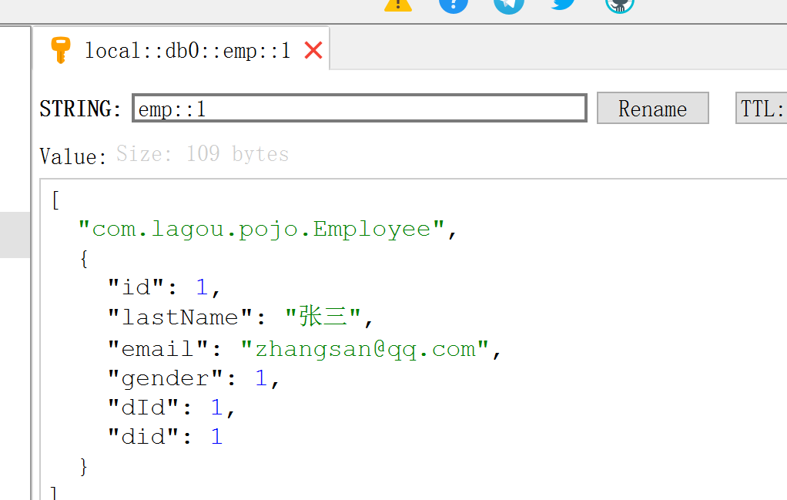


#### 注解

##### 	属性注入常用注解  

###### 	@Configuration

​			声明一个类作为配置类

###### 	@Bean

​			声明在方法上，将方法的返回值加入Bean容器

###### 	@Value

​			属性注入

```java
@Value("${com.location}")
private String location;
```

###### 	@ConfigurationProperties

​			批量属性注入，通常使用@EnableConfigurationProperties启用该注解用于启用

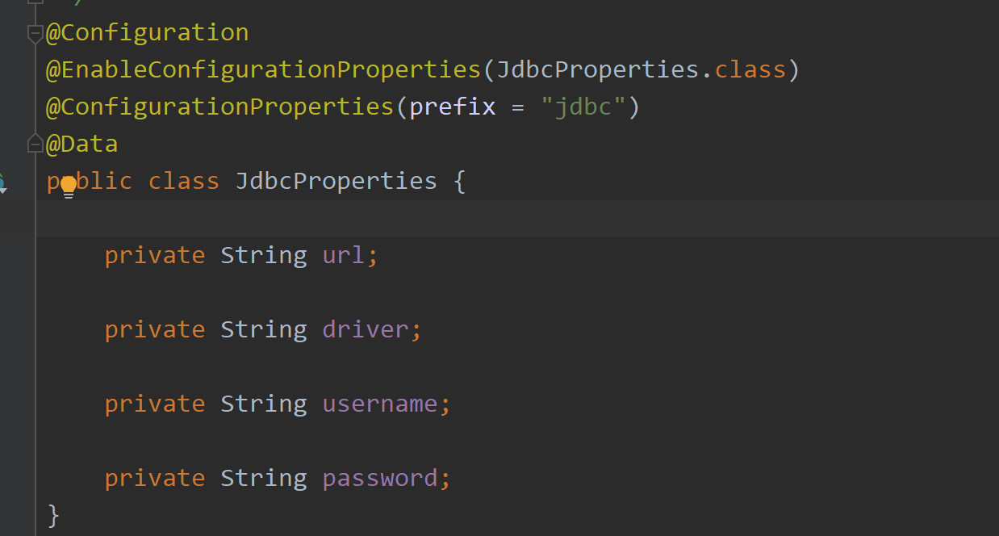

###### 	@PropertySource

​			指定外部属性文件。在类上添加 

