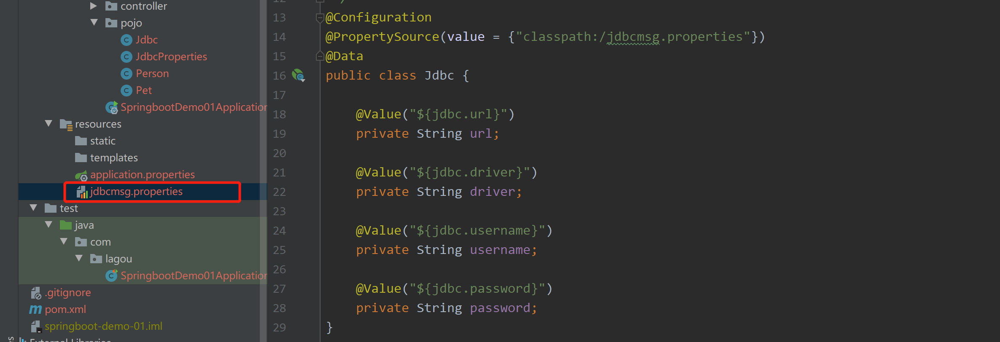

### SpringBoot

​		SpringBoot 的设计是为了让尽可能快的跑起来 Spring 应用程序并且尽可能减少你的配置文件，使约定优于配置(Convention over Configuration)。


#### 一、SpringBoot应用

##### 1、热部署

###### 	1.1 热部署配置

* **引入热部署依赖**

  ```xml
  <!-- 引入热部署依赖 -->
  <dependency>
  	<groupId>org.springframework.boot</groupId>
  	<artifactId>spring-boot-devtools</artifactId>
  </dependency>
  ```

* **IDEA配置开启自动编译**

  

* IDEA**配置在运行过程中自动编译（Ctrl+Shift+Alt+/”打开Maintenance选项框）**

  

###### 1.2 热部署排除资源

​		某些资源在更改后不一定需要触发重新启动。  可以在 application.properties 里配置

```properties 
spring.devtools.restart.exclude=static/**,public/**
```

##### 2、配置文件

###### 	**2.1 properties配置信息注入实体类**

* 引入SpringBoot配置处理器依赖

  ```xml
  <dependency>
  	<groupId>org.springframework.boot</groupId>
      <artifactId>spring-boot-configuration-processor</artifactId>
      <optional>true</optional>
  </dependency>
  ```

* 实体类，使用 @Component 将类加入Spring IOC 容器中，@ConfigurationProperties(prefix = "person")  将配置文件中以person开头的属性注入到该类中

  ```java
  package com.lagou.pojo;
  
  import lombok.Data;
  import org.springframework.boot.context.properties.ConfigurationProperties;
  import org.springframework.stereotype.Component;
  
  import java.util.List;
  import java.util.Map;
  
  @Data
  @Component
  @ConfigurationProperties(prefix = "person")
  public class Person {
      private String name;
      private List<String> hobby;
      private String[] family;
      private Map<String, Object> map;
      private Pet pet;
  }
  ```

  ```java
  package com.lagou.pojo;
  
  import lombok.Data;
  
  @Data
  public class Pet {
      private String type;
      private String name;
  }
  ```

* 配置文件 application.properties

  ```properties
  person.name=ZhangSan
  person.family=mother,father
  person.hobby=吃饭,睡觉
  person.map.k1 = v1
  person.map.k2 = v2
  person.pet.name = 旺财
  person.pet.type = dog
  ```

* 运行结果

  

  

  ###### **2.2 yml配置方式  application.yml**

```yaml
spring:
  devtools:
    restart:
      exclude: [static/**,public/**]
person:
  name: LiSi
  family: [mother, father]
  hobby: [吃饭, 睡觉]
  map: {k1: v1,k2: v2}
  pet: {name: 大黄,type: dog}

```

​		

###### 	2.3 配置批量注入

​	@Configuration 标识该类为一个配置类

​	@EnableConfigurationProperties 使用该注解用于启用应用对另外一个注解 @ConfigurationProperties 的支持

​	@ConfigurationProperties  批量注入配置信息

```java
package com.lagou.pojo;

import lombok.Data;
import org.springframework.boot.context.properties.ConfigurationProperties;
import org.springframework.boot.context.properties.EnableConfigurationProperties;
import org.springframework.context.annotation.Configuration;

@Configuration
@EnableConfigurationProperties(JdbcProperties.class)
@ConfigurationProperties(prefix = "jdbc")
@Data
public class JdbcProperties {

    private String url;

    private String driver;

    private String username;

    private String password;
}

```


###### 	2.3 第三方配置

​	@ConfigurationProperties 用于注释类之外，还可以在公共 @Bean 方法上使用它。可以将属性绑定到控件之外的第三方组件。

```java
@Data
public class AnotherComponent {
	private boolean enabled;
	private InetAddress remoteAddress;
}
```

```java
@Configuration
public class MyService {
    @ConfigurationProperties("another")
    @Bean
    public AnotherComponent anotherComponent(){
    	return new AnotherComponent();
    }
}
```

```properties
another.enabled=true
another.remoteAddress=192.168.10.11
```


###### 	2.4 松散绑定

​			Spring Boot使用一些宽松的规则将环境属性绑定到@ConfigurationProperties bean，因此环境属性名和bean属性名之间不需要完全匹配

```java
@Data
@Component
@ConfigurationProperties("acme.my-person.person")
public class OwnerProperties {
	private String firstName;
}
```

```yaml
acme:
	my-person:
		person:
			first-name: 泰森
```


##### 3、日志框架

###### 3.1、SLF4J 结合各种日志框架的官方示例


​		在项目中存在着各种不同的第三方 jar  时，可以使用一种和要替换的日志框架类完全一样的 jar 进行替换，这样不至于原来的第三方 jar 报错，而这个替换的 jar 其实使用了 SLF4J API.。这样项目中的日志就都可以通过 SLF4J API 结合自己选择的框架进行日志输出。

​		统一日志框架使用步骤归纳如下：1.排除系统中的其他日志框架。2.使用中间包替换要替换的日志框架。3.导入我们选择的 SLF4J 实现    


###### 3.2 自定义日志输出

```properties
# 日志配置
# 指定具体包的日志级别
logging.level.com.lagou=debug
# 控制台和日志文件输出格式
logging.pattern.console=%d{yyyy-MM-dd HH:mm:ss.SSS} [%thread] %-5level%logger{50} - %msg%n
logging.pattern.file=%d{yyyy-MM-dd HH:mm:ss.SSS} [%thread] %-5level %logger{50} - %msg%n
# 日志输出路径，默认文件spring.log
logging.file.path=spring.log
```

###### 3.3 替换日志框架

​		替换日志框架为 Log4j2   

```xml
<dependency>
	<groupId>org.springframework.boot</groupId>
	<artifactId>spring-boot-starter-web</artifactId>
	<exclusions>
		<exclusion>
			<artifactId>spring-boot-starter-logging</artifactId>
			<groupId>org.springframework.boot</groupId>
		</exclusion>
	</exclusions>
</dependency>

<dependency>
	<groupId>org.springframework.boot</groupId>
	<artifactId>spring-boot-starter-log4j2</artifactId>
</dependency>
```


#### 二、SpringBoot 源码

##### 1、SpringBoot 源码构建

###### 1.1 环境

* JDK 1.8+
* Maven 3.5+

###### 1.2 下载源码

https://github.com/spring-projects/spring-boot/releases  （当前使用spring-boot-2.2.9.RELEASE）

###### 1.3 编译源码

* 进⼊spring-boot源码根⽬录
* 执⾏mvn命令: mvn clean install -DskipTests -Pfast

###### 1.4 IDEA 打开工程


disable.checks 报红处理

```xml
<properties>
	<revision>2.2.9.RELEASE</revision>
	<main.basedir>${basedir}</main.basedir>
	<disable.checks>true</disable.checks>
</properties>
```

###### 1.5 新建一个module


Springboot 依赖版本要注意和下载的一样


建好测试类


##### 2、SpringBoot 自动配置原理

##### 3、SpringBoot run 方法执行流程

###### 3.1 run 方法执行流程及作用


run 方法执行的六个步骤

1. **获取并启动监听器**
2. **构造应用上下文环境**
3. **初始化应用上下文**
4. **刷新应用上下文前的准备阶段**
5. **刷新应用上下文**
6. **刷新应用上下文后的扩展接口**

```java
	public ConfigurableApplicationContext run(String... args) {
		//记录程序运行时间
		StopWatch stopWatch = new StopWatch();
		stopWatch.start();
		// ConfigurableApplicationContext Spring 的上下文
		ConfigurableApplicationContext context = null;
		Collection<SpringBootExceptionReporter> exceptionReporters = new ArrayList<>();
		configureHeadlessProperty();
		//【1、获取并启动监听器】
		SpringApplicationRunListeners listeners = getRunListeners(args);
        // 启动监听器
		listeners.starting();
		try {
			ApplicationArguments applicationArguments = new DefaultApplicationArguments(args);
			//【2、构造应用上下文环境】
			ConfigurableEnvironment environment = prepareEnvironment(listeners, applicationArguments);
			//处理需要忽略的Bean
			configureIgnoreBeanInfo(environment);
			//打印banner
			Banner printedBanner = printBanner(environment);
			///【3、初始化应用上下文】
			context = createApplicationContext();
			//实例化SpringBootExceptionReporter.class，用来支持报告关于启动的错误
			exceptionReporters = getSpringFactoriesInstances(SpringBootExceptionReporter.class,
					new Class[] { ConfigurableApplicationContext.class }, context);
			//【4、刷新应用上下文前的准备阶段】
			prepareContext(context, environment, listeners, applicationArguments, printedBanner);
			//【5、刷新应用上下文】
			refreshContext(context);
			//【6、刷新应用上下文后的扩展接口】
			afterRefresh(context, applicationArguments);
			//时间记录停止
			stopWatch.stop();
			if (this.logStartupInfo) {
				new StartupInfoLogger(this.mainApplicationClass).logStarted(getApplicationLog(), stopWatch);
			}
			//发布容器启动完成事件
			listeners.started(context);
			callRunners(context, applicationArguments);
		}
		catch (Throwable ex) {
			handleRunFailure(context, ex, exceptionReporters, listeners);
			throw new IllegalStateException(ex);
		}

		try {
			listeners.running(context);
		}
		catch (Throwable ex) {
			handleRunFailure(context, ex, exceptionReporters, null);
			throw new IllegalStateException(ex);
		}
		return context;
	}
```


##### 4、自定义 Start

###### 4.1 SpringBoot Start 机制

​		SpringBoot中的starter是一种非常重要的机制，能够抛弃以前繁杂的配置，将其统一集成进starter，应用者只需要在maven中引入starter依赖，SpringBoot就能自动扫描到要加载的信息并启动相应的默认配置。Starter让我们摆脱了各种依赖库的处理，需要配置各种信息的困扰。
​		SpringBoot会自动通过classpath路径下的类发现需要的Bean，并注册进IOC容器。SpringBoot提供了针对日常企业应用研发各种场景的spring-boot-starter依赖模块。所有这些依赖模块都遵循着约定成俗的默认配置，并允许我们调整这些配置，即遵循“约定大于配置”的理念。  

###### 4.2 自定义starter的命名规则

​		SpringBoot提供的starter以 spring-boot-starter-xxx 的方式命名的。

​		官方建议自定义的starter使用 xxx-spring-boot-starter 命名规则。以区分SpringBoot生态提供的starter。

###### 4.3 自定义starter代码实现

* 新建 maven jar 工程，工程名为 zdy-spring-boot-starter，导入依赖：

  ```xml
  <dependencies>
  	<dependency>
  		<groupId>org.springframework.boot</groupId>
  		<artifactId>spring-boot-autoconfigure</artifactId>
  		<version>2.2.9.RELEASE</version>
  	</dependency>
  </dependencies>
  ```

* 编写 JavaBean

  ```java
  package com.lagou.pojo;
  
  import lombok.Data;
  import org.springframework.boot.context.properties.ConfigurationProperties;
  import org.springframework.boot.context.properties.EnableConfigurationProperties;
  
  @Data
  @EnableConfigurationProperties
  @ConfigurationProperties(prefix = "simplebean")
  public class SimpleBean {
  
  	private int id;
  	private String name;
  }
  
  ```

* 编写配置类 MyAutoConfiguration

  ```java
  package com.lagou.config;
  
  import com.lagou.pojo.SimpleBean;
  import org.springframework.boot.autoconfigure.condition.ConditionalOnBean;
  import org.springframework.context.annotation.Bean;
  import org.springframework.context.annotation.Configuration;
  
  @Configuration
  public class MyAutoConfiguration {
  
  	static {
  		System.out.println("MyAutoConfiguration init.... ");
  	}
  
  	@Bean
  	public SimpleBean simpleBean(){
  		return new SimpleBean();
  	}
  
  }
  
  ```

* resources下创建/META-INF/spring.factories ，配置编写的自动配置类

  

  ```properties
  org.springframework.boot.autoconfigure.EnableAutoConfiguration=\
  com.lagou.config.MyAutoConfiguration
  ```

* 使用自定义 starter，导入自定义 starter 依赖，在全局配置文件中配置属性值

  ```xml
  <dependency>
  	<groupId>com.lagou</groupId>
  	<artifactId>zdy-spring-boot-starter</artifactId>
  	<version>1.0-SNAPSHOT</version>
  </dependency>
  ```

  ```properties
  simplebean.id=1
  simplebean.name=zhangsan
  ```

###### 4.4 热插拔技术


​		@Enablexxx注解就是一种热拔插技术，加了这个注解就可以启动对应的starter，当不需要对应的starter的时候只需要把这个注解注释掉就行。

​		改造自定义 starter 工程支持热插拔

* 新增标记类ConfigMarker

  ```java
  package com.lagou.config;
  
  public class ConfigMarker {
  }
  ```

* 新增 EnableRegisterServer  注解

  ```java
  package com.lagou.config;
  
  
  import org.springframework.context.annotation.Import;
  
  import java.lang.annotation.ElementType;
  import java.lang.annotation.Retention;
  import java.lang.annotation.RetentionPolicy;
  import java.lang.annotation.Target;
  
  @Target(ElementType.TYPE)
  @Retention(RetentionPolicy.RUNTIME)
  @Import(ConfigMarker.class)
  public @interface EnableRegisterServer {
  }
  ```

* 改造 MyAutoConfiguration 新增条件注解 @ConditionalOnBean(ConfigMarker.class) ，
  @ConditionalOnBean 这个是条件注解，前面的意思代表只有当期上下文中含有 ConfigMarker对象，被标注的类才会被实例化 

  ```java
  package com.lagou.config;
  
  import com.lagou.pojo.SimpleBean;
  import org.springframework.boot.autoconfigure.condition.ConditionalOnBean;
  import org.springframework.context.annotation.Bean;
  import org.springframework.context.annotation.Configuration;
  
  @Configuration
  @ConditionalOnBean(ConfigMarker.class)
  public class MyAutoConfiguration {
  
  	static {
  		System.out.println("MyAutoConfiguration init.... ");
  	}
  
  	@Bean
  	public SimpleBean simpleBean(){
  		return new SimpleBean();
  	}
  
  }
  ```

##### 5、内嵌tomcat原理

SpringBoot支持Tomcat，Jetty，Undertow作为底层容器。
SpringBoot默认使用Tomcat，一旦引入spring-boot-starter-web模块，就默认使用Tomcat容器。

spring-boot-starter-web核心就是引入了tomcat和SpringMVC。

###### 5.1 切换servlet容器

* 将tomcat依赖移除
* 引入其他Servlet容器依赖

```xml
<dependency>
	<groupId>org.springframework.boot</groupId>
	<artifactId>spring-boot-starter-web</artifactId>
	<exclusions>
        <exclusion>
        <!--移除spring-boot-starter-web中的tomcat-->
		<artifactId>spring-boot-starter-tomcat</artifactId>
		<groupId>org.springframework.boot</groupId>
		<exclusion>
     </exclusions>
</dependency>
<dependency>
	<groupId>org.springframework.boot</groupId>
	<!--引入jetty-->
	<artifactId>spring-boot-starter-jetty</artifactId>
</dependency>
```

###### 5.2 内嵌 tomcat 源码

**进入 SpringBoot 启动类 @SpringBootApplication**


**找到自动配置注解 @EnableAutoConfiguration** 


**@EnableAutoConfiguration 注解对 AutoConfigurationImportSelector 进行了引入**


**首先调用 selectImport() 方法，在该方法中调用了 getAutoConfigurationEntry() 方法，在之中又调用了getCandidateConfigurations() 方法，getCandidateConfigurations() 方法就去 META-INF/spring.factory 配置文件中加载相关配置类**


**tomcat 加载在 ServletWebServerFactoryAutoConfiguration 配置类中**  


**通过@Import注解将EmbeddedTomcat、EmbeddedJetty、EmbeddedUndertow等嵌入式容器类加载进来了**  


**EmbeddedTomcat 中实例化了 tomcat 工厂类**


**在 TomcatServletWebServerFactory 的 getWebServer() 方法中，实例化了一个 tomcat，设置了 tomcat 相关信息**


**一直进入 getTomcatWebServer() 方法，最终在 initialize() 方法中启动了 tomcat**


###### 5.3 getWebServer() 的调用分析  


##### 6、自动配置SpringMVC功能

​		普遍 web 项目使用 SpringMVC 需要配置 web.xml ，配置对应的DispatcherServlet 。

 ```xml
<servlet>
	<description>spring mvc servlet</description>
	<servlet-name>springMvc</servlet-name>
	<servletclass>org.springframework.web.servlet.DispatcherServlet</servlet-class>
	<load-on-startup>1</load-on-startup>
</servlet>
<servlet-mapping>
	<servlet-name>springMvc</servlet-name>
	<url-pattern>*.do</url-pattern>
</servlet-mapping>
 ```

​		在 Servlet3.0 规范中，要添加一个Servlet，处理采用xml配置的方式，还可以通过代码添加

```java
servletContext.addServlet(name, this.servlet);
```

###### 6.1 自动配置DispatcherServlet和DispatcherServletRegistry

SpringMVC 自动配置类

  ```java
org.springframework.boot.autoconfigure.web.servlet.DispatcherServletAutoConfiguration
  ```


DispatcherServletAutoConfiguration主要包含两个内部类DispatcherServletConfiguration 和DispatcherServletRegistrationConfiguration 。


​		前者是配置DispatcherServlet，后者是配置DispatcherServlet的注册类。什么是注册类？我们知道Servlet实例是要被添加（注册）到如tomcat这样的ServletContext里的，这样才能够提供请求服务。所以，DispatcherServletRegistrationConfiguration将生成一个Bean，负责将
DispatcherServlet给注册到ServletContext中 。

**DispatcherServletConfiguration**这个内部类

​		@Conditional指明了一个前置条件判断，由DefaultDispatcherServletCondition实现。主要是判
断了是否已经存在DispatcherServlet，如果没有才会触发解析。
​		@ConditionalOnClass指明了当ServletRegistration这个类存在的时候才会触发解析，生成的
DispatcherServlet才能注册到ServletContext中。
​		最后，@EnableConfigrationProperties将会从application.properties这样的配置文件中读取
spring.http和spring.mvc前缀的属性生成配置对象HttpProperties和WebMvcProperties 。

​		dispatcherServlet方法将生成一个DispatcherServlet的Bean对象。比较简单，就是获取一个实
例，然后添加一些属性设置。
​		multipartResolver方法主要是把你配置的MultipartResolver的Bean给重命名一下，防止你不是用
multipartResolver这个名字作为Bean的名字。

**DispatcherServletRegistrationConfiguration**这个内部类

​		@Conditional有一个前置判断，DispatcherServletRegistrationCondition主要判断了该注册类的Bean是否存在。
​		@ConditionOnClass也判断了ServletRegistration是否存在。
​		@EnableConfigurationProperties生成了WebMvcProperties的属性对象。
​		@Import导入了DispatcherServletConfiguration，也就是我们上面的配置对象。   

​		只有一个方法DispatcherServletRegistrationBean，生成了DispatcherServletRegistrationBean。核心逻辑就是实例化了一个

Bean，设置了一些参数，如dispatcherServlet、loadOnStartup等  


#### 注解

##### 	属性注入常用注解  

###### 	@Configuration

​			声明一个类作为配置类

###### 	@Bean

​			声明在方法上，将方法的返回值加入Bean容器

###### 	@Value

​			属性注入

```java
@Value("${com.location}")
private String location;
```

###### 	@ConfigurationProperties

​			批量属性注入，通常使用@EnableConfigurationProperties启用该注解用于启用


###### 	@PropertySource

​			指定外部属性文件。在类上添加 

