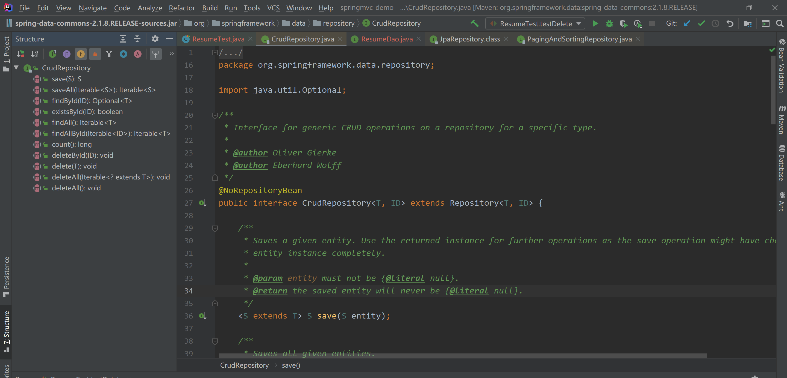

#### Spring Data JPA

##### 1、pom依赖

```xml
    <dependencies>
        <!--单元测试jar-->
        <dependency>
            <groupId>junit</groupId>
            <artifactId>junit</artifactId>
            <version>4.12</version>
            <scope>test</scope>
        </dependency>
        <!--spring-data-jpa 需要引⼊的jar,start-->
        <dependency>
            <groupId>org.springframework.data</groupId>
            <artifactId>spring-data-jpa</artifactId>
            <version>2.1.8.RELEASE</version>
        </dependency>
        <dependency>
            <groupId>javax.el</groupId>
            <artifactId>javax.el-api</artifactId>
            <version>3.0.1-b04</version>
        </dependency>
        <dependency>
            <groupId>org.glassfish.web</groupId>
            <artifactId>javax.el</artifactId>
            <version>2.2.6</version>
        </dependency>
        <!--spring-data-jpa 需要引⼊的jar,end-->
        <!--spring 相关jar,start-->
        <dependency>
            <groupId>org.springframework</groupId>
            <artifactId>spring-aop</artifactId>
            <version>5.1.12.RELEASE</version>
        </dependency>
        <dependency>
            <groupId>org.aspectj</groupId><artifactId>aspectjweaver</artifactId>
            <version>1.8.13</version>
        </dependency>
        <dependency>
            <groupId>org.springframework</groupId>
            <artifactId>spring-context</artifactId>
            <version>5.1.12.RELEASE</version>
        </dependency>
        <dependency>
            <groupId>org.springframework</groupId>
            <artifactId>spring-context-support</artifactId>
            <version>5.1.12.RELEASE</version>
        </dependency>
        <!--spring对orm框架的⽀持包-->
        <dependency>
            <groupId>org.springframework</groupId>
            <artifactId>spring-orm</artifactId>
            <version>5.1.12.RELEASE</version>
        </dependency>
        <dependency>
            <groupId>org.springframework</groupId>
            <artifactId>spring-beans</artifactId>
            <version>5.1.12.RELEASE</version>
        </dependency>
        <dependency>
            <groupId>org.springframework</groupId>
            <artifactId>spring-core</artifactId>
            <version>5.1.12.RELEASE</version>
        </dependency>
        <!--spring 相关jar,end-->
        <!--hibernate相关jar包,start-->
        <dependency>
            <groupId>org.hibernate</groupId>
            <artifactId>hibernate-core</artifactId>
            <version>5.4.0.Final</version>
        </dependency>
        <!--hibernate对jpa的实现jar-->
        <dependency>
            <groupId>org.hibernate</groupId>
            <artifactId>hibernate-entitymanager</artifactId>
            <version>5.4.0.Final</version>
        </dependency>
        <dependency>
            <groupId>org.hibernate</groupId>
            <artifactId>hibernate-validator</artifactId>
            <version>5.4.0.Final</version>
        </dependency>
        <!--hibernate相关jar包,end-->
        <!--mysql 数据库驱动jar-->
        <dependency>
            <groupId>mysql</groupId>
            <artifactId>mysql-connector-java</artifactId>
            <version>5.1.46</version>
        </dependency>
        <!--druid连接池-->
        <dependency>
            <groupId>com.alibaba</groupId>
            <artifactId>druid</artifactId>
            <version>1.1.21</version>
        </dependency>
        <!--spring-test-->
        <dependency>
            <groupId>org.springframework</groupId>
            <artifactId>spring-test</artifactId>
            <version>5.1.12.RELEASE</version>
        </dependency>
    </dependencies>
```

##### 2、applicationContext.xml配置

```xml
<?xml version="1.0" encoding="UTF-8"?>
<beans xmlns="http://www.springframework.org/schema/beans"
       xmlns:context="http://www.springframework.org/schema/context"
       xmlns:jpa="http://www.springframework.org/schema/data/jpa"
       xmlns:xsi="http://www.w3.org/2001/XMLSchema-instance"
       xsi:schemaLocation="
        http://www.springframework.org/schema/beans
        https://www.springframework.org/schema/beans/spring-beans.xsd
        http://www.springframework.org/schema/context
        https://www.springframework.org/schema/context/spring-context.xsd
        http://www.springframework.org/schema/data/jpa
        https://www.springframework.org/schema/data/jpa/spring-jpa.xsd
">
    <!--对Spring和SpringDataJPA进行配置-->

    <!--1、创建数据库连接池druid-->
    <!--引入外部资源文件-->
    <context:property-placeholder location="classpath:jdbc.properties"/>
    <!--第三方jar中的bean定义在xml中-->
    <bean id="dataSource" class="com.alibaba.druid.pool.DruidDataSource">
        <property name="driverClassName" value="${jdbc.driver}"/>
        <property name="url" value="${jdbc.url}"/>
        <property name="username" value="${jdbc.username}"/>
        <property name="password" value="${jdbc.password}"/>
    </bean>
    
    <!--2、配置一个JPA中非常重要的对象,entityManagerFactory
            entityManager类似于mybatis中的SqlSession
            entityManagerFactory类似于Mybatis中的SqlSessionFactory
    -->
    <bean id="entityManagerFactory" class="org.springframework.orm.jpa.LocalContainerEntityManagerFactoryBean">
        <!--配置数据源-->
        <property name="dataSource" ref="dataSource"/>
        <!--配置包扫描（pojo实体类所在的包）-->
        <property name="packagesToScan" value="com.lagou.edu.pojo"/>
        <!--指定jpa的具体实现，也就是hibernate-->
        <property name="persistenceProvider">
            <bean class="org.hibernate.jpa.HibernatePersistenceProvider"/>
        </property>
        <!--jpa方言配置,不同的jpa实现对于类似于beginTransaction等细节实现起来是不一样的，
               所以传入JpaDialect具体的实现类-->
        <property name="jpaDialect">
            <bean class="org.springframework.orm.jpa.vendor.HibernateJpaDialect"/>
        </property>
        
        <!--配置具体provider，hibearnte框架的执行细节-->
        <property name="jpaVendorAdapter">
            <bean class="org.springframework.orm.jpa.vendor.HibernateJpaVendorAdapter">
                <!--定义hibernate框架的一些细节-->
                <!--
                    配置数据表是否自动创建
                    因为我们会建立pojo和数据表之间的映射关系
                    程序启动时，如果数据表还没有创建，是否要程序给创建一下
                -->
                <property name="generateDdl" value="false"/>
                <!--
                    指定数据库的类型
                    hibernate本身是个dao层框架，可以支持多种数据库类型的，这里就指定本次使用的什么数据库
                -->
                <property name="database" value="MYSQL"/>
                <!--
                    配置数据库的方言
                    hiberante可以帮助我们拼装sql语句，但是不同的数据库sql语法是不同的，所以需要我们注入具体的数据库方言
                -->
                <property name="databasePlatform" value="org.hibernate.dialect.MySQLDialect"/>
                <!--是否显示sql
                    操作数据库时，是否打印sql
                -->
                <property name="showSql" value="true"/>
            </bean>
        </property>
    </bean>

    <!--3、引用上面创建的entityManagerFactory
             <jpa:repositories> 配置jpa的dao层细节
             base-package:指定dao层接口所在包
    -->
    <jpa:repositories base-package="com.lagou.edu.dao" entity-manager-factory-ref="entityManagerFactory"
                      transaction-manager-ref="transactionManager"/>
    
    <!--4、事务管理器配置
        jdbcTemplate/mybatis 使用的是DataSourceTransactionManager
        jpa规范：JpaTransactionManager
    -->
    <bean id="transactionManager" class="org.springframework.orm.jpa.JpaTransactionManager">
        <property name="entityManagerFactory" ref="entityManagerFactory"/>
    </bean>
    
    <!--5、声明式事务配置-->
    <!--
        <tx:annotation-driven/>
    -->

    <!--6、配置spring包扫描-->
    <context:component-scan base-package="com.lagou.edu"/>
</beans> 
    
```

##### 3、Spring Data JPA 应用

###### 3.1 编写实体类，使用 JPA 注解配置与表的映射关系

```java
package com.lagou.edu.pojo;

import lombok.Data;

import javax.persistence.*;

/**
 * @author ying
 * @version 1.0
 * @date 2021-05-06 20:52
 */
@Data
@Entity  // 标记为一个实体，能够被JPA所识别
@Table(name = "tb_resume")  // 实体映射的表
public class Resume {
    
    /**
     * 主键生成策略
     * GenerationType.IDENTITY:依赖数据库中主键自增功能  Mysql
     * GenerationType.SEQUENCE:依靠序列来产生主键     Oracle
     */
    @GeneratedValue(strategy = GenerationType.AUTO)
    @Id  // 标记为id
    @Column(name = "id")  // 表映射的字段
    private Long id;

    @Column(name = "name")
    private String name;

    @Column(name = "address")
    private String address;

    @Column(name = "phone")
    private String phone;
}
```

###### 3.2 编写dao层接口，继承JpaRepository和JpaSpecificationExecutor

```java
package com.lagou.edu.dao;

import com.lagou.edu.pojo.Resume;
import org.springframework.data.jpa.repository.JpaRepository;
import org.springframework.data.jpa.repository.JpaSpecificationExecutor;


/**
 * 一个符合SpringDataJpa要求的Dao层接口是需要继承JpaRepository和JpaSpecificationExecutor
 * <p>
 * JpaRepository<操作的实体类类型,主键类型>
 * 封装了基本的CRUD操作
 * <p>
 * JpaSpecificationExecutor<操作的实体类类型>
 * 封装了复杂的查询（分页、排序等）
 *
 * @author ying
 * @version 1.0
 * @date 2021-05-06 20:59
 */
public interface ResumeDao extends JpaRepository<Resume, Long>, JpaSpecificationExecutor<Resume> {

}
```

###### 3.3 使用常规方法操作数据库，即接口 JpaRepository 和 JpaSpecificationExecutor 的方法



```java
import com.lagou.edu.dao.ResumeDao;
import com.lagou.edu.pojo.Resume;
import org.junit.Test;
import org.junit.runner.RunWith;
import org.springframework.beans.factory.annotation.Autowired;
import org.springframework.data.domain.Example;
import org.springframework.test.context.ContextConfiguration;
import org.springframework.test.context.junit4.SpringJUnit4ClassRunner;

import java.util.Optional;


/**
 * @author ying
 * @version 1.0
 * @date 2021-05-06 22:53
 */
@RunWith(SpringJUnit4ClassRunner.class)
@ContextConfiguration(locations = {"classpath:applicationContext.xml"})
public class ResumeTest {

    @Autowired
    private ResumeDao resumeDao;

    @Test
    public void testFindById() {
        // 根据id查询
        Optional<Resume> resume = resumeDao.findById(1L);
        System.out.println(resume.get());
    }

    @Test
    public void testFindOne() {
        // 根据条件查询
        Resume resume = new Resume();
        resume.setId(1L);
        resume.setName("张三");
        Example<Resume> example = Example.of(resume);
        Optional<Resume> one = resumeDao.findOne(example);
        Resume resume1 = one.get();
        System.out.println(resume1);
    }

    @Test
    public void testSave() {
        // 新增和更新都使用save方法，通过传入的对象的主键有无来区分，没有主键信息那就是新增，有主键信息就是更新
        Resume resume = new Resume();
        resume.setId(5L);
        resume.setName("赵六");
        resume.setAddress("成都");
        resume.setPhone("132000000");
        Resume save = resumeDao.save(resume);
        System.out.println(save);
    }

    @Test
    public void testDelete() {
        // 根据id删除
        resumeDao.deleteById(5L);
    }
}
```

###### 3.4 JPAL语句

```java
package com.lagou.edu.dao;

import com.lagou.edu.pojo.Resume;
import org.springframework.data.jpa.repository.JpaRepository;
import org.springframework.data.jpa.repository.JpaSpecificationExecutor;
import org.springframework.data.jpa.repository.Query;

import java.util.List;

public interface ResumeDao extends JpaRepository<Resume, Long>, JpaSpecificationExecutor<Resume> {

    @Query("from Resume  where id=?1 and name=?2")
    List<Resume> findByJpal(Long id, String name);
}
```

###### 3.5 使用原生SQL语句

```java
    /**
     * 使用原生sql语句查询，需要将nativeQuery属性设置为true，默认为false（jpql）
     *
     * @param name
     * @param address
     * @return
     */
    @Query(value = "select * from tb_resume  where name like ?1 and address like ?2", nativeQuery = true)
    List<Resume> findBySql(String name, String address);
```

###### 3.6 方法命名规则

```java
    /**
     * 方法命名规则查询
     * 按照name模糊查询（like）
     * 方法名以findBy开头
     * -属性名（首字母大写）
     * -查询方式（模糊查询、等价查询），如果不写查询方式，默认等价查询
     */
    List<Resume> findByNameLikeAndAddress(String name, String address);
```

###### 3.7 动态查询条件

​		service层传入dao层的条件不确定，把service拿到条件封装成一个对象传递给Dao层，这个对象就叫做Specification（对条件的一个封装）

```java
	interface Specification<T> toPredicate(Root<T> var1, CriteriaQuery<?> var2, CriteriaBuilder var3);
```
封装查询条件
		Root：根属性（查询所需要的任何属性都可以从根对象中获取）
		CriteriaQuery：自定义查询方式
		CriteriaBuilder ：查询构造器，封装了很多的查询条件（like = 等）

```java
    // 动态查询，查询单个对象
    @Test
    public void testSpecfication() {

        /**
         * 动态条件封装
         * lambda表达式或者匿名内部类
         *
         * toPredicate：动态组装查询条件
         *
         *      借助于两个参数完成条件拼装，，， select * from tb_resume where name='张三'
         *      Root: 获取需要查询的对象属性
         *      CriteriaBuilder：构建查询条件，内部封装了很多查询条件（模糊查询，精准查询）
         *
         *      需求：根据name（指定为"张三"）查询简历
         */
        Specification<Resume> specification = (Specification<Resume>) (root, criteriaQuery, criteriaBuilder) -> {
            // 获取到name属性
            Path<Object> name = root.get("name");
            // 使用CriteriaBuilder针对name属性构建条件（精准查询）
            Predicate predicate = criteriaBuilder.equal(name, "张三");
            return predicate;
        };
        Optional<Resume> optional = resumeDao.findOne(specification);
        Resume resume = optional.get();
        System.out.println(resume);
    }
```

```java
    @Test
    public void testSpecficationMultiCon() {
        /**
         *  需求：根据name（指定为"张三"）并且，address 以"北"开头（模糊匹配），查询简历
         */
        Specification<Resume> specification = (Specification<Resume>) (root, criteriaQuery, criteriaBuilder) -> {
            // 获取到name属性
            Path<Object> name = root.get("name");
            Path<Object> address = root.get("address");
            // 条件1：使用CriteriaBuilder针对name属性构建条件（精准查询）
            Predicate predicate1 = criteriaBuilder.equal(name, "张三");
            // 条件2：address 以"北"开头（模糊匹配）
            Predicate predicate2 = criteriaBuilder.like(address.as(String.class), "北%");
            // 组合两个条件
            Predicate and = criteriaBuilder.and(predicate1, predicate2);
            return and;
        };

        Optional<Resume> optional = resumeDao.findOne(specification);
        Resume resume = optional.get();
        System.out.println(resume);
    }
```

###### 3.8 排序

```java
    @Test
    public void testSort(){
        Sort sort = new Sort(Sort.Direction.DESC,"id");
        List<Resume> list = resumeDao.findAll(sort);
        for (Resume resume : list) {
            System.out.println(resume);
        }
    }
```

###### 3.9 分页

```java
    @Test
    public void testPage(){
        /**
         * 第一个参数：当前查询的页数，从0开始
         * 第二个参数：每页查询的数量
         */
        Pageable pageable  = PageRequest.of(0,2);
        //Pageable pageable = new PageRequest(0,2);
        Page<Resume> all = resumeDao.findAll(pageable);
        System.out.println(all);
    }
```

