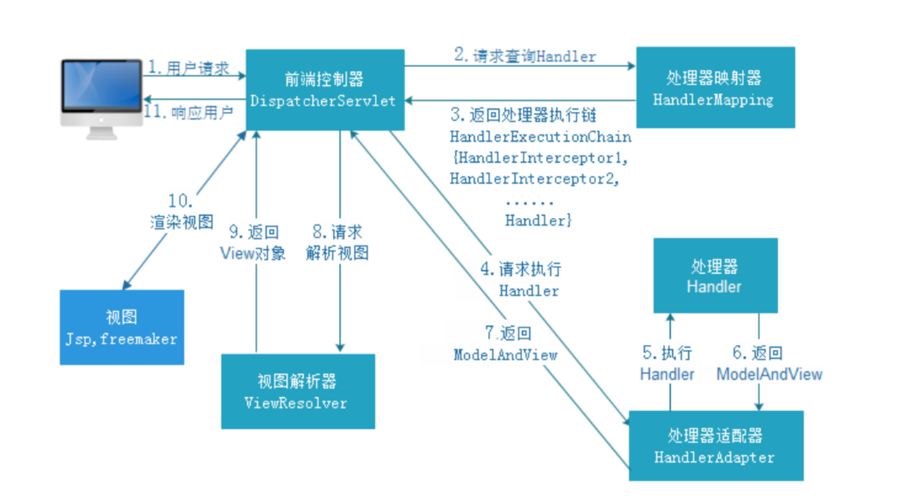
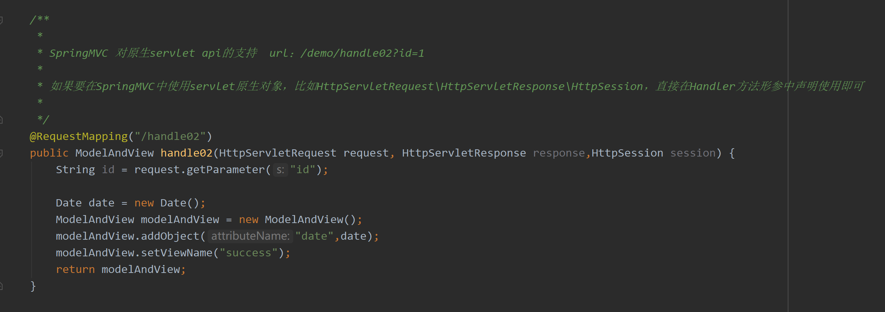
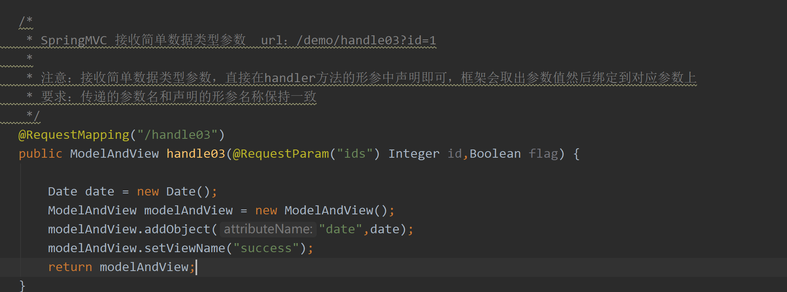
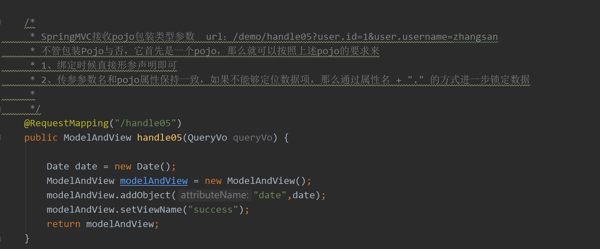

#### SpringMVC

##### 一、Spring MVC 应用

###### 1、MVC 设计模式

* Model（模型）：模型包含业务模型和数据模型，数据模型⽤于封装数据，业务模型⽤于处理业务。

* View（视图）：通常指 jsp 或者 html 。作⽤⼀般就是展示数据的。通常视图是依据模型数据创建的。  

* Controller（控制层）：应⽤程序中处理⽤户交互的部分。作⽤⼀般就是处理程序逻辑的。  

  

###### 2、Spring MVC 工作流程




###### 3、Spring MVC 九大组件

* **HandlerMapping（处理器映射器）**
  		HandlerMapping 是⽤来查找 Handler 的，也就是处理器，具体的表现形式可以是类，也可以是⽅法。⽐如，标注了@RequestMapping的每个⽅法都可以看成是⼀个Handler。 Handler负责具体实际的请求处理，在请求到达后， HandlerMapping 的作⽤便是找到请求相应的处理器Handler 和 Interceptor。

* **HandlerAdapter（处理器适配器）**

  ​		HandlerAdapter 是⼀个适配器。因为 Spring MVC 中 Handler 可以是任意形式的，只要能处理请求即可。但是把请求交给 Servlet 的时候，由于 Servlet 的⽅法结构都是doService(HttpServletRequest req,HttpServletResponse resp)形式的，要让固定的 Servlet 处理⽅法调⽤ Handler 来进⾏处理，便是 HandlerAdapter 的职责。

* **HandlerExceptionResolver**

  ​		HandlerExceptionResolver ⽤于处理 Handler 产⽣的异常情况。它的作⽤是根据异常设置ModelAndView，之后交给渲染⽅法进⾏渲染，渲染⽅法会将 ModelAndView 渲染成⻚⾯。

* **ViewResolver**

  ​		ViewResolver即视图解析器，⽤于将String类型的视图名和Locale解析为View类型的视图，只有⼀个resolveViewName()⽅法。从⽅法的定义可以看出， Controller层返回的String类型视图名viewName 最终会在这⾥被解析成为View。 View是⽤来渲染⻚⾯的，也就是说，它会将程序返回的参数和数据填⼊模板中，⽣成html⽂件。 ViewResolver 在这个过程主要完成两件事情：ViewResolver 找到渲染所⽤的模板（第⼀件⼤事）和所⽤的技术（第⼆件⼤事，其实也就是找到视图的类型，如JSP）并填⼊参数。默认情况下， Spring MVC会⾃动为我们配置⼀个InternalResourceViewResolver,是针对 JSP 类型视图的。

* **RequestToViewNameTranslator**

  ​		RequestToViewNameTranslator 组件的作⽤是从请求中获取 ViewName.因为 ViewResolver 根据ViewName 查找 View，但有的 Handler 处理完成之后,没有设置 View，也没有设置 ViewName，便要通过这个组件从请求中查找 ViewName。

* **LocaleResolver**

  ​		ViewResolver 组件的 resolveViewName ⽅法需要两个参数，⼀个是视图名，⼀个是 Locale。LocaleResolver ⽤于从请求中解析出 Locale，⽐如中国 Locale 是 zh-CN，⽤来表示⼀个区域。这个组件也是 i18n 的基础。

* **ThemeResolver**

  ​		ThemeResolver 组件是⽤来解析主题的。主题是样式、图⽚及它们所形成的显示效果的集合。Spring MVC 中⼀套主题对应⼀个 properties⽂件，⾥⾯存放着与当前主题相关的所有资源，如图⽚、 CSS样式等。创建主题⾮常简单，只需准备好资源，然后新建⼀个“主题名.properties”并将资源设置进去，放在classpath下，之后便可以在⻚⾯中使⽤了。 SpringMVC中与主题相关的类有ThemeResolver、 ThemeSource和Theme。 ThemeResolver负责从请求中解析出主题名，ThemeSource根据主题名找到具体的主题，其抽象也就是Theme，可以通过Theme来获取主题和具体的资源。

* **MultipartResolver**

  ​		MultipartResolver ⽤于上传请求，通过将普通的请求包装成 MultipartHttpServletRequest 来实现。MultipartHttpServletRequest 可以通过 getFile() ⽅法 直接获得⽂件。如果上传多个⽂件，还可以调⽤ getFileMap()⽅法得到Map<FileName， File>这样的结构， MultipartResolver 的作⽤就是封装普通的请求，使其拥有⽂件上传的功能。

* **FlashMapManager**

  ​		FlashMap ⽤于重定向时的参数传递，⽐如在处理⽤户订单时候，为了避免重复提交，可以处理完post请求之后重定向到⼀个get请求，这个get请求可以⽤来显示订单详情之类的信息。这样做虽然可以规避⽤户重新提交订单的问题，但是在这个⻚⾯上要显示订单的信息，这些数据从哪⾥来获得呢？因为重定向时么有传递参数这⼀功能的，如果不想把参数写进URL（不推荐），那么就可以通过FlashMap来传递。只需要在重定向之前将要传递的数据写⼊请求（可以通过ServletRequestAttributes.getRequest()⽅法获得）的属性OUTPUT_FLASH_MAP_ATTRIBUTE中，这样在重定向之后的Handler中Spring就会⾃动将其设置到Model中在显示订单信息的⻚⾯上就可以直接从Model中获取数据。 FlashMapManager 就是⽤来管理 FalshMap 的。  


###### 4、拦截匹配规则的url

​		在web.xml配置

```xml
<url-pattern>/</url-pattern>
```

* 带后缀，比如\*.action，*.do， *.aaa，该种方式比较精确、方便
* / 不会拦截 .jsp，但是会拦截 .html等静态资源（静态资源：除了servlet和jsp之外的js、css、png等）

* /* 拦截所有，包括.jsp

**为什么配置为/ 会拦截静态资源？**

​		因为tomcat容器中有一个web.xml（父），你的项目中也有一个web.xml（子），是一个继承关系父web.xml中有一个DefaultServlet,  url-pattern 是一个 /，此时我们自己的web.xml中也配置了一个 / ,覆写了父web.xml的配置。

**为什么不拦截.jsp？**

​		因为父web.xml中有一个JspServlet，这个servlet拦截.jsp文件，而我们并没有覆写这个配置，所以springmvc此时不拦截jsp，jsp的处理交给了tomcat。

**静态资源不拦截配置**

方案一：springmvc.xml配置

```xml
<mvc:default-servlet-handler/>
```

​		原理：添加该标签配置之后，会在SpringMVC上下文中定义一个DefaultServletHttpRequestHandler对象这个对象如同一个检查人员，对进入DispatcherServlet的url请求进行过滤筛查，如果发现是一个静态资源请求那么会把请求转由web应用服务器（tomcat）默认的DefaultServlet来处理，如果不是静态资源请求，那么继续由SpringMVC框架处理。

方案二：springmvc.xml配置

```xml
<mvc:resources location="classpath:/"  mapping="/resources/**"/>
<mvc:resources location="/WEB-INF/js/" mapping="/js/**"/>
```

​		SpringMVC框架自己处理静态资源 mapping：约定的静态资源的 url 规则 location：指定的静态资源的存放位置。


###### 5、请求参数绑定

* 默认⽀持 Servlet API 作为⽅法参数  



* 绑定简单类型参数  

  ​		简单数据类型：⼋种基本数据类型及其包装类型。参数类型推荐使⽤包装数据类型，因为基础数据类型不可以为 null。

  | 数据类型 | type                                                         |
  | -------- | ------------------------------------------------------------ |
  | 整型     | Integer、 int                                                |
  | 字符串   | String                                                       |
  | 单精度   | Float、 float                                                |
  | 双精度   | Double、 double                                              |
  | 布尔型   | Boolean、 boolean（对于布尔类型的参数， 请求的参数值为true或false，或者1或0） |

  ​		绑定简单数据类型参数，只需要直接声明形参即可（形参参数名和传递的参数名要保持⼀
  致，建议 使⽤包装类型，当形参参数名和传递参数名不⼀致时可以使⽤@RequestParam注解进⾏
  ⼿动映射）。

  

* 绑定Pojo类型参数

  ​		接收pojo类型参数，直接形参声明即可，类型就是Pojo的类型，形参名⽆所谓，要求传递的参数名必须和Pojo的属性名保持⼀致。

* 绑定Pojo包装对象参数  

  ​		