#### SpringMVC

##### 一、Spring MVC 应用

###### 1、MVC 设计模式

* Model（模型）：模型包含业务模型和数据模型，数据模型⽤于封装数据，业务模型⽤于处理业务。

* View（视图）：通常指 jsp 或者 html 。作⽤⼀般就是展示数据的。通常视图是依据模型数据创建的。  

* Controller（控制层）：应⽤程序中处理⽤户交互的部分。作⽤⼀般就是处理程序逻辑的。  

  

###### 2、Spring MVC 工作流程


###### 3、Spring MVC 九大组件

* **HandlerMapping（处理器映射器）**
  		HandlerMapping 是⽤来查找 Handler 的，也就是处理器，具体的表现形式可以是类，也可以是⽅法。⽐如，标注了@RequestMapping的每个⽅法都可以看成是⼀个Handler。 Handler负责具体实际的请求处理，在请求到达后， HandlerMapping 的作⽤便是找到请求相应的处理器Handler 和 Interceptor。

* **HandlerAdapter（处理器适配器）**

  ​		HandlerAdapter 是⼀个适配器。因为 Spring MVC 中 Handler 可以是任意形式的，只要能处理请求即可。但是把请求交给 Servlet 的时候，由于 Servlet 的⽅法结构都是doService(HttpServletRequest req,HttpServletResponse resp)形式的，要让固定的 Servlet 处理⽅法调⽤ Handler 来进⾏处理，便是 HandlerAdapter 的职责。

* **HandlerExceptionResolver**

  ​		HandlerExceptionResolver ⽤于处理 Handler 产⽣的异常情况。它的作⽤是根据异常设置ModelAndView，之后交给渲染⽅法进⾏渲染，渲染⽅法会将 ModelAndView 渲染成⻚⾯。

* **ViewResolver**

  ​		ViewResolver即视图解析器，⽤于将String类型的视图名和Locale解析为View类型的视图，只有⼀个resolveViewName()⽅法。从⽅法的定义可以看出， Controller层返回的String类型视图名viewName 最终会在这⾥被解析成为View。 View是⽤来渲染⻚⾯的，也就是说，它会将程序返回的参数和数据填⼊模板中，⽣成html⽂件。 ViewResolver 在这个过程主要完成两件事情：ViewResolver 找到渲染所⽤的模板（第⼀件⼤事）和所⽤的技术（第⼆件⼤事，其实也就是找到视图的类型，如JSP）并填⼊参数。默认情况下， Spring MVC会⾃动为我们配置⼀个InternalResourceViewResolver,是针对 JSP 类型视图的。

* **RequestToViewNameTranslator**

  ​		RequestToViewNameTranslator 组件的作⽤是从请求中获取 ViewName.因为 ViewResolver 根据ViewName 查找 View，但有的 Handler 处理完成之后,没有设置 View，也没有设置 ViewName，便要通过这个组件从请求中查找 ViewName。

* **LocaleResolver**

  ​		ViewResolver 组件的 resolveViewName ⽅法需要两个参数，⼀个是视图名，⼀个是 Locale。LocaleResolver ⽤于从请求中解析出 Locale，⽐如中国 Locale 是 zh-CN，⽤来表示⼀个区域。这个组件也是 i18n 的基础。

* **ThemeResolver**

  ​		ThemeResolver 组件是⽤来解析主题的。主题是样式、图⽚及它们所形成的显示效果的集合。Spring MVC 中⼀套主题对应⼀个 properties⽂件，⾥⾯存放着与当前主题相关的所有资源，如图⽚、 CSS样式等。创建主题⾮常简单，只需准备好资源，然后新建⼀个“主题名.properties”并将资源设置进去，放在classpath下，之后便可以在⻚⾯中使⽤了。 SpringMVC中与主题相关的类有ThemeResolver、 ThemeSource和Theme。 ThemeResolver负责从请求中解析出主题名，ThemeSource根据主题名找到具体的主题，其抽象也就是Theme，可以通过Theme来获取主题和具体的资源。

* **MultipartResolver**

  ​		MultipartResolver ⽤于上传请求，通过将普通的请求包装成 MultipartHttpServletRequest 来实现。MultipartHttpServletRequest 可以通过 getFile() ⽅法 直接获得⽂件。如果上传多个⽂件，还可以调⽤ getFileMap()⽅法得到Map<FileName， File>这样的结构， MultipartResolver 的作⽤就是封装普通的请求，使其拥有⽂件上传的功能。

* **FlashMapManager**

  ​		FlashMap ⽤于重定向时的参数传递，⽐如在处理⽤户订单时候，为了避免重复提交，可以处理完post请求之后重定向到⼀个get请求，这个get请求可以⽤来显示订单详情之类的信息。这样做虽然可以规避⽤户重新提交订单的问题，但是在这个⻚⾯上要显示订单的信息，这些数据从哪⾥来获得呢？因为重定向时么有传递参数这⼀功能的，如果不想把参数写进URL（不推荐），那么就可以通过FlashMap来传递。只需要在重定向之前将要传递的数据写⼊请求（可以通过ServletRequestAttributes.getRequest()⽅法获得）的属性OUTPUT_FLASH_MAP_ATTRIBUTE中，这样在重定向之后的Handler中Spring就会⾃动将其设置到Model中在显示订单信息的⻚⾯上就可以直接从Model中获取数据。 FlashMapManager 就是⽤来管理 FalshMap 的。  


###### 4、拦截匹配规则的url

​		在web.xml配置

```xml
<url-pattern>/</url-pattern>
```

* 带后缀，比如\*.action，*.do， *.aaa，该种方式比较精确、方便
* / 不会拦截 .jsp，但是会拦截 .html等静态资源（静态资源：除了servlet和jsp之外的js、css、png等）

* /* 拦截所有，包括.jsp

**为什么配置为/ 会拦截静态资源？**

​		因为tomcat容器中有一个web.xml（父），你的项目中也有一个web.xml（子），是一个继承关系父web.xml中有一个DefaultServlet,  url-pattern 是一个 /，此时我们自己的web.xml中也配置了一个 / ,覆写了父web.xml的配置。

**为什么不拦截.jsp？**

​		因为父web.xml中有一个JspServlet，这个servlet拦截.jsp文件，而我们并没有覆写这个配置，所以springmvc此时不拦截jsp，jsp的处理交给了tomcat。

**静态资源不拦截配置**

方案一：springmvc.xml配置

```xml
<mvc:default-servlet-handler/>
```

​		原理：添加该标签配置之后，会在SpringMVC上下文中定义一个DefaultServletHttpRequestHandler对象这个对象如同一个检查人员，对进入DispatcherServlet的url请求进行过滤筛查，如果发现是一个静态资源请求那么会把请求转由web应用服务器（tomcat）默认的DefaultServlet来处理，如果不是静态资源请求，那么继续由SpringMVC框架处理。

方案二：springmvc.xml配置

```xml
<mvc:resources location="classpath:/"  mapping="/resources/**"/>
<mvc:resources location="/WEB-INF/js/" mapping="/js/**"/>
```

​		SpringMVC框架自己处理静态资源 mapping：约定的静态资源的 url 规则 location：指定的静态资源的存放位置。


###### 5、请求参数绑定

* 默认⽀持 Servlet API 作为⽅法参数  


* 绑定简单类型参数  

  ​		简单数据类型：⼋种基本数据类型及其包装类型。参数类型推荐使⽤包装数据类型，因为基础数据类型不可以为 null。

  | 数据类型 | type                                                         |
  | -------- | ------------------------------------------------------------ |
  | 整型     | Integer、 int                                                |
  | 字符串   | String                                                       |
  | 单精度   | Float、 float                                                |
  | 双精度   | Double、 double                                              |
  | 布尔型   | Boolean、 boolean（对于布尔类型的参数， 请求的参数值为true或false，或者1或0） |

  ​		绑定简单数据类型参数，只需要直接声明形参即可（形参参数名和传递的参数名要保持⼀
  致，建议 使⽤包装类型，当形参参数名和传递参数名不⼀致时可以使⽤@RequestParam注解进⾏
  ⼿动映射）。

  

* 绑定Pojo类型参数

  ​		接收pojo类型参数，直接形参声明即可，类型就是Pojo的类型，形参名⽆所谓，要求传递的参数名必须和Pojo的属性名保持⼀致。

* 绑定Pojo包装对象参数  

  ​		

* 绑定日期类型参数（配置⾃定义类型转换器  ）

  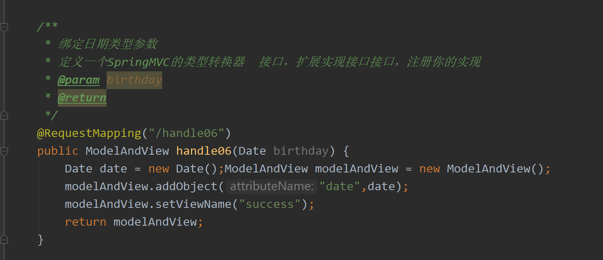

  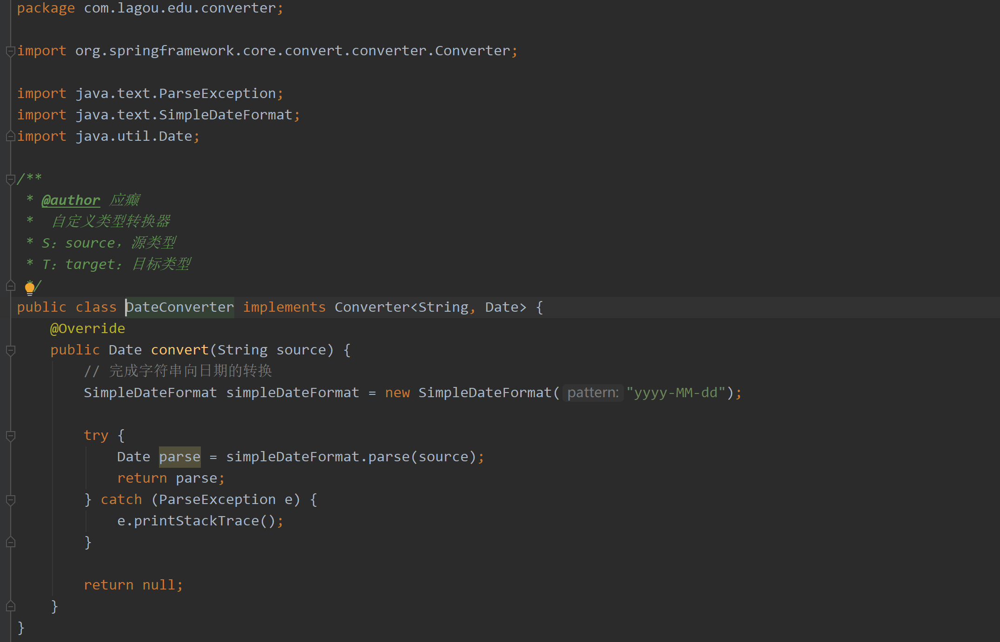

  springmvc.xml 注册自定义类型转换器

  ```xml
  <!--注册自定义类型转换器-->
  <bean id="conversionServiceBean" class="org.springframework.format.support.FormattingConversionServiceFactoryBean">
  	<property name="converters">
  		<set>
  			<bean class="com.lagou.edu.converter.DateConverter"></bean>
  		</set>
  	</property>
  </bean>
  ```


###### 6、RESTful风格

​		Representational State Transfer，表现层状态转化。RESTful的关键是定义可表示流程元素/资源的对象。在REST中，每一个对象都是通过URL来表示的，对象用户负责将状态信息打包进每一条消息内，以便对象的处理总是无状态的。它是一种互联网应用程序的API设计理念：URL定位资源，用HTTP动词（GET,POST,DELETE,DETC）描述操作。


###### 7、pots请求乱码解决方式

配置编码过滤器

```xml
<!--springmvc提供的针对post请求的编码过滤器-->
<filter>
	<filter-name>encoding</filter-name>
	<filter-class>org.springframework.web.filter.CharacterEncodingFilter</filter-class>
    <init-param>
    	<param-name>encoding</param-name>
      	<param-value>UTF-8</param-value>
    </init-param>
</filter>
<filter-mapping>
	<filter-name>encoding</filter-name>
    <url-pattern>/*</url-pattern>
</filter-mapping>
```


###### 8、请求方式转换

请求设置name=“_method”，value为对应请求方式

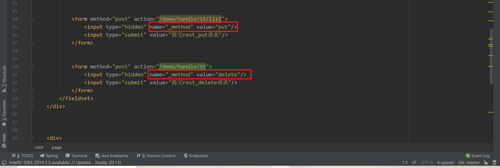

web.xml配置请求过滤器

```xml
<!--配置springmvc请求方式转换过滤器，会检查请求参数中是否有_method参数，如果有就按照指定的请求方式进行转换-->
<filter>
   <filter-name>hiddenHttpMethodFilter</filter-name>
   <filter-class>org.springframework.web.filter.HiddenHttpMethodFilter</filter-class>
</filter>
```

controller配置对应请求方式

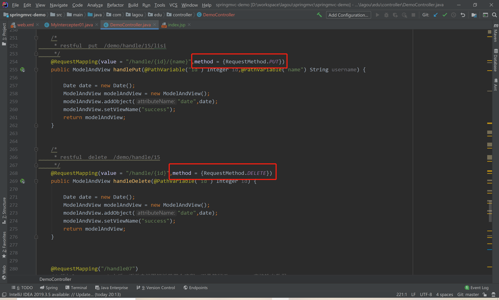


###### 9、Servlet、监听器、拦截器、过滤器

​		从配置的⻆度也能够总结发现： serlvet、 filter、 listener是配置在web.xml中的，⽽interceptor是配置在表现层框架⾃⼰的配置⽂件中的。在Handler业务逻辑执⾏之前拦截⼀次，在Handler逻辑执⾏完毕但未跳转⻚⾯之前拦截⼀次在跳转⻚⾯之后拦截⼀次。

* **Servlet**：处理Request请求和Response响应

* **过滤器（Filter）**：对Request请求起到过滤的作⽤，作⽤在Servlet之前，如果配置为/*可以对所有的资源访问（servlet、 js/css静态资源等）进⾏过滤处理

* **监听器（Listener）**：实现了javax.servlet.ServletContextListener 接⼝的服务器端组件，它随Web应⽤的启动⽽启动，只初始化⼀次，然后会⼀直运⾏监视，随Web应⽤的停⽌⽽销毁

  * 作⽤⼀： 做⼀些初始化⼯作， web应⽤中spring容器启动ContextLoaderListener
  * 作⽤⼆： 监听web中的特定事件，⽐如HttpSession,ServletRequest的创建和销毁；变量的创建、
    销毁和修改等。可以在某些动作前后增加处理，实现监控，⽐如统计在线⼈数，利⽤HttpSessionLisener等。

* **拦截器（Interceptor）**：是SpringMVC、 Struts等表现层框架⾃⼰的，不会拦截jsp/html/css/image的访问等，只会拦截访问的控制器⽅法（Handler）。  

  * **拦截器执行流程**

    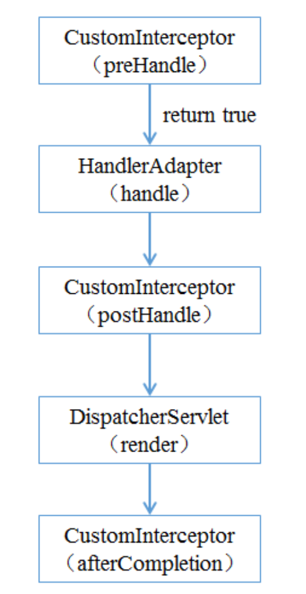

    1）程序先执⾏preHandle()⽅法，如果该⽅法的返回值为true，则程序会继续向下执⾏处理器中的⽅法，否则将不再向下执⾏。
    2）在业务处理器（即控制器Controller类）处理完请求后，会执⾏postHandle()⽅法，然后会通过DispatcherServlet向客户端返回响应。
    3）在DispatcherServlet处理完请求后，才会执⾏afterCompletion()⽅法。

  * **多个拦截器的执⾏流程**

    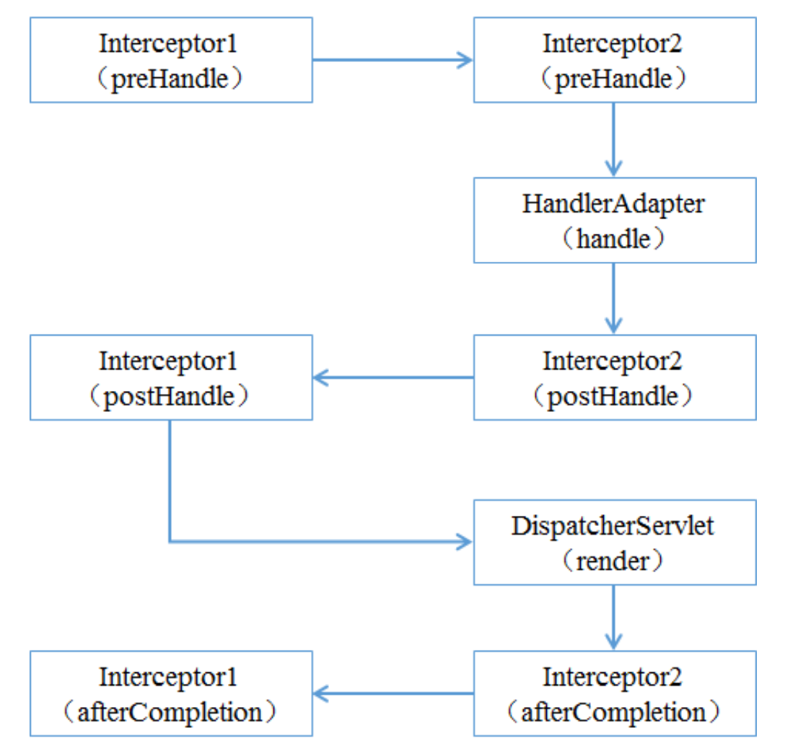

    当有多个拦截器同时⼯作时，它们的preHandle()⽅法会按照配置⽂件中拦截器的配置顺序执⾏，⽽它们的postHandle()⽅法和afterCompletion()⽅法则会按照配置顺序的反序执⾏。

  * **拦截器示例代码**

    ```java
    package com.lagou.edu.interceptor;
    
    
    import org.springframework.web.servlet.HandlerInterceptor;
    import org.springframework.web.servlet.ModelAndView;
    
    import javax.servlet.http.HttpServletRequest;
    import javax.servlet.http.HttpServletResponse;
    
    /**
     * 自定义springmvc拦截器
     */
    public class MyIntercepter01 implements HandlerInterceptor {
    
    
        /**
         * 会在handler方法业务逻辑执行之前执行
         * 往往在这里完成权限校验工作
         * @param request
         * @param response
         * @param handler
         * @return  返回值boolean代表是否放行，true代表放行，false代表中止
         * @throws Exception
         */
        @Override
        public boolean preHandle(HttpServletRequest request, HttpServletResponse response, Object handler) throws Exception {
            System.out.println("MyIntercepter01 preHandle......");
            return true;
        }
    
    
        /**
         * 会在handler方法业务逻辑执行之后尚未跳转页面时执行
         * @param request
         * @param response
         * @param handler
         * @param modelAndView  封装了视图和数据，此时尚未跳转页面呢，你可以在这里针对返回的数据和视图信息进行修改
         * @throws Exception
         */
        @Override
        public void postHandle(HttpServletRequest request, HttpServletResponse response, Object handler, ModelAndView modelAndView) throws Exception {
            System.out.println("MyIntercepter01 postHandle......");
        }
    
        /**
         * 页面已经跳转渲染完毕之后执行
         * @param request
         * @param response
         * @param handler
         * @param ex  可以在这里捕获异常
         * @throws Exception
         */
        @Override
        public void afterCompletion(HttpServletRequest request, HttpServletResponse response, Object handler, Exception ex) throws Exception {
            System.out.println("MyIntercepter01 afterCompletion......");
        }
    }
    ```

  * **springmvc.xml配置拦截器**

    ```xml
    <mvc:interceptors>
        <!--拦截所有handler-->
        <!--<bean class="com.lagou.edu.interceptor.MyIntercepter01"/>-->
        
        <mvc:interceptor>
            <!--配置当前拦截器的url拦截规则，**代表当前目录下及其子目录下的所有url-->
            <mvc:mapping path="/**"/>
            <!--exclude-mapping可以在mapping的基础上排除一些url拦截-->
            <!--<mvc:exclude-mapping path="/demo/**"/>-->
            <bean class="com.lagou.edu.interceptor.MyIntercepter01"/>
        </mvc:interceptor>
    
        <mvc:interceptor>
            <mvc:mapping path="/**"/>
            <bean class="com.lagou.edu.interceptor.MyIntercepter02"/>
        </mvc:interceptor>
        
    </mvc:interceptors>
    ```

  

###### 10、处理multipart形式的数据（文件上传）

原⽣servlet处理上传的⽂件数据的， springmvc是对serlvet的封装，导入所需jar包

```xml
<!--⽂件上传所需jar坐标-->
<dependency>
	<groupId>commons-fileupload</groupId>
	<artifactId>commons-fileupload</artifactId>
	<version>1.3.1</version>
</dependency>
```

springmvc.xml配置⽂件上传解析器 

```xml
<!--多元素解析器
    id固定为multipartResolver
-->
<bean id="multipartResolver" class="org.springframework.web.multipart.commons.CommonsMultipartResolver">
    <!--设置上传文件大小上限，单位是字节，-1代表没有限制也是默认的-->
    <property name="maxUploadSize" value="5000000"/>
</bean>
```

前端jsp，form表单

```jsp
<div>
    <h2>multipart 文件上传</h2>
    <fieldset>
        <%--
            1 method="post"
            2 enctype="multipart/form-data"
            3 type="file"
        --%>
        <form method="post" enctype="multipart/form-data" action="/demo/upload">
            <input type="file" name="uploadFile"/>
            <input type="submit" value="上传"/>
        </form>
    </fieldset>
</div>
```

后端接受处理

```java
    /**
     * 文件上传
     *
     * @return
     */
    @RequestMapping(value = "/upload")
    public ModelAndView upload(MultipartFile uploadFile, HttpSession session) throws IOException {
        // 处理上传文件，重命名，原名123.jpg，获取后缀
        // 原始名称
        String originalFilename = uploadFile.getOriginalFilename();
        // 扩展名  jpg
        String ext = originalFilename.substring(originalFilename.lastIndexOf(".") + 1, originalFilename.length());
        String newName = UUID.randomUUID().toString() + "." + ext;
        // 存储,要存储到指定的文件夹，/uploads/yyyy-MM-dd，考虑文件过多的情况按照日期，生成一个子文件夹
        String realPath = session.getServletContext().getRealPath("/uploads");
        String datePath = new SimpleDateFormat("yyyy-MM-dd").format(new Date());
        File folder = new File(realPath + "/" + datePath);
        if (!folder.exists()) {
            folder.mkdirs();
        }
        // 存储文件到目录
        uploadFile.transferTo(new File(folder, newName));
        
        // TODO 文件磁盘路径要更新到数据库字段

        Date date = new Date();
        ModelAndView modelAndView = new ModelAndView();
        modelAndView.addObject("date", date);
        modelAndView.setViewName("success");
        return modelAndView;
    }
```

​	

###### 11、异常处理

​		捕获所有 Controller 对象 handler ⽅法抛出的异常  ，返回特定信息。

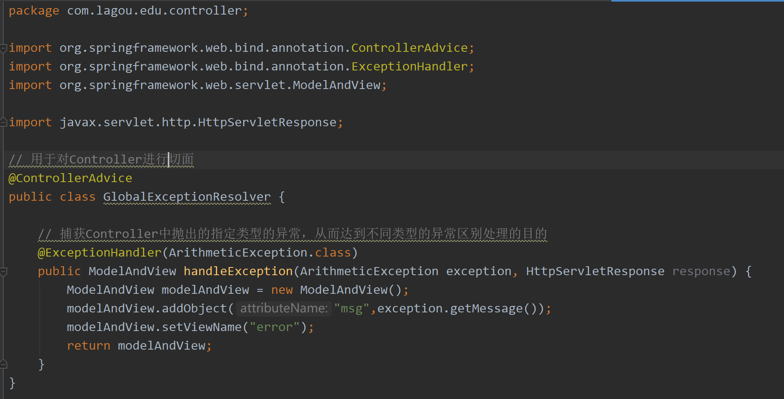


###### 12、重定向请求参数传递

*  方法一：手动参数拼接

  ```java
  return "redirect:handle01?name=" + name;
  ```

* 方法二：使⽤SpringMVC提供的flash属性机制，向上下⽂中添加flash属性，框架会在session中记录该属性值，当跳转到⻚⾯之后框架会⾃动删除flash属性。

  ```java
  @RequestMapping("/handleRedirect")
  public String handleRedirect(String name, RedirectAttributes redirectAttributes) {
      // addFlashAttribute方法设置了一个flash类型属性，该属性会被暂存到session中，在跳转到页面之后该属性销毁
      redirectAttributes.addFlashAttribute("name", name);
      return "redirect:handle01";
  }
  ```

    


##### Spring MVC 注解

###### @RequestMapping

​		用来映射请求，也就是通过它来指定控制器可以处理哪些URL请求。

###### @PathVariable

​		用于获取 RESTful ⻛格的请求URL中的路径变量，可以将URL中占位符参数{xxx}绑定到处理器类的方法形参中@PathVariable(“xxx“)。

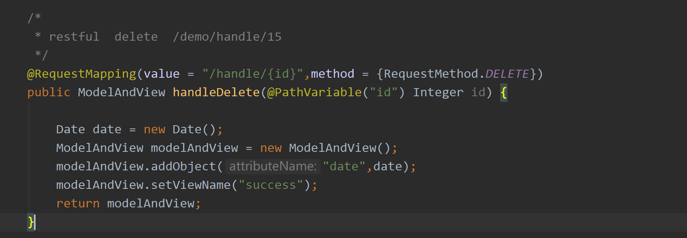

###### @RequestBody

​		前端ajax发送json格式字符串，后台直接接收为pojo参数，使⽤注解@RequstBody。

###### @ResponseBody

​		后台直接返回pojo对象，前端直接接收为json对象或者字符串，使⽤注解@ResponseBody。

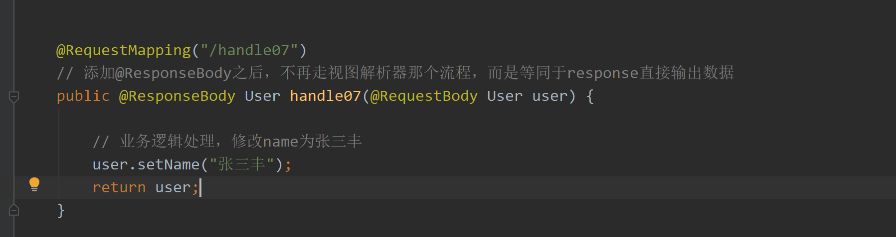

###### @ModelAttribute

​		用于将方法的参数或方法的返回值绑定到指定的模型属性上，并返回给Web视图

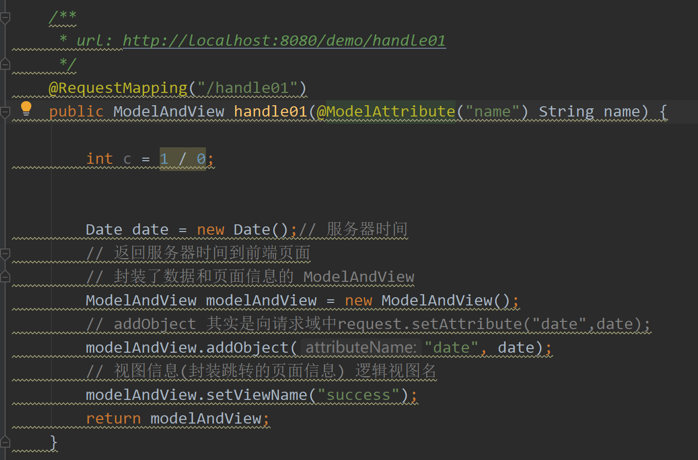

###### @ControllerAdvice

​		用于对Controller进行切面，一般用作全局异常处理、全局数据绑定、全局数据预处理

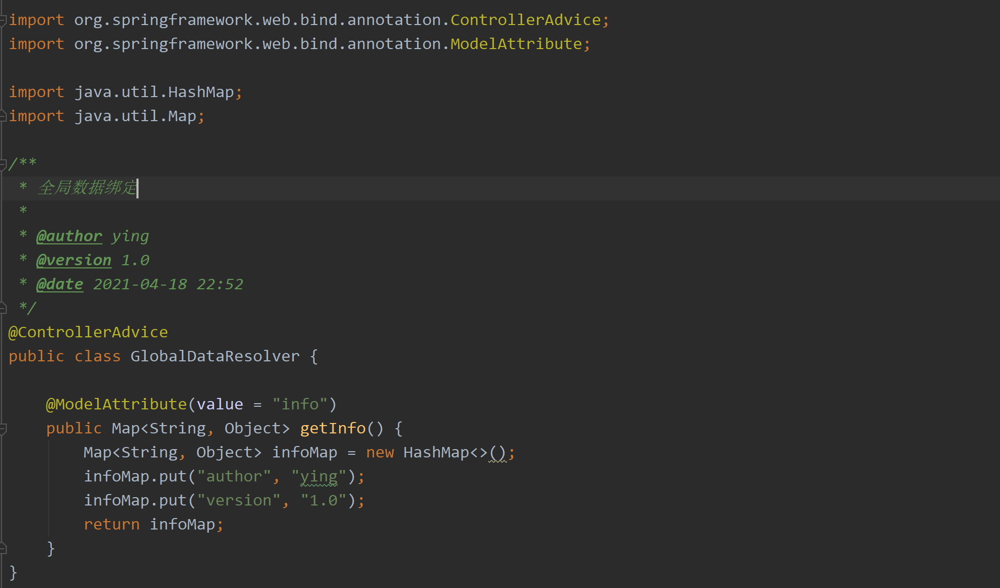

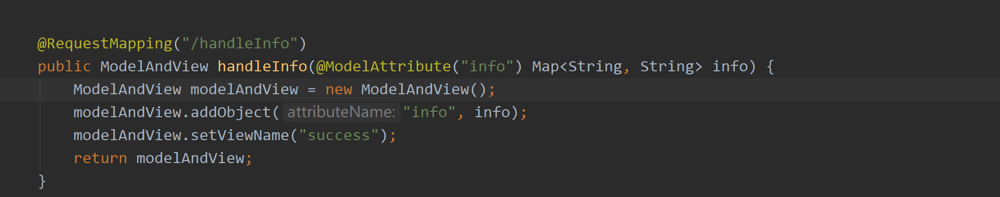

###### @ExceptionHandler

​		统一处理方法抛出的异常，可以添加参数，参数是某个异常类的class，代表这个方法专门处理该类异常。

​		标识了@ExceptionHandler注解的方法，返回值类型和标识了@RequestMapping的方法是统一的，可参见@RequestMapping的说明，比如默认返回Spring的ModelAndView对象，也可以返回String，这时的String是ModelAndView的路径，而不是字符串本身。有些情况下我们会给标识了@RequestMapping的方法添加@ResponseBody，比如使用Ajax的场景，直接返回字符串，异常处理类也可以如此操作，添加@ResponseBody注解后，可以直接返回字符串。

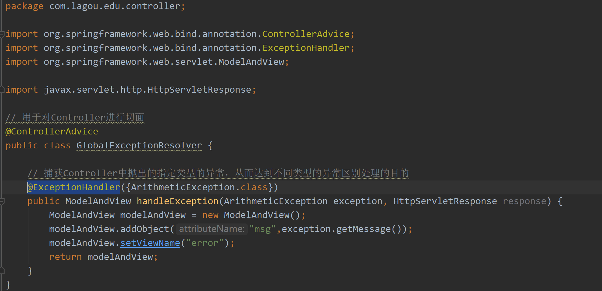

