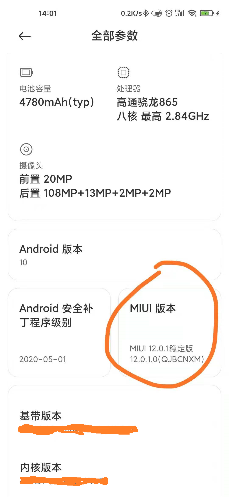
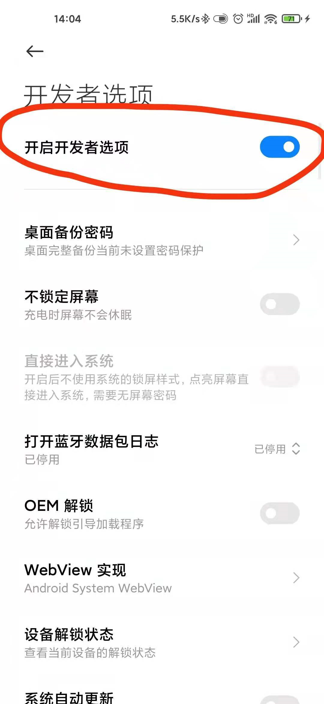
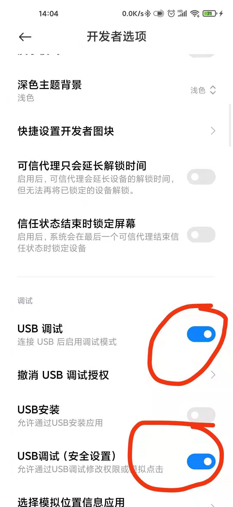
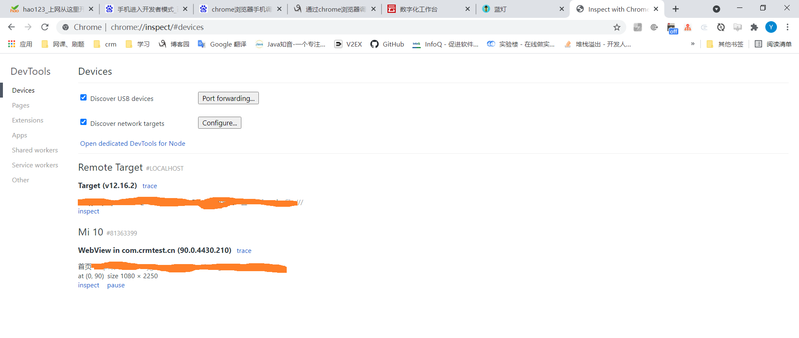
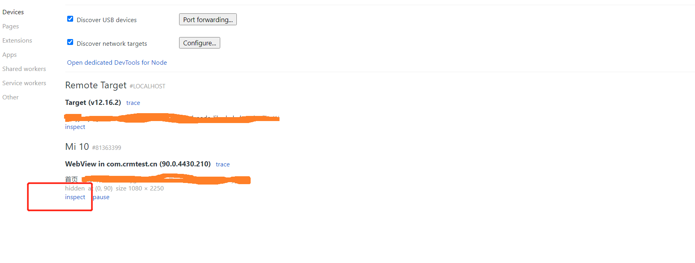
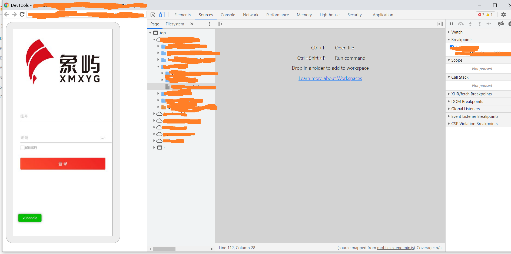

#### chrom调试真机

###### 1、找到手机系统版本，连续点击进入开发者模式

###### 2、从设置中找到开发者模式，打开开发者模式和USB调试

###### 3、chrome浏览器，打开手机调试模式：chrome://inspect/#devices。手机和电脑用USB连接

###### 4、因为chrome的DevTools需要翻墙，下载个蓝灯

蓝灯地址：https://github.com/getlantern/lantern

###### 5、等待页面在chrome上显示，点击inspect

